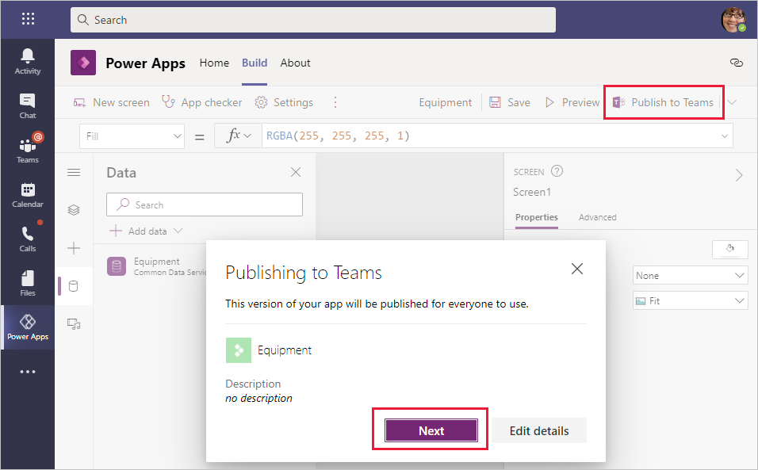
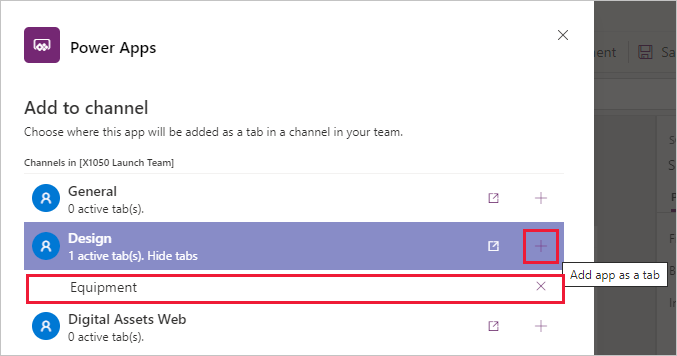

Now that you have built an app, you will want to share it with your team. You can accomplish this task by publishing the app to Teams. After the app has been published, it will be accessible for your team to start taking advantage of it.

1. Open your app for editing in Power Apps Studio.

1. Select **Publish to Teams** from the toolbar and then select **Next**.
    
    

1. For each channel where you want the app to appear in a tab, select **Add app as a tab**. You can only publish to channels for the team that you created the app in.

    

1. Select **Save and close**.

By default, your Dataverse for Teams app is only available to the team that you created the app in. Occasionally, you will want to share your application with others in your organization. 

To share your app with others outside the team:

1. Verify that you are a team owner where the app is currently published.

1. Open the **Build** tab in the Power Apps for Teams app and then select **See all**.

1. Select **Share with colleagues**.

1. Enter the Microsoft 365 group or Microsoft Azure Active Directory (Azure AD) security group to share with in the **Enter or select a security group** field.

1. Turn on or off the sharing of apps to the users and then select **Save**.

   

Afterward, the app will appear in the **Built by your colleagues** page when users select **Apps** in Teams. To learn more about publishing your apps, see the links in the Summary unit at the end of this module.
