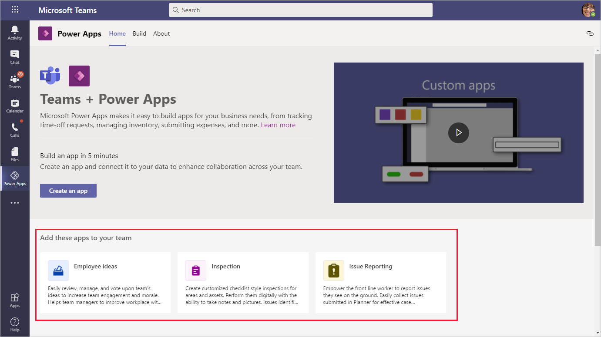
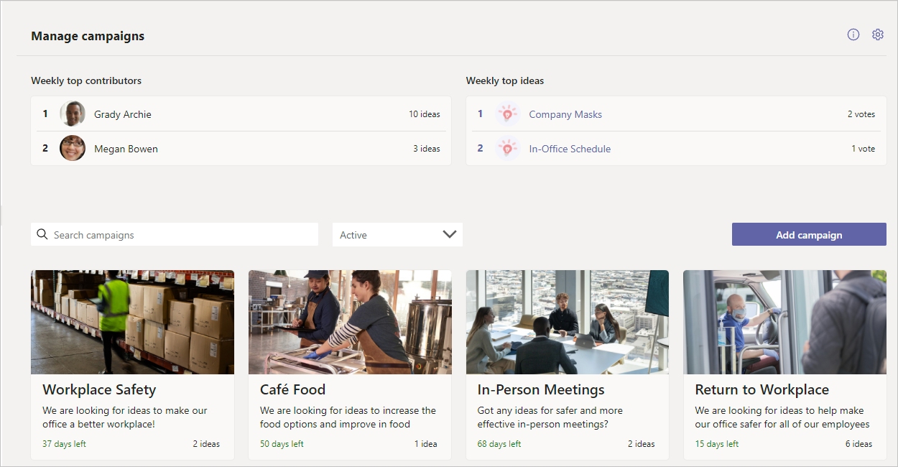
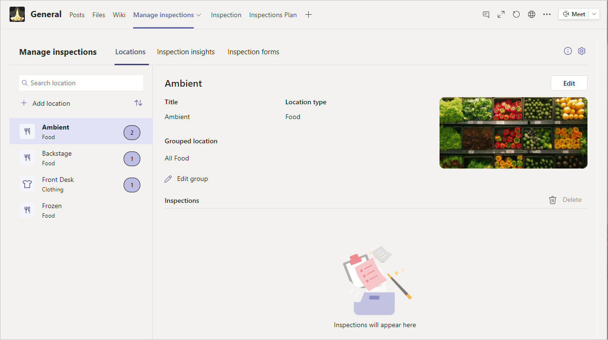
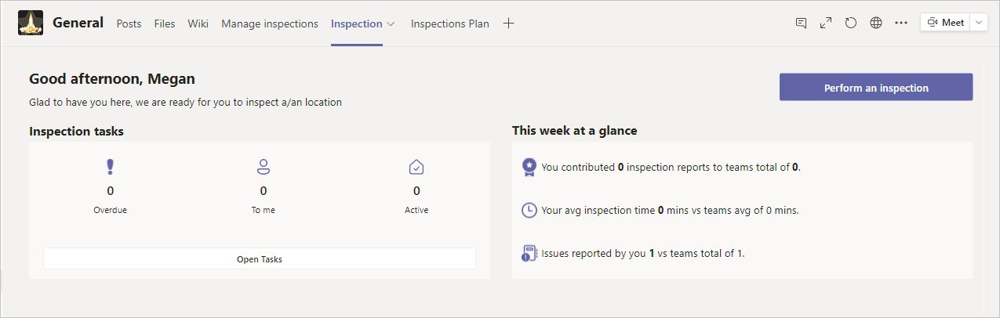
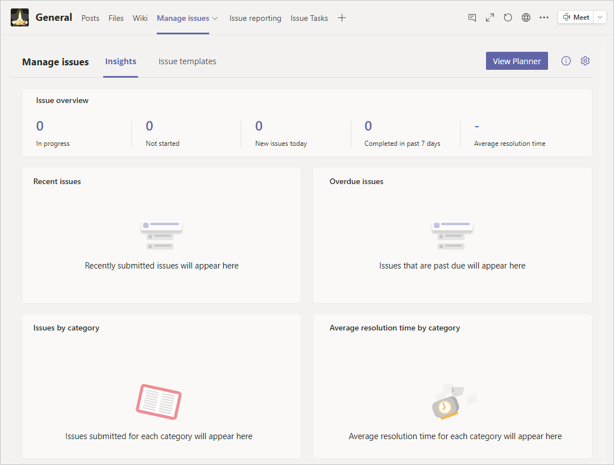
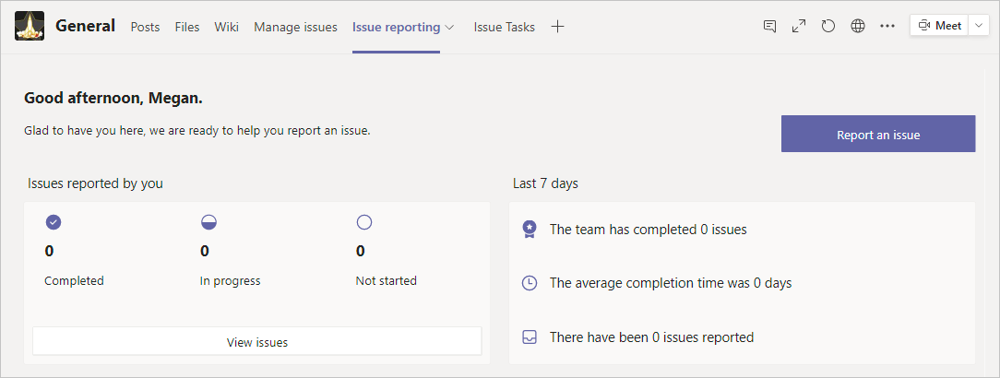

Microsoft created a few sample apps that can be used as-is or customized to suit your specific business needs. You can find these apps when you first open the app for Power Apps in Teams.

Each app has unique requirements and uses various Office 365 services. The install process might be slightly different depending on what is needed. To install any of these apps, left-click on it and then select **Add to a team**. Keep in mind that it may take a while to install the selected app into the channel, but you’ll get a notification when the app is installed.

## Employee ideas app

With the **Employee ideas** app, you can collect ideas from your team and then review, manage, and vote on them to see which ones are worth exploring. Additionally, you can use campaigns to organize the team's ideas. The app will post each idea to a Team channel as they're submitted.

## Inspection app

The **Inspection** app manages, schedules, and collects reports from your team. From this app, you can analyze the results. It uses Microsoft Planner to track the inspections. Two apps will be installed: **Manage inspections** and **Inspection**.

The **Manage inspections** app allows you to edit settings and define the type of inspections that your team can make. It also gives you an overview of everything that has been completed and will then provide reporting.

Each team member uses the Inspection app to view and update inspections that are assigned to them. Team members can start an inspection, review status, and track their own progress.

## Issue reporting

Create a place for your team to report issues, assign tickets, and track progress with the **Issue reporting** app. This app uses Planner as a ticket system. Two apps are installed: **Manage issues** and **Issue reporting**.

The **Manage issues** app gives an overview of all tracked tasks and can create templates to help make it easier for your team to collect the needed information.

The **Issue reporting** app provides a personalized view for each team member, where they can view, edit, and create new items.

Other ready-to-install templates include: **Bulletins** and **Milestones**.  

The **Bulletins** template allows you to keep your team informed of all company communications, broadcasts and announcements in an easy-to-consume experience.

The **Milestones** template provides the team the ability to plan, track and prioritize work capacity across projects in a central place.

Other templates including **Profile+**, **Boards**, and **Perspectives** can be installed into Teams via GitHub.