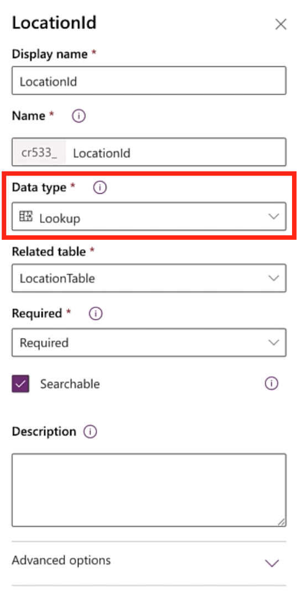
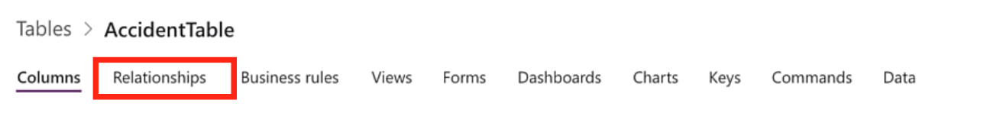
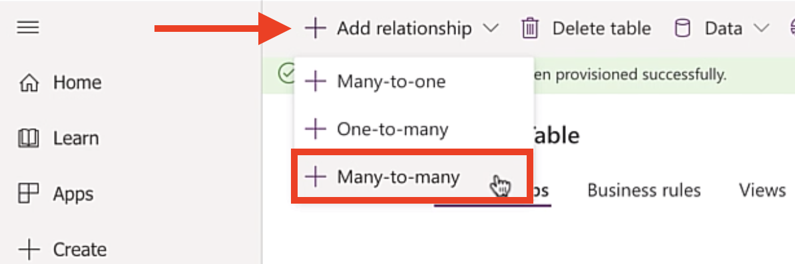
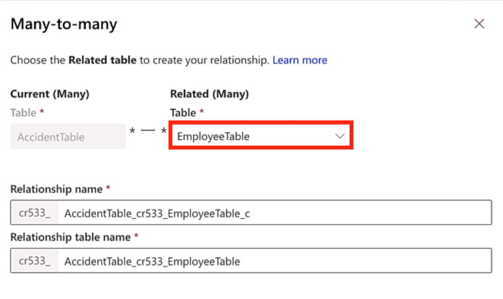
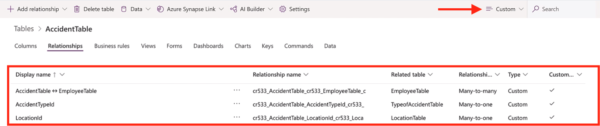

In this exercise, we will build the final main *AccidentTable* and at the same time build out the relationships with the other tables created before.

1. On the main menu, expand **Dataverse** and select **Tables**.

1. Select **+ New Table**.

1. Enter the following information:

    - **Display Name:** *AccidentTable* (Note: You don't need to enter the *Table* suffix, just doing as preference for this exercise).

    The **Plural display name** will auto populate automatically, you can choose to modify it but, in our case, we will use the default.

    - **Primary Name Column Display Name:** *AccidentId* (Note: the primary name is the column showed to users when they select records from this table, also the column shown on the many side when a Lookup column is used).

1. Click on **Create** at the bottom.

1. Under the **Columns** tab, find the *AccidentId* field and click on it.

1. On the columns tab, on the right, change the **Data type** from Text to **Autonumber**.

1. On the Autonumber type, select **String prefixed number**.

1. On the Minimum number of digits, enter **4**.

1. For the Seed value, enter **1000**.

1. With our AccidentTable now created, select **+ Add Column** and create the following columns below:

     - **Display name:** *AccidentDescription*
     - **Data type:** *Text*
     - **Required:** *Required*
     - **Searchable:** *Yes*

     - **Display name:** *AccidentDate*
     - **Data type:** *Date and Time*
     - **Required:** *Required*
     - **Searchable:** *Yes*

     - **Display name:** *ManagerComments*
     - **Data type:** *Text*
     - **Required:** *Optional*
     - **Searchable:** *Yes*

     - **Display name:** *ManagerReviewed*
     - **Data type:** *Choice*
     - **Choice:** *A Yes or No Boolean*
     - **Default value:** *\[No default value\]*
     - **Required:** *Optional*
     - **Searchable:** *Yes*

     - **Display name:** *LocationId*
     - **Data type:** *Lookup*
     - **Related table:** *LocationTable*

    > [!NOTE]
    > In Related table dropdown this is where you would select which table to lookup values from. We selected the *LocationTable*, which we created in the previous exercise. This will create a many-to-one relationship. Many in the *AccidentTable* to one in the *Location table.*

    > [!div class="mx-imgBorder"]
    > 

    - **Required:** *Required*
    - **Searchable:** *Yes*

    You will be able to see the relationships created in the table once all the changes are saved.

    - **Display name:** *AccidentTypeId*
    - **Data type:** *Lookup*

     In the **related table** dropdown is where you would select which table to lookup values from. Select the *TypeofAccidentTable* we created in the previous exercise. This will create a many-to-one relationship. Many in the *AccidentTable* to one in the *AccidentTypeTable.*

    - **Required:** *Required*
    - **Searchable:** *Yes*

To create the many-to-many relationship, follow the next steps:

1. In the middle of the ribbon, select **Relationships**.

    > [!div class="mx-imgBorder"]
    > 

1. Select **+ Add relationship** from the top menu and then select **+ Many-to-many**.

    > [!div class="mx-imgBorder"]
    > 

1. On the related dropdown, find the *EmployeeTable* we created in the previous exercise. You will notice that by default **Dataverse** will provide a **Relationship name and a Relationship table name**. You can choose to update and rename those. For our purpose, we will stick to the default names.

    > [!div class="mx-imgBorder"]
    > 

1. Once finished, click **Done**.

1. Don't forget to click **Save Table** to save all the changes you made.

On the **Relationships** tab, you can see the other Many-to-one relationships that were created when we added the **Lookup** columns in the previous steps. You can filter the list to just the **Custom** relationships by filtering the top left menu to **Custom**.

> [!div class="mx-imgBorder"]
> 
