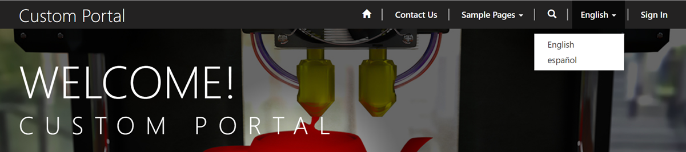
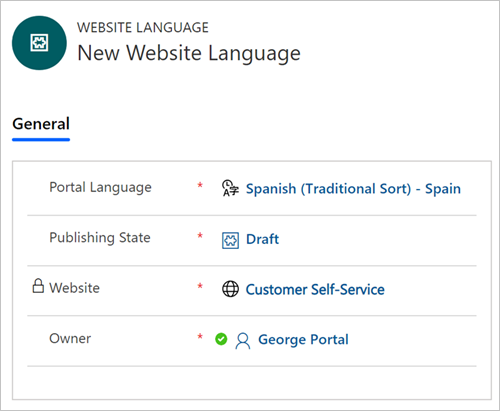
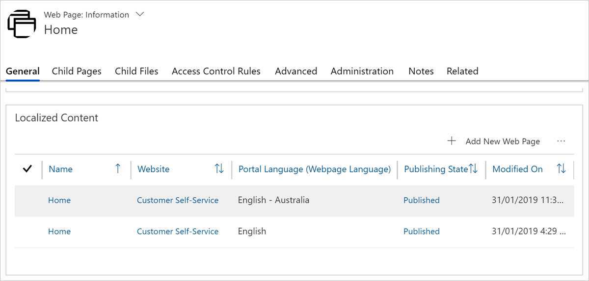

Organizations often need to serve audiences of different languages or are required to provide multi-lingual  content by law. A Power Apps portal can deliver content in multiple languages. Multiple languages are supported by creating versions of your content structure for each additional language, making it easier to translate and maintain. When a portal user selects a language, they are selecting a specific language version of your content structure.

> [!div class="mx-imgBorder"]
> 

To implement an additional language, it must first be enabled in your Common Data Service instance. Navigate to [Power platform admin center](https://aka.ms/ppac/?azure-portal=true), select the environment, select **Settings** , then **Languages**. Select and enable required languages.

> [!NOTE]
>If a portal will be in multiple languages, it is best to create the portal after all the languages you want have been activated in the organization. If you activate new languages after the portal has been provisioned, you can [import the metadata translations](https://docs.microsoft.com/dynamics365/portals/manage-portal#import-metadata-translation/?azure-portal=true) to get the metadata translated for the newly activated languages.

## Configure additional languages

**Website** record has a **Supported Languages** section where you have the option to **Add New Website Language**. When you add a new website language to a website, you need to select Portal Language and  Publishing State.

> [!div class="mx-imgBorder"]
> 

## Create language-aware content

### Web pages

Web pages have the concept of localized content pages. Localized content page is where the actual content of the web page is created/modified. You can select different templates for each of the content pages, rendering them differently depending on the language.

> [!div class="mx-imgBorder"]
> 

Once multiple languages are enabled, however, there is still a single page hierarchy structure for webpages. In each language of the portal, parent and child pages will have the same relationship. They will also all inherit the same security and web files as they would in a single language portal.

### Web Link Sets

Each supported language of a website should have corresponding Web Link Sets in the language. The Web Link Sets are specific to the language chosen. This means that the site navigation can vary for different languages of the portal. If a Web Link Set does not exist for a language, the navigation links do not appear in that language.

### Content snippets

Content Snippets can be language specific or language agnostic. When a content snippet exists with no supported language value, then it will be available in the context of all languages. Language-agnostic snippets are used to deliver content that does not require translation. It could be, for example, a company logo, or some like JavaScript processing instructions.

On the other hand, if a content snippet has a language value, then the value of the content snippet will only be available when the portal context is in that specific language.

## Browse multi-lingual portal

Site setting `MultiLanguage/DisplayLanguageCodeInURL` (true or false) controls if language is determined by URL or by per session cookie. When URL-based approach is selected, Code property of the Portal Language will be used as part of the URL `https://portal_url/<code>/page/`, e.g.`https://www.contoso.com/en-US/contact-us/`.

## Language considerations

### Multi-lingual design

There are certain areas of site design that may be affected by the language:

* Text length may vary significantly between the languages so appropriate space must be reserved.
* Typography elements such as fonts may differ and affect the layout rendering.
* Dates & currency are displayed differently depending on locale and the language used.
* There are potentially some ethical or culture-sensitive aspects that need to be taken into account when designing the look of the site, for example, use of certain images that may be considered offensive by the target audience.

Work with the template designers and use different templates to render the content pages depending on the language.

### Localization

Besides translating the site content and navigation, there are number of additional considerations that needs to be given to the multi-lingual deployment:

* You would need to be disciplined in identifying and localizing every string and phrase that could appear to the site visitor. If you are working with the developers and JavaScript is used, that means translation of error messages, status bar messages, alert boxes, dialog boxes, etc. Make extensive use of Content Snippets as they allow translation of pieces of information like error message without changing the rest of the site.
* If you use images for buttons that contain text, those too would need to be localized. You might create an image map or directory file that lets you find images for the appropriate culture by some key.
* Any communications with the portal users need to take into account their preferred language (that they can set on their user profile).
* If your Common Data Service is customized, ensure that all custom entities, fields, option sets, messages, and descriptions are translated.
* If your deployment uses 3rd-party solutions, work with the vendors to ensure that their solutions are localized into required languages.
* For deployments that use Knowledge Articles, ensure that the relevant articles are translated or, at least, create placeholders directing visitors to the base language versions where they can use browser-based translation tools such as [Bing Translate](https://www.bing.com/translator/?azure-portal=true).
