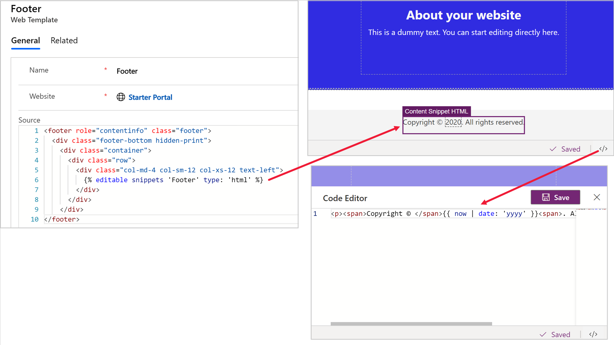
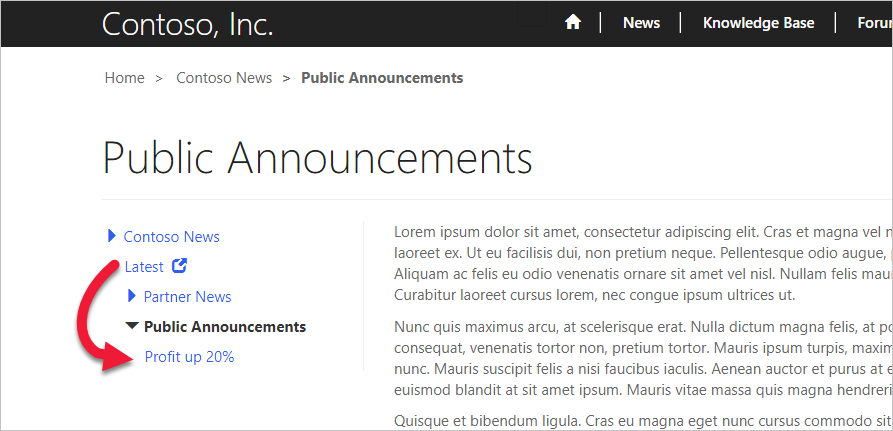

Blocks of content that can be copied and reused can help maintain the design and consistency of your portal. The Power Apps portals solution offers a few ways to reuse content.

## Content snippets

Content snippets are small chunks of editable content that can be placed by a template maker on a page template, allowing for customizable content to populate any portion of a page, including headers and footers.

New content snippets can only be created in the Portal Management app. If a template maker inserts a snippet as editable, then the portals Studio will display the **Edit** command when a user hovers over the snippet. Snippet content then can be edited by using the Source code editor.

> [!div class="mx-imgBorder"]
> 

Content managers who are editing a snippet should be aware whether the snippet is used in one place only, for example when defining the title on the portals home page, or if the snippet is used in multiple templates throughout the site, such as an official business trading name (that can change). In the latter scenario, changing the content in one place will update it wherever the snippet is used.

Snippets can contain more than text content; they can also contain HTML, layout elements, styles, or even Liquid code template processing instructions. A snippet can be used wherever the need exists to make part of a portal (not necessarily even visible) customizable and reusable.

Using snippets creates a consistent appearance and behavior for the site, which helps make it easier to translate the multilingual context and allows for focused editing of the parts of a page without affecting the overall content.

## Shortcuts

The front-side content editor can be used to create the hierarchical structure of your portal by adding child pages, child files, and child shortcuts to a webpage. A shortcut can be a link to an external URL, another webpage or web file, or a forum on your portal. Shortcuts allow you to modify the site map without actually moving content.

For example, consider scenarios when you have a **News** page that contains news categories. You might decide to list the latest company announcement as part of the news navigation. To accomplish that task, you would define a **Latest** shortcut (with the **News** page as a parent) that points to the latest announcement (which could be "buried" in the hierarchy and have a URL such as `https://www.contoso.com/news/2019/Q1/profit-up-20-percent`). As a result, your navigation would place a shortcut on a page from the hierarchy directly below the top level news categories.

> [!div class="mx-imgBorder"]
> 

Normally, the shortcut security is defined by the security target. Select **Disable target validation** to define shortcut visibility by the security that is assigned to the parent page. This action will determine whether the shortcut will be visible in the site map.

## Redirects

Redirects are useful in two scenarios:

- When you want to have a simple URL that redirects to a page that is deeper in the site. For example, if a customer support page is located at `https://www.contoso.com/customer-engagement/customer-service`, you might want to publish a URL that is simpler to remember and quicker to type, such as `https://www.contoso.com/help`.
- To allow for a legacy or erroneous URL to be used with the site and automatically redirect to a new URL in the site.

With page redirects, you can specify a URL that, when requested, will be redirected on a permanent or temporary basis to a specific webpage or web file. These redirect URLs are managed separately from the page content so that they don't have to fit directly in the web hierarchy.

> [!NOTE]
> Redirects can only be defined by using the Portal Management app.
