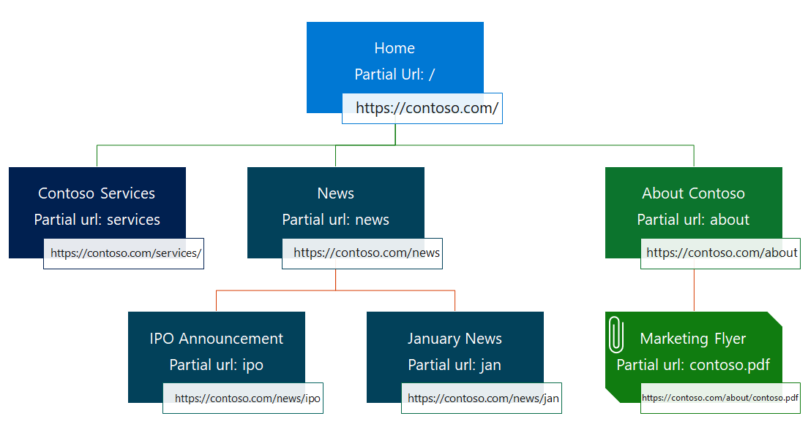
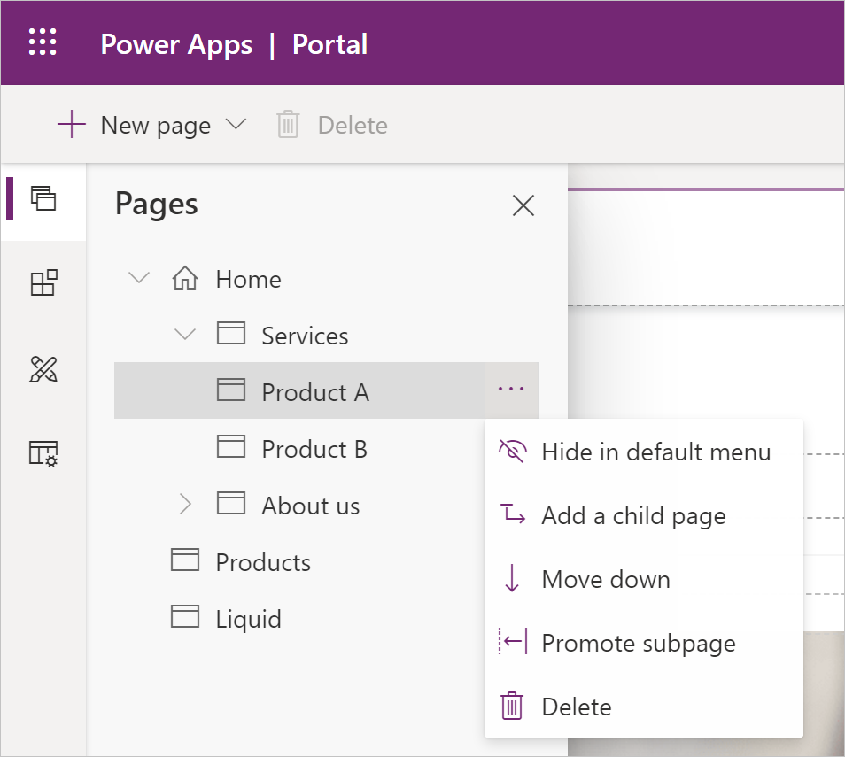
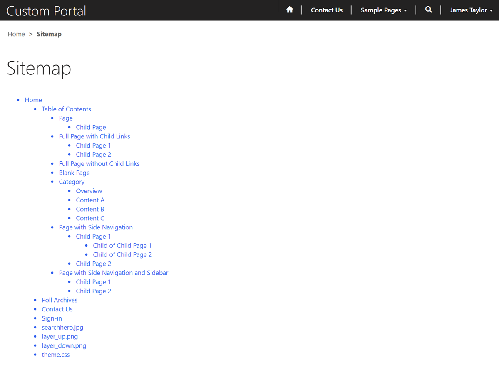
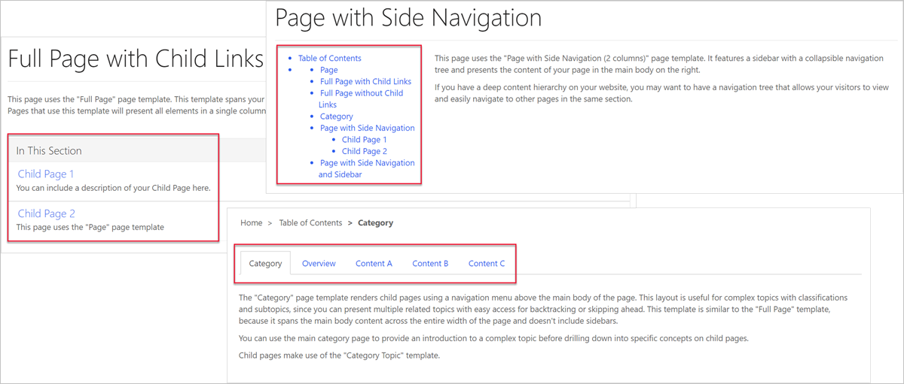

Most of a portal's content is represented by webpages. A webpage represents a particular URL in a portal's website. Portal structure is hierarchical and all webpages have a parent page, except for the single root (Home) page of a website.

Webpages also form the basis for including other, specialized entity types such as web files, shortcuts, forums, ideas, and blogs. Each of these records has a relationship with a parent page. Through parent and child relationships, these entities form the hierarchy of the website, that is, its site map.

> [!div class="mx-imgBorder"]
> 

### Child pages

You can view the parent-child relationships for a particular page by selecting the **Pages** section of the toolbelt, which will display the ordered list of the site pages. You can rearrange the page order and add, edit, delete, promote, and demote pages. Additionally, you can see whether the particular page is visible in the default menu.

> [!div class="mx-imgBorder"]
> 

### Site map

You can view your site structure at `https://portal_url/sitemap`. This site map is a visual representation of the hierarchy of the entire site, and you could use it for verification, documentation, and building navigation. You can hide the records from the site map by setting the **Hidden from Sitemap** field.

Site maps can be shaped by security. If a visitor doesn't have permissions to access a particular page, that page won't be visible for them in the site map.

> [!div class="mx-imgBorder"]
> 

The other type of site map, which is designed for consumption by search engines and web crawlers, is not included with the portal out of the box but can be created by using templates.

## Web links

A web link can link to any URL or to a webpage within the portal. It's similar to a shortcut but does not participate in the site hierarchy. In fact, web links do not exist on their own, they are always part of a web link set. After you have defined a web link set, templates can use it to build navigational elements such as main menu, footer menu, and wherever else the ordered, hierarchical list of links can be used.

When a web link is linked to a webpage, the security and publishing state of the webpage will apply to the web link as well. This feature can be disabled with the **Disable Page Validation** option of the web link.

For example, if a **Partners Only** page requires the user to sign in, it will not be visible in the navigation for anonymous visitors. However, you might want to display the link on the page, regardless of the security, so that anonymous visitors will see the **Partners Only** link but, when they select it, they will be redirected to a sign-in page.

For more information, see [Manage web links](https://docs.microsoft.com/powerapps/maker/portals/configure/manage-web-links/?azure-portal=true).

## Other navigation

The web link sets are not the only way to navigate the website. The hierarchical relationship between parent and child webpages can also be used by page templates that display links to child pages.

How the child links are rendered is entirely up to the template. Portal templates include a number of pages that demonstrate different rendering techniques for navigation.

> [!div class="mx-imgBorder"]
> 
