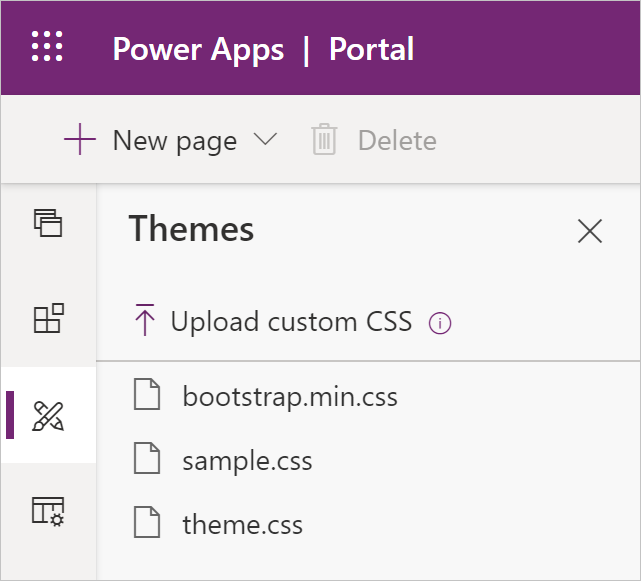

Portals use the [Bootstrap front-end framework](http://getbootstrap.com/?azure-portal=true) to control the design and layout of the web site. Bootstrap is a package of HTML and CSS design templates for typography, forms, buttons navigation and other elements, as well as optional JavaScript extensions. One of the appealing features of Bootstrap is that it offers responsive layout out of the box - it automatically adjusts your website to look good on all devices from small phones to large desktops.

## Theme fundamentals

A theme determines the appearance of all web pages in your portal to ensure visual consistency. It controls the navigational structure, the banner, colors and fonts, and other visual elements of a web page.

The web templates included in a starter portal are implemented using standard Bootstrap components with minimal additional custom styles. This means that it can take advantage of the customization options
provided by Bootstrap - the theme is easily customized in a way that's applied consistently to the entire portal.

### CSS on web pages

Cascading Style Sheets (CSS) is a language that determines the style of a web page by describing how its HTML elements are to be displayed. That includes text, fonts, colors, backgrounds borders and margins.

Making changes to the style of your portal pages can be as easy as applying CSS statements directly to a page in Custom CSS field. For example, if you need to increase the height of the navigation bar at the top of a particular page to fit a logo, you can simply editing the page and add a custom CSS statement.

```css
.navbar-static-top.navbar { min-height: 100px; background-color:gold; }
```

> [!NOTE]
>CSS statements added directly to a web page will only apply to that web page only.

This works for quick small adjustments on a single page but better approach, of course, is to record customizations in one or more CSS files and apply them to the entire portal or parts of it.

## Apply customizations

Customizations are applied by adding a Web File containing CSS, to your site. The CSS contained in the web file applies to the file's parent page and all descendants of that page. That makes it possible to build fully customized sections of your site.

For example, if you want to apply different styling to your News section and all the new articles below, navigate to News, create a child Web File with **.css** extension, upload your CSS file (the name does not matter), and the style will be applied to the News section and its content only.

> [!IMPORTANT]
>The partial URL must end in **.css** for the portal to recognize it and apply it to the web page and its child pages.

Any starter portal has two files already included `bootstrap.min.css` and `theme.css` as child web files of the home page.  These files define default styles and theme for your entire portal. Additional stylesheets can be uploaded and edited in Portal Studio using **Themes** section on the toolbelt.

> [!div class="mx-imgBorder"]
> [](../media/css-edit.png#lightbox)

You need to consider how to approach style modifications for your portal:

* Create complete styling for the entire site and replace the content of the .css above. It works well if you have access to good designers who can ensure that all relevant elements are defined. This approach creates centrally controlled styling and ensures consistency throughout the portal.
* Redefine only the elements requiring modifications, for example, colors, and font size. Create and upload CSS file containing just these incremental adjustments. This works well if your target design is close to the starter portal design and only minor styling modifications are required. This approach allows incremental modifications that can be easily undone.

> [!WARNING]
>If you decide to overwrite `bootstrap.min.css` or `theme.css` files, make sure you download a backup copy of these files prior to replacing them. If your replacement CSS is invalid or incomplete, you will not be able to undo the replacement. You will have to restore the content of these files, potentially using Power Apps portals App if the portal is rendered non-functional.

### Customize bootstrap

The standard way to create a custom version of Bootstrap is [through the official Bootstrap site](http://getbootstrap.com/customize/#less-variables/?azure-portal=true). However, due to the popularity of Bootstrap, many third-party sites have also been created for this purpose. These sites might provide an easier-to-use interface for Bootstrap customization or predesigned versions of Bootstrap for you to download. [The official Bootstrap customize](http://getbootstrap.com/customize/?azure-portal=true) site has more information about Bootstrap customization.

> [!TIP]
>When customizing Bootstrap, only select elements requiring modifications. For example, if you just would like to replace the fonts with your corporate standard fonts, just select Typography components of Bootstrap. That will reduce chances of accidentally rewriting other CSS elements.

Once Bootstrap is customized, it will generate one or more files that you would want to upload as Web Files. Unless your intent is to completely *replace* the original styles, make sure not to use `bootstrap.css`, `bootstrap.min.css`, `theme.css`, or `theme.min.css` in your partial URLs because of how the portal handles multiple CSS files.

### Background images

When starting portal customizations, one of the most common asks is to replace the background images. These images are applied using CSS but can easily be replaced without changing CSS. Look for .jpg Web Files under the portal's Home page, for example `forumhero.jpg`. Replace the attachments of these Web Files with your own images and that is all that's required. Make sure that the size of the new images is compatible to maintain consistent layout.
