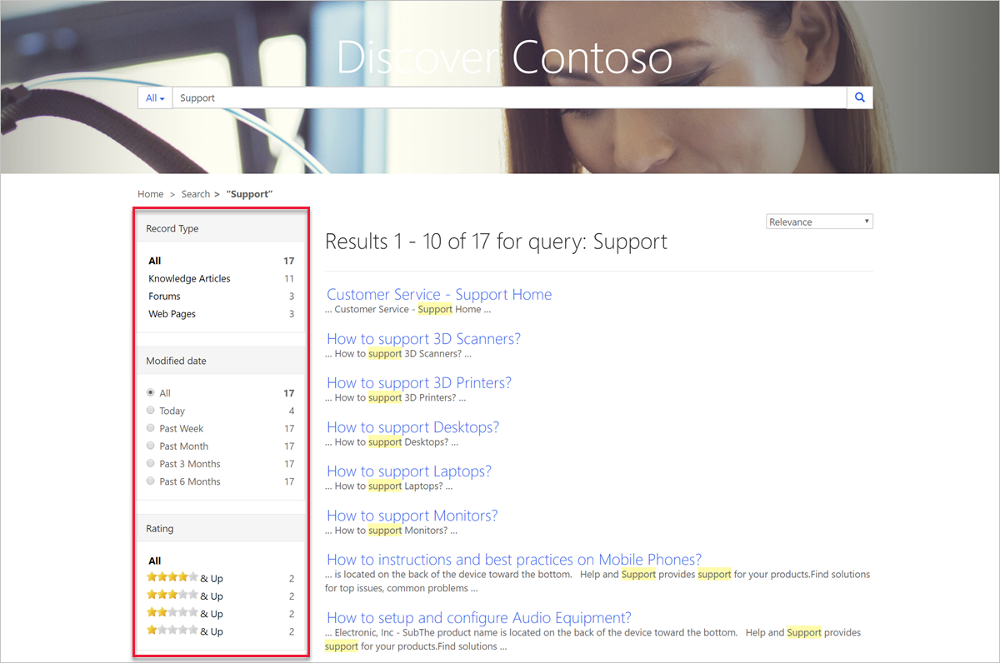

In Power Apps portals, you can search for records across multiple entities by using the portal’s global search functionality. You can also search within records of entity lists by using entity list search functionality.

## Global search

Global search of Power Apps portals allows you to search for records across multiple entities. It also allows you to search across multiple columns and configure what columns of an entity would be searchable.

Among the benefits of global search are its ability to:

- Find matches to any word in the search term in any field in the entity. Matches can include inflectional words like stream, streaming, or streamed.
- Return results from all searchable entities in a single list, sorted by relevance, based on factors like number of words matched or their proximity to each other in the text.
- Highlight matches in the search results.
- Provide facet options that can be used to further filter search results.

### Searchable entities

The aim of global search is to locate information within the site content. All content is located within the entities that are installed with Dynamics 365 Portals solutions and, depending on the starter portal that has been selected, the following entities can be searched: **Web Page**, **Web File**, **Knowledge Article**, **Forums**, **Blogs**, **Ideas**, **Incident (Case)**. Directly related entities are also searched, for example, a *blog* search also includes the **Blog Post** and **Blog Comment** entities.

Each of the mentioned entities includes a **Portal Search** view that defines a set of fields that are searchable within the entity. You can change the columns that are defined in these views and publish the changes to modify the scope of the search. The name of the view is defined by the site setting `Search/IndexQueryName` and can be changed.

> [!NOTE]
> After changing the views or the view name, you need to rebuild the index as documented in the [Rebuild full search index](https://docs.microsoft.com/powerapps/maker/portals/configure/search#rebuild-full-search-index/?azure-portal=true) article.

Knowledge articles have a feature that allows you to mark an article as **Internal Only**. Articles are searchable only if they are published and their **Internal Only** field is set to **false**.

Notes and attachments on knowledge articles and web files are searched as well. For more information, see [Search within file attachment content](https://docs.microsoft.com/powerapps/maker/portals/configure/search-file-attachment/?azure-portal=true).

All other entities, both system and custom, that might have been used to generate portal content are not part of the global search. They cannot be added to the global search, but targeted search functionality is available. For example, if an entity is used to generate a list of records on a page, that list can include search capabilities.

## Faceted search

Portal content can be searched by using filters based on characteristics of the content. The filters that are implemented by a faceted portal search allow customers to find the content that they want quicker than a traditional search.

Faceted search enables portals to have search filters that allow you to choose between items like forums, blogs, pages, and knowledge articles. More filters are available for specific search types. For example, knowledge articles can be filtered by Record Type, Modified Date, Rating, and Products to help customers find the content they need.

> [!div class="mx-imgBorder"]
> 

Faceted search can be enabled or disabled by using the `Search/FacetedView` site setting. Individual parts of faceted search can be disabled by deactivating specific entity views in Dynamics 365. Similar entities can be grouped together, for example, the search result type **Documents** describes both knowledge article attachments and web files.

For more information, see [Use faceted search to improve portal search](https://docs.microsoft.com/powerapps/maker/portals/configure/improve-portal-search-faceted-search/?azure-portal=true).

## Configuration

Global search is highly configurable, and configuration is available for both functionality and user interface for the search results.

### Related site settings

Every aspect of the global search functionality can be configured by using the site settings that are described in detail in [Related site settings](https://docs.microsoft.com/powerapps/maker/portals/configure/search#related-site-settings/?azure-portal=true).

### Content snippets

Visual aspects of the global search functionality can be configured by using relevant content snippets, which define elements of the search user interface, including faceted search. The configurable elements include captions, titles, tooltips, buttons, and others. Because content snippets are language-aware, you can adapt the appearance and behavior of the search for the multilingual audience.

For more information, see [Related content snippets](https://docs.microsoft.com/powerapps/maker/portals/configure/search#related-content-snippets/?azure-portal=true).

### Attachment search

Power Apps portals allows you to index and search knowledge article and web file attachments. By default, this search is switched off but can be enabled by using site settings.

> [!IMPORTANT]
> Power Apps **Relevance Search** must be enabled for attachment search. For more information, see [Relevance search](https://docs.microsoft.com/powerapps/user/relevance-search/?azure-portal=true).

You can exclude individual web files from the search by setting the **Exclude From Search** field to **Yes**.

Other aspects of attachment search can be modified by using additional site settings or templates. For more information, see [Search within file attachment content](https://docs.microsoft.com/powerapps/maker/portals/configure/search-file-attachment/?azure-portal=true).
