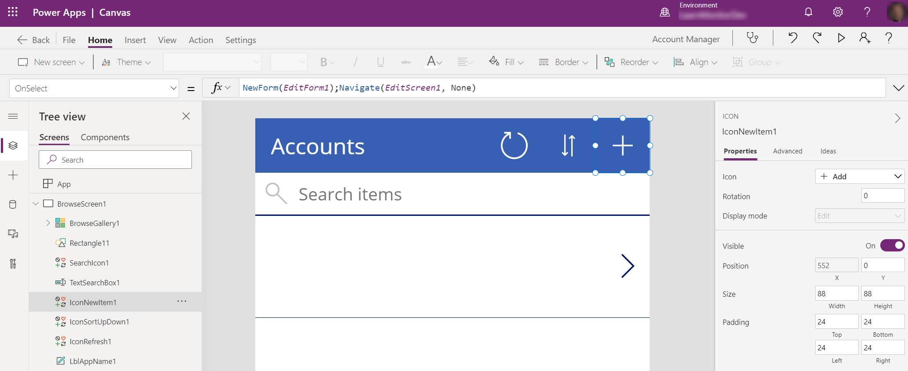
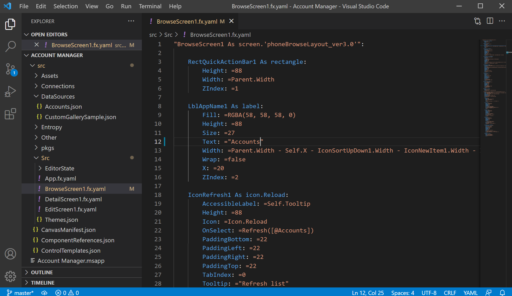
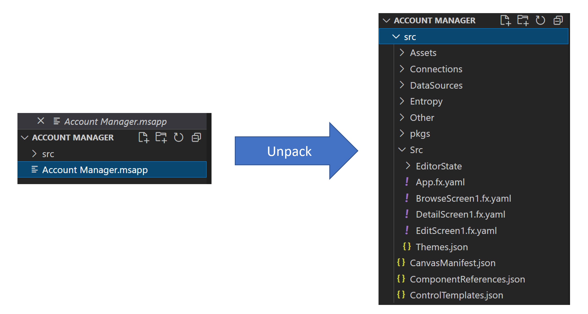
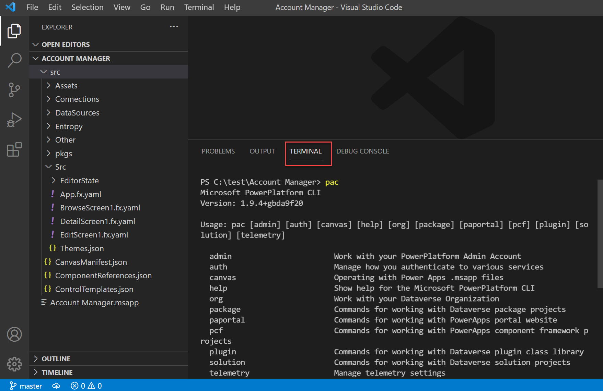

When you edit a canvas app in Power Apps Studio, you see a visual representation of the app.

> [!div class="mx-imgBorder"]
> 

You can drag and drop a control on the screen, use the formula bar to edit your expressions and the properties panel to edit control property values. Using these tools is how most makers create and modify apps.

You can save a copy of a canvas app to your computer as a single file with .msapp extension. If the canvas app is a part of a Dataverse solution, then you can use the [Power Platform CLI (command line interface)](/powerapps/developer/data-platform/powerapps-cli/?azure-portal=true) to download the solution and extract the app. The app file is self-contained and represents the entire app including screens, controls, components, connections, formulas, and so on. Internally, however, it contains many separate files, each describing a part of the app. You can use the unpack feature of the Power Platform CLI to extract these files. Once unpacked, most of the files can be edited using any text editor. Below is the same app opened in Visual Studio Code after it's unpacked.

> [!div class="mx-imgBorder"]
> 

Unpacking the canvas app into individual text files enables the following scenarios:

-   Edit the source code directly in a text editor instead of a visual designer. For example, doing global find and replace would be much easier and faster in a text editor.

-   Store individual text files in source control allowing granular tracking of changes in an app. For example, you could easily look back to see when a label in the app was changed from x to y and who made the change.

-   Use automated development tools that rely on source code. For example, static code analysis, code generators, templates, and so on.

The source to your app is represented by a subset of [YAML](https://yaml.org/?azure-portal=true). YAML is a human friendly data serialization language. We'll cover how to work with YAML in a separate topic in this module.

## Power Platform CLI 

The [Power Platform CLI](/powerapps/developer/data-platform/powerapps-cli/?azure-portal=true) (CLI)is a command-line tool that can be used for many development and administrative tasks in Microsoft Power Platform. For example, building Power Apps Component Framework components, managing environments, working with solutions and portals, and more. The CLI can be used from a simple command prompt, as part of an automated build, or from the terminal in Visual Studio Code.

In this module, we focus on the canvas app and solution functionality of the CLI. You can review the other capabilities and how they work in the [product documentation](/powerapps/developer/data-platform/powerapps-cli#common-commands/?azure-portal=true). You can download and install [Microsoft Power Platform CLI](https://aka.ms/PowerAppsCLI/?azure-portal=true). If you already have the CLI installed, ensure you have the latest version using the following command:

	`pac install latest`

### Canvas unpack command

When you download a canvas app from the cloud, it's a single file with a .msapp extension. The canvas unpack command takes this file as input and "unpacks" it into multiple files that represent the different parts of the app. For example, each screen in the app will have its own file in the output from the command.

To unpack a canvas app .msapp file you would use the following command:

	`pac canvas unpack --msapp "Account Manager.msapp" --sources src`

The target output folder is identified by sources switch using the [following folder structure](/powerapps/developer/data-platform/powerapps-cli?azure-portal=true#folder-structure).

> [!div class="mx-imgBorder"]
> 

### Canvas pack command

The canvas pack command does the reverse of the unpack command by taking the folder containing individual files and "packing" it back into a single .msapp file. To pack the app so it's ready for upload to the cloud or to be included in a solution use this command:

	`pac canvas pack --msapp "Account Manager.msapp" --sources src`

### Solution commands

You can get the .msapp file for your canvas app from the maker portal by downloading the individual app. If you're using solutions to hold your apps and flows, then exported solution will contain the .msapp file for each canvas app in the solution. Using the CLI and the solution unpack command you can extract the individual .msapp files from the solution. The following is an example of the solution unpack command:

	`pac solution unpack --solution-zip C:\SampleSolution.zip --folder .\SampleSolutionUnpacked\.`

In the SampleSolutionUnpacked folder, you would find a CanvasApps subfolder containing the .msapp file for each app included in your solution.

Similar to canvas pack, the solution pack reassembles the files into a solution you could import to a cloud environment. Below is an example of the command:

	`pac solution pack --solution-zip C:\SampleSolution.zip --folder .\SampleSolutionUnpacked\.`

## Power Platform vs Code Extension

The Power Platform extension makes it possible to use the Power Platform CLI from within VS Code. When you install the extension, it installs the latest Power Platform CLI for use within a VS Code terminal window.

> [!div class="mx-imgBorder"]
> 

Using the extension, you can pack and unpack your canvas apps without leaving VS Code. Use the same commands we discussed above with the standalone CLI.

## Source control 

Unpacking a canvas app creates many files and makes it possible to commit the individual files to source control for each change. These steps can become a part of your overall [Power Platform ALM strategy](/power-platform/alm/?azure-portal=true). By committing the individual files to source control, you get much more granular tracking of the changes that you made. More specifically, if you commit just the .msapp file the only differencing between the versions is to note that "something" has changed. By unpacking and committing the individual files, you can get line by line differencing and highlight what has changed in each commit. Combined with work item tracking you get requirements traceability all the way down to the change that was made to support the work item.

In the rest of the module we will explore more detail how to work with source control from your canvas app.