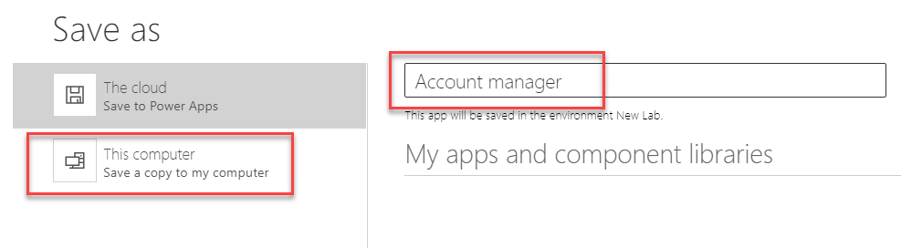
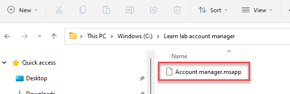
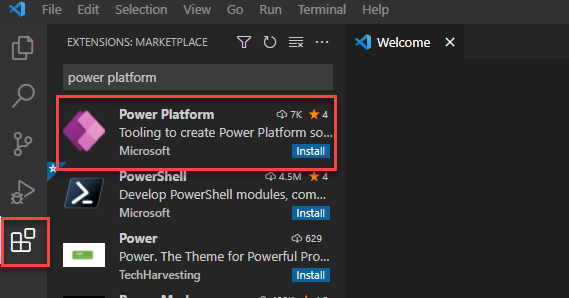
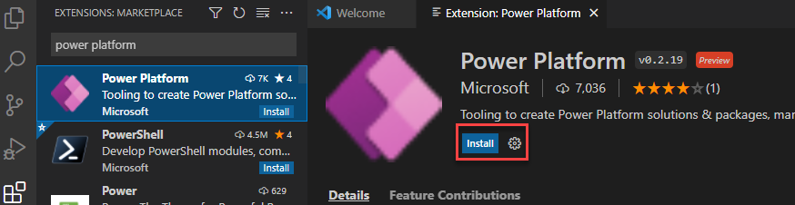
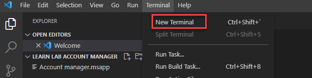
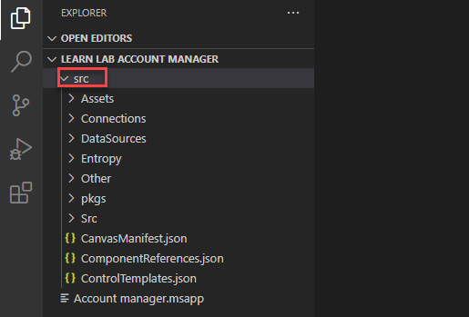

In this exercise scenario, you have been asked to create an account management app for your organization. One development requirement within your organization is for the source of any in-house app to be available in text format. This requirement allows the company to perform an automatic scan of the source code for potential copyright infringement.

You decided to create a canvas app and to make the app source available in text format.

## Requirement

To complete this exercise, make sure that you have a Microsoft Dataverse environment with database installed.

## Objectives

The objectives for this exercise are for you to learn how to:

- Create a canvas application and download it to your computer.

- Install the Power Platform extension for Visual Studio Code.

- Unpack a canvas application in Visual Studio Code.

## Exercise 1: Create an app 

In this exercise, you will create an account management canvas application and save it to your local machine.

### Task: Create an application

In this task, you will create an application and save it to your local machine.

1.  Go to [Power Apps maker portal](https://make.powerapps.com/?azure-portal=true), sign in, and then select the environment that you want to use for this lab.

1.  Select **Home > Dataverse**.

	> [!div class="mx-imgBorder"]
	> 

1.  If Microsoft Dataverse is selected, skip to the next step. Otherwise select **+ New connection > Microsoft Dataverse**.

1.  Select **File > Create**.

1.  Select the Accounts table and then select **Connect**.

1.  Select **Cloud**, enter **Account manager** for **Name**, and then select **Save > Save As**.

1.  Select **This computer**.

	> [!div class="mx-imgBorder"]
	> 

1.  Select **Download**.

1. Create a new folder on your computer and name it **Learn lab account manager**.

1. Move the downloaded app to the folder that you created.

	> [!div class="mx-imgBorder"]
	> 

## Exercise 2: Install tools and unpack

In this exercise, you will install Visual Studio Code, install the Power Platform extension for Visual Studio, and then unpack the canvas application.

### Task: Install tools

In this task, you will install Visual Studio Code.

1.  Go to [Download Visual Studio Code - Mac, Linux, Windows](https://code.visualstudio.com/Download/?azure-portal=true) and select the download for your platform.

1.  Follow prompts to install Visual Studio Code.

1.  Start Visual Studio Code after installation completes.

1.  Select the **View** menu and then select **Extensions**. Search for and select **Power Platform**.

	> [!div class="mx-imgBorder"]
	> 

1.  Select **Install** and then wait for the installation to complete.

	> [!div class="mx-imgBorder"]
	> 

1.  Select the **File** menu and then select **Open Folder**.

1.  Select the **Learn lab account manager** folder that you created previously.

1.  Select the **Terminal** menu and then select **New Terminal**.

	> [!div class="mx-imgBorder"]
	> 

1.  Run the following command to unpack the Account manager application.

	`pac canvas unpack --msapp "Account manager.msapp" --sources src`

1. The unpack should succeed. Expand the **src** folder that was created.

	> [!div class="mx-imgBorder"]
	> 

1. Expand each folder inside the **src** folder and then examine the content of each.
