In this scenario, you have been asked to create an account management app for your organization. You decided to create a canvas app and to make the app source available in text format to comply with the organization's legal requirements. Your company's development policies require that all assets that are created by developers are stored in the source control repository. Source code should be committed to the repository in text format, wherever possible, to simplify the process of collaborating in a project team environment and to make the source available for automatic scanning and differencing.

## Requirements

To complete this exercise, you need to have a Microsoft Dataverse environment with database installed.

## Objectives

The goal of this exercise is for you to learn how to:

- Edit a canvas application in Visual Studio Code.

- Package a canvas application in Visual Studio Code.

- Upload a canvas application to Power Apps Studio.

- Create and initialize local and remote Git repositories.

- Synchronize local and remote repositories and work with changes.

## Prerequisite

Make sure that you have completed the prior lab from this module before starting this exercise.

## Exercise 1: Edit the application 

In this exercise, you'll edit the account manager application in Visual Studio Code.

### Task: Edit the app

In this task, you'll edit the application in Visual Studio Code.

1.  Open Visual Studio Code.

1.  If the **Learn lab account manager** folder doesn't open automatically, select **File > Open Folder**. Locate and open the **Learn lab account manager** folder.

1.  Expand the **src** folder, expand the **Src** folder, and then select **BrowseScreen1.fx.yaml** file.

	> [!div class="mx-imgBorder"]
	> [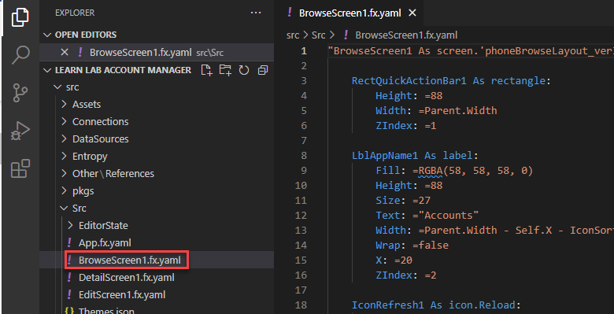](../media/browse-screen.png#lightbox)

1.  Locate **LblAppName1**.

1.  Change the **Text** value of **LblAppName1** to **Companies** and the **Size** to **28**.

	> [!div class="mx-imgBorder"]
	> [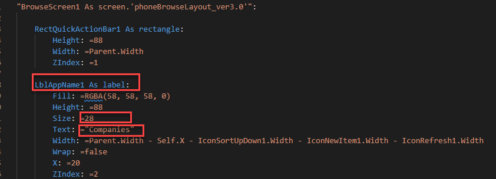](../media/text-size.png#lightbox)

1.  Locate **IconNewItem1**.

1.  Change the **Navigate** formula transition from **None** to **CoverRight**, and then add the following **Trace()** expression.

	`;Trace("New Item Selected")`

	> [!div class="mx-imgBorder"]
	> [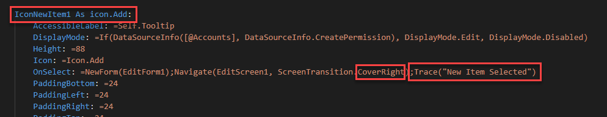](../media/formula-trace.png#lightbox)

1.  Select the **DetailScreen1.fx.yaml** file.

1.  Locate **LblAppName2**.

1. Change the **Text** value of **LblAppName2** to **Companies** and the **Size** to **28**.

1. Select the **EditScreen1.fx.yaml** file.

1. Locate **LblAppName3**.

1. Change the **Text** value of **LblAppName3** to **Companies** and the **Size** to **28**.

1. Select **File > Save all**.

## Exercise 2: Pack and upload

In this exercise, you'll package the application and upload it to your environment.

### Task: Pack and upload

In this task, you'll package and upload the application.

1.  Open **Terminal** and then run the following command.

	`pac canvas pack --msapp "Account manager.msapp" --sources src`

	> [!div class="mx-imgBorder"]
	> [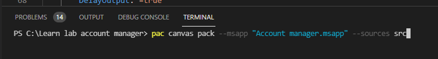](../media/package-application-command.png#lightbox)

1.  You might receive a warning message stating, **Warning PA2001: Checksum mismatch**. You can safely ignore this message.

1.  Switch to browser, go to [Power Apps maker portal](https://make.powerapps.com/?azure-portal=true), and then make sure that you are in the correct environment.

1.  Select **Apps**.

1.  Select the **Account manager** app and then select **Edit**.

1.  Select **File > Open > Browse**.

	> [!div class="mx-imgBorder"]
	> [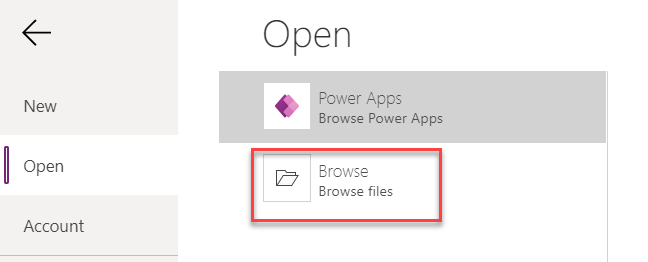](../media/browse.png#lightbox)

1.  Select the **Account manager.msapp** file that is located in the **Learn lab account manager** folder and then select **Open**.

	> [!div class="mx-imgBorder"]
	> [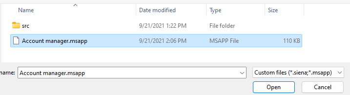](../media/import.png#lightbox)

1.  Select **Preview the app**.

	> [!div class="mx-imgBorder"]
	> [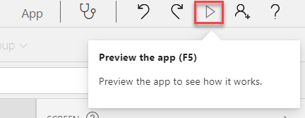](../media/preview.png#lightbox)

1.  The label text should show the changes that you made in Visual Studio Code. Select the plus (**+**) icon to add a new account.

	> [!div class="mx-imgBorder"]
	> [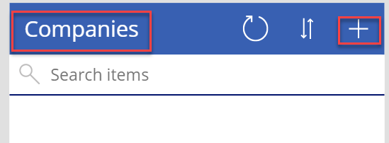](../media/add-account.png#lightbox)

1. The label text should show the changes that you made in Visual Studio Code. Fill out the form and then select **Save**.

	> [!div class="mx-imgBorder"]
	> [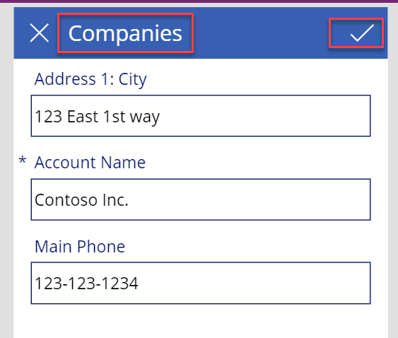](../media/create-account.png#lightbox)

1. Select to open the new account.

1. The label text should show the changes that you made. Close the app preview.

	> [!div class="mx-imgBorder"]
	> [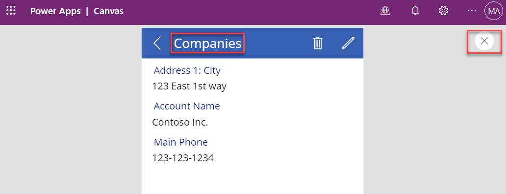](../media/close.png#lightbox)

1. Select **File > Save**.

1. Select **Publish**.

1. Select **Publish this version** and then wait for the publishing process to complete.

## Exercise 3: GitHub (Optional)

In this exercise, you'll create a new repository in GitHub, initialize the repository, and then work with changes.

### Task 1: Initialize the remote repository

In this task, you'll initialize the remote repository.

1.  Go to [GitHub](https://github.com/?azure-portal=true) and sign in. If this is your first time, select **Sign up** and then follow the prompts to complete the sign-up process.

1.  Select the plus (**+**) button and then select **New repository**.

	> [!div class="mx-imgBorder"]
	> [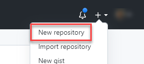](../media/new-repository.png#lightbox)

1.  Enter **Contoto\_Man** for the **Repository name**, select **Private**, and then select **Create repository**.

	> [!div class="mx-imgBorder"]
	> [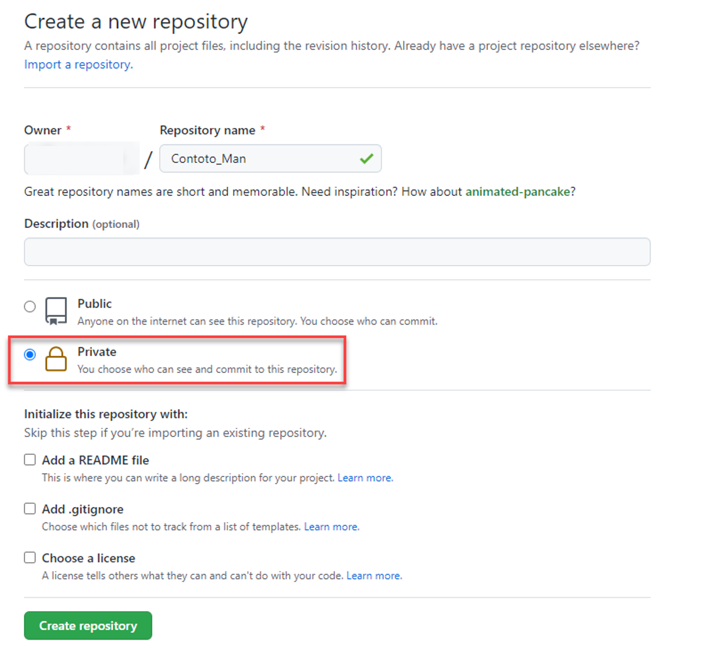](../media/private.png#lightbox)

1.  Copy the **URL** and then paste it in Notepad to use later.

	> [!div class="mx-imgBorder"]
	> [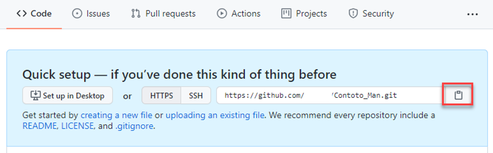](../media/copy-url.png#lightbox)

### Task 2: Initialize the local repository

In this task, you'll initialize the local repository.

1.  Open Visual Studio Code.

1.  If the **Learn lab account manager** folder doesn't open automatically, select **File > Open Folder**. Locate and open the **Learn lab account manager** folder.

1.  Select the **View** menu and then select **SCM** (source control manager).

1.  Select **Initialize Repository**.

	> [!div class="mx-imgBorder"]
	> [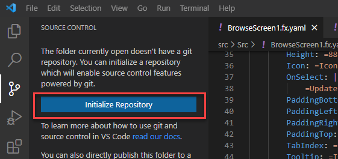](../media/initialize-repository.png#lightbox)

1.  Hover the cursor over the **Changes** option and then select the plus (**+**) icon to **Stage All Changes**.

	> [!div class="mx-imgBorder"]
	> [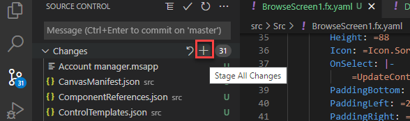](../media/stage-changes.png#lightbox)

1.  Type **Initial commit** for the message and then select **Commit** (checkbox button).

	> [!div class="mx-imgBorder"]
	> [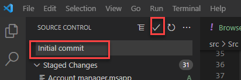](../media/initial-commit.png#lightbox)

### Task 3: Add and sync a remote repository

In this task, you'll add a remote repository and then sync the repository.

1.  Select the ellipsis (**...**) button and then select **Remote > Add Remote**.

	> [!div class="mx-imgBorder"]
	> [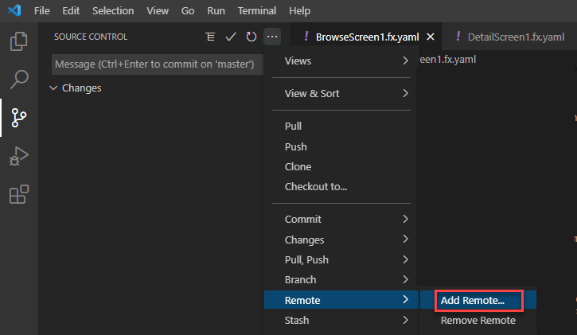](../media/add-remote.png#lightbox)

1.  Paste the repository URL that you copied previously and then select **Add remote from URL**. Sign in if prompted.

	> [!div class="mx-imgBorder"]
	> [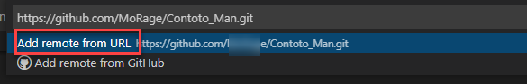](../media/add-remote-url.png#lightbox)

1.  Type **Origin** as the remote name and then press the **Enter** key.

	> [!div class="mx-imgBorder"]
	> [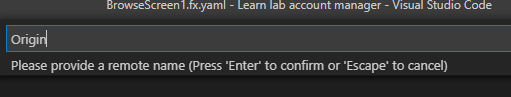](../media/origin.png#lightbox)

1.  Select the ellipsis (**...**) button and then select **Pull, Push > Sync**.

	> [!div class="mx-imgBorder"]
	> [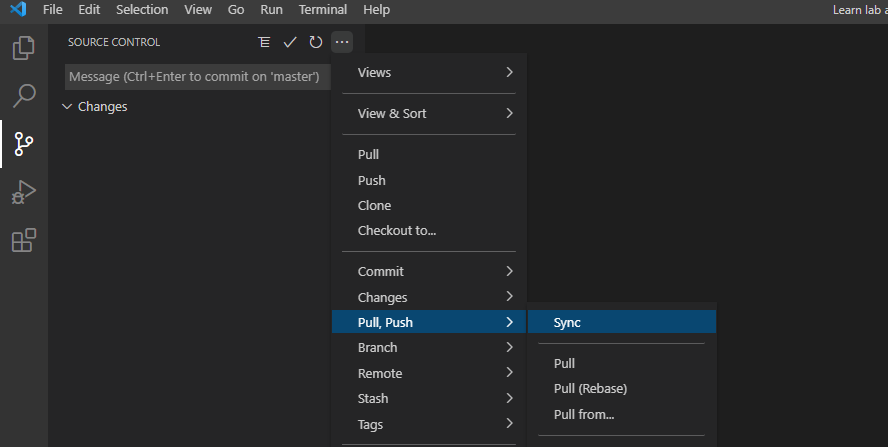](../media/sync.png#lightbox)

1.  Select **OK**.

1.  Go to GitHub and open the **Contoso_Man** repository.

1.  Select to open the **src** folder.

	> [!div class="mx-imgBorder"]
	> [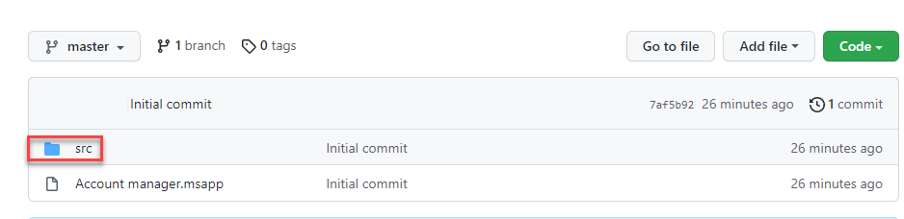](../media/repository-folder.png#lightbox)

1.  Examine the contents of the folder.

### Task 4: Work with changes

In this task, you'll work with the changes.

1.  Switch to Visual Studio Code and then select the **BrowseScreen1.fx.yaml** file.

1.  Locate **IconNewItem1** and then change the **Navigate** formula transition from **CoverRight** to **UnCover**.

	> [!div class="mx-imgBorder"]
	> [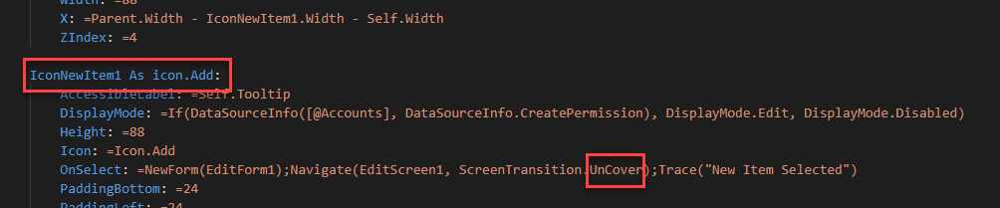](../media/navigate-formula-transition.png#lightbox)

1.  Select **File > Save all**.

1.  Select **Source Control > Stage all changes**.

	> [!div class="mx-imgBorder"]
	> [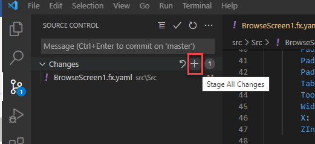](../media/stage-changes-2.png#lightbox)

1.  Type **Change transition as per UX guidelines** for the message and then select **Commit** (checkbox icon).

	> [!div class="mx-imgBorder"]
	> [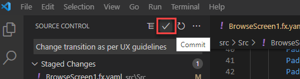](../media/commit.png#lightbox)

1.  Select the ellipsis (**...**) button and then select **Push**.

1.  Return to GitHub and open the **Contoso_Man** repository.

1.  Select to open the commit.

	> [!div class="mx-imgBorder"]
	> [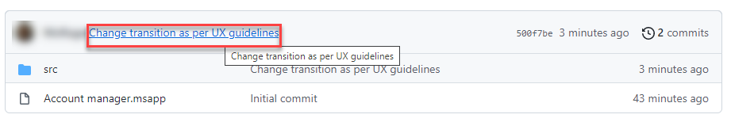](../media/open-commit.png#lightbox)

1.  Review the changes.

	> [!div class="mx-imgBorder"]
	> [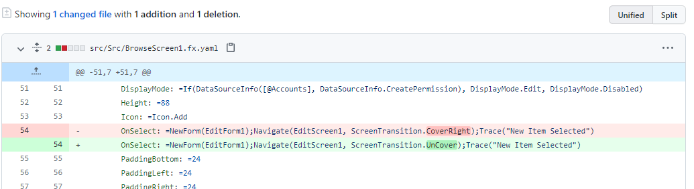](../media/review-changes.png#lightbox)
