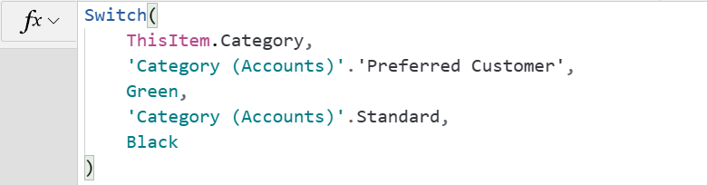
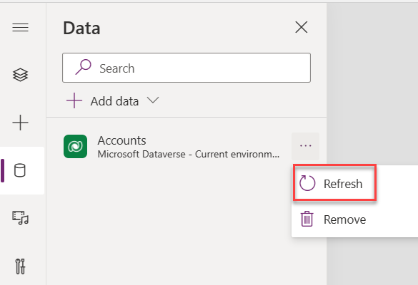
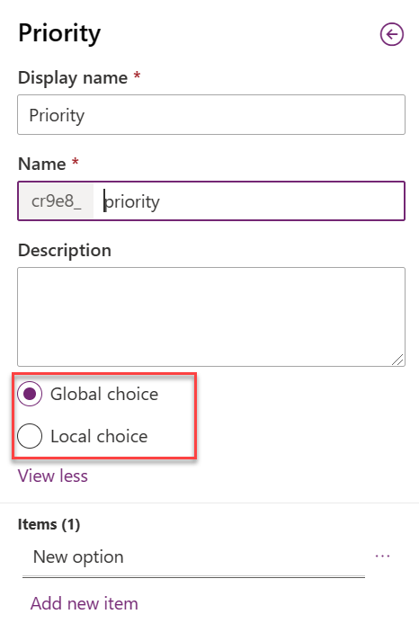
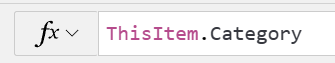
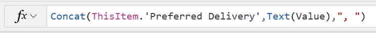

A common business app data storage requirement is to have a data column that has a standardized, infrequently changing list of values to help ensure data consistency. Users entering data would choose an option from a list instead of typing a free-form value. Examples include list of countries, incident priority, satisfaction rating, and so on.

Microsoft Dataverse has two table column types, **Choice** and **Choices**, to support this concept. Choice columns allow a user to pick a single value from the list and choices columns allow selecting multiple. Both choice and choices columns can use a single list of known values. For example, Primary Category could be a choice column and Other Categories could be a choices column allowing multiple. In this example, both could have the same list of categories.

The list of known choice values for a choice or choices column is defined by the system or a customizer and stored as table column metadata. Unlike application data, only an app maker can modify it, and not a user of an app. A benefit of this is when you're building an app that works with a list of values. Your formulas can use the name of the choice list and the display name of the values in the formula. For example, the following formula sets a color on an item's fill property based on the Category column that is a choice column.

> [!div class="mx-imgBorder"]
> 

As you compose this formula, the editor knows the possible values for the Category column and allows you to select the value to compare from the list of known values for the choice column.

> [!NOTE]
> If you add or change values on a choice list and the modified item is not showing in the editor, you must refresh the table on the data panel by selecting the ellipsis (...) next to the table and selecting **Refresh** from the pop-up menu.

> [!div class="mx-imgBorder"]
> 

## Local versus global

The list of available values can be configured as either local or global for both choice and choices columns. Local list values are used only for the column where they're defined. Global choice allows the list to be used for multiple columns in the same table or in different tables. Global is recommended to encourage reuse of the same choices unless you're confident the values only apply to that single column. The selection of global or local is made when you create a new column and a list of values and cannot be changed later.

> [!div class="mx-imgBorder"]
> 

How you reference the list of values in your formulas depends on if they're local or global. For example, if you created a choice column on the Account table named **Priority** with values **High**, **Medium**, and **Low** the following is how you would use the list of values:

**Local**: 'Priority (Accounts)'.High

**Global**: 'Priority'.High

The difference is that the local list includes the table name, **(Accounts)**. This matters because you'll need to make sure you're referencing the correct list of values.

## Displaying column values

When the data for either choice or choices columns is stored in the Dataverse row, only the numeric value is stored and not the text. For choices, a comma-separated list of numeric values is stored to represent multiple selections.

How you display values in a control such as a label is different for choice and choices columns. Choice fields can easily be used to set the value of a label to display the list text value. For example, if you had a Category choice field for category of customer you could display that in a label in a gallery using the following formula:

> [!div class="mx-imgBorder"]
> 

For columns of type choices, the property on the record is of type table. It's a single column table with a value column with each row representing a selected value. To display a user-friendly comma-separated list of text values, some pre-processing is required. For example, if we had a Preferred Delivery column that allowed choosing one or more weekdays for delivery, we'd use the following formula to set the Text property on a label.

> [!div class="mx-imgBorder"]
> 

This would result in the following display of the list of selected values:

> [!div class="mx-imgBorder"]
> 

## Choice versus lookup

One common data modeling decision is choosing between a choice column and a lookup column or a choices column and many-to-many relationship. This can affect not only how you manage the list of values but the formulas you can apply. The following are some of the differences to consider:

| Choice or choices | Lookup or many-to-many relationship |
|-------------------|-------------------------------------|
| List modified by maker, no user editing | List is just table data and normal security applies |
| Data stored as a whole number (choice) or a comma-separated list of numbers (choices) | Data stored as a table reference |
| No built-in way to inactivate or retire choice | Supports inactive state on row and can be filtered by formulas in app to limit selection |
| Treated as a solution component with full ALM support | Treated as reference data |
| Only has label and value, and only label is useable in formulas. For example, filter and sorting only on display label. | Can add other data to a look-up target table that can be used in formulas. For example, filter and sorting on any column added to table. |
| Localization built-in | Handle localization yourself |
| No built-in support of dependent choice columns. | Easier to data model and implement dependent columns (see [Create a dependent drop-down list in a canvas app](/powerapps/maker/canvas-apps/dependent-drop-down-lists/?azure-portal=true)). |

Once you create the column you can't change the data type so it's important to consider, before you create the column, how the apps and automation will be using the data.

In the rest of this module, we'll explore how to use choice and choices columns when building Power Apps canvas apps.
