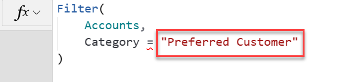
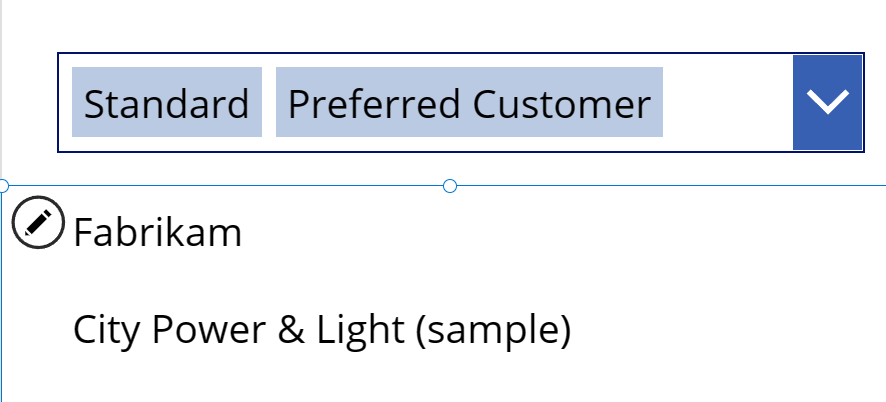
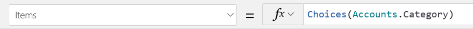
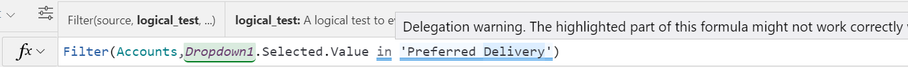
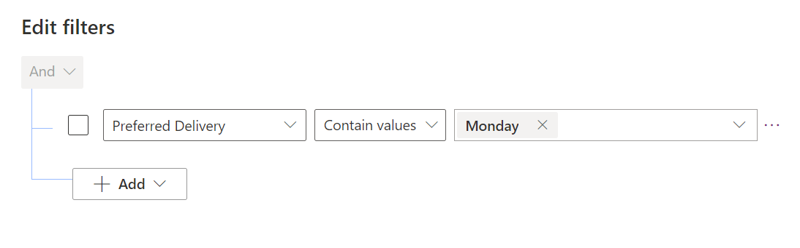

When you have a Dataverse table with choice or choices columns, you'll often want to filter the data using these columns. The following are the most common scenarios:

- Filter the table rows for display in a gallery.

- Have a drop-down or combo box control with the list of choice values and let the user select one or more. Then use the selected values to filter the table rows that you show in the gallery

For example, if we had a Category choice field on the Accounts table, we could use the following to filter only the preferred customers:

```powerappsfl
Filter(
  Accounts,
  Category = 'Category (Accounts)'.'Preferred Customer'
)
```

You might think you could just use the string "Preferred Customer," but that is invalid, and you must use the fully qualified reference: `'Category (Accounts)'.'Preferred Customer'`.

> [!div class="mx-imgBorder"]
> [](../media/invalid.png#lightbox)

In many cases, you want to use a drop-down or combo box to allow users to determine the filtered values. In the follow example, use a combo box allowing multiple selections of categories of accounts to show.

> [!div class="mx-imgBorder"]
> [](../media/categories.png#lightbox)

First, add a combo box to the screen and then set the Items property using the [Choices function](/powerapps/maker/canvas-apps/functions/function-choices/?azure-portal=true).

> [!div class="mx-imgBorder"]
> [](../media/choices.png#lightbox)

The choices function prepares a list of values for your user to select from using the metadata for the choice column **Accounts.Category**.

Next, modify the formula on the gallery to include using the combo box **SelectedItems** property.

`Filter(Accounts.Category in ComboBoxCategory.SelectedItems)`

By using the in operator, it allows it to filter on any of the categories selected.

This only shows rows in the gallery when at least one category is selected. If you want to show all rows when no categories are selected, you could add an **IsEmpty** check to your formula.

```powerappsfl
Filter(
  Accounts.Category in ComboBoxCategory.SelectedItems
  || IsEmpty(ComboBoxCategory.SelectedItems)
)
```

## Filtering choices columns

Filtering table rows on a choices column is complicated by how the data is stored in Dataverse as a comma-separated list. As a result, any filter you compose involving a choices column will receive a [delegation](https://docs.microsoft.com/powerapps/maker/canvas-apps/delegation-overview/?azure-portal=true) warning as illustrated in the following example:

> [!div class="mx-imgBorder"]
> [](../media/filter.png#lightbox)

One approach you could take is create a Dataverse table view that filtered the choices values and then used it in your filter() function criteria. This would avoid the delegation challenge but wouldn't allow the app user to provide the filter criteria values. The following is a Dataverse view filter for the Preferred Delivery choices column.

> [!div class="mx-imgBorder"]
> [](../media/edit.png#lightbox)

You could use this Dataverse view named Monday Delivery using the following filter() function:

```powerappsfl
Filter(
  Accounts,
  'Accounts (Views)'.'Monday Delivery'
)
```

You can also still include user entered criteria for other columns besides the view. For example, the following filter() function shows adding the Category choice column, which is filtered on the value selected from the drop-down list by the user.

```powerappsfl
Filter(
  Accounts,
  'Accounts (Views)'.'Monday Delivery',
  Category = Dropdown1.Selected.Value
)
```

Because of their standardized list of values, choice and choices columns are useful to provide consistent ways to filter table rows.
