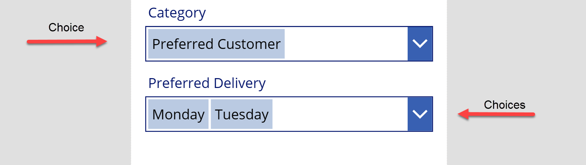
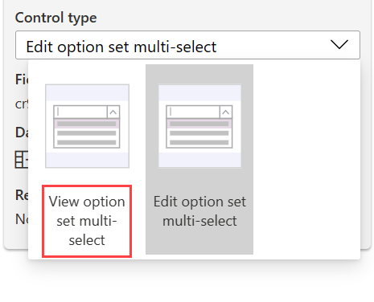
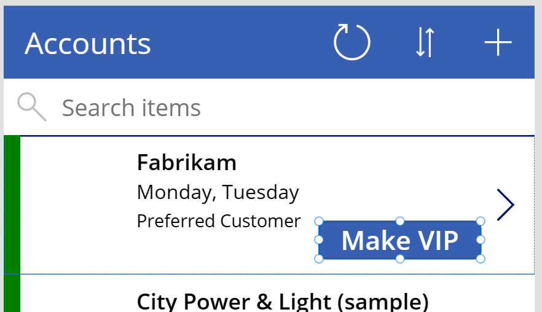

The simplest way to set a choice or choices column value is to use an [Edit form](/powerapps/maker/canvas-apps/controls/control-form-detail/?azure-portal=true). When you add a choice or choices column to the form, it sets up the field to complete the following tasks:

- Set up as either a dropdown menu (choice) or a combo box (choices).

- Use the Choices() function to populate the list of values that the user can select.

- Set the control's current value from the row's column value.

- Save the value, if it changes, to Dataverse when the SubmitForm function is called.

> [!div class="mx-imgBorder"]
> 

When a column is added to the form by default, it will be editable. If you want to display the choice or choices column on the form but not have it editable, you can change the form field **Control type** to the **View option**.

> [!div class="mx-imgBorder"]
> 

## Use patch to create or update

You can create or modify choice and choices columns by using the Patch() function. This approach is suitable when you're updating only a few fields and they require little or no user input. For example, on a gallery item, you can have a button that, when selected, will use the **OnSelect** behavior to run a Patch() function to update the row.

The following example shows that a button has been set up on the gallery item to make the account a preferred customer. When the button is selected, the goal is to set the row's **Category** choice field to **Preferred Customer**. To accomplish this task, you can add a **Make VIP** button to the gallery item.

> [!div class="mx-imgBorder"]
> 

The **OnSelect** property for the **Make VIP** button contains the Patch() formula, as shown in the following screenshot.

> [!div class="mx-imgBorder"]
> 

## Clear values

You can use the Patch() function to clear existing values from a choice or choices column by using the Blank() function. For example, the following formula would reset the **Category** column choice field on the current item in a gallery.

`Patch( Accounts, ThisItem, {Category:Blank()} )`

The same syntax would clear the value for a choices column. For example, the following formula would clear existing values for the **Preferred Delivery** choices column.

`Patch(Accounts,ThisItem,{'Preferred Delivery':Blank()})`
