In this exercise, you'll be helping Contoso add choice and choices columns to an existing Dataverse table. Then, you'll modify their **Product Management** app to use the new columns.

## Objectives

The goal for this exercise is for you to learn how to:

- Create choice column types.

- Create choices column types.

- Use filter data in the app by using the choice and choices columns.

- Use the Patch() function to update and clear column values.

## Prerequisite

To complete this exercise, you'll need an environment with Microsoft Dataverse.

## Exercise 1: Import a solution

In this exercise, you'll import a solution into your environment. This solution contains a product table and an application for product management.

### Task 1: Import the starting solution

In this task, you'll import a solution into your environment.

1. Go to the [Power Apps maker portal](https://make.powerapps.com/?azure-portal=true) and select the environment that you want to use for this lab.

1. Select **Solutions > Import**.

   > [!div class="mx-imgBorder"]
   > [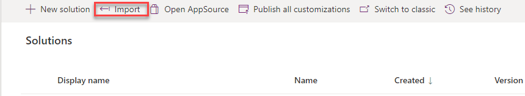](../media/import.png#lightbox)

1. Select **Browse**.

1. Browse to the lab resources folder, select the **ContosoProductChoiceLab_1_0_0_0.zip** solution, and then select **Open**.

1. Select **Next**.

1. Select **Import** and then wait for the solution importing process to complete.

### Task 2: Run the application

In this task, you'll run the **Contoso Product Management** application and add product rows.

1. Select **Apps** and then select to launch the **Contoso Product Management** application.

1. Select the **Create new product** button (the plus **+** icon).

   > [!div class="mx-imgBorder"]
   > [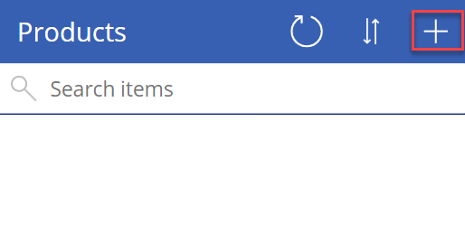](../media/new.png#lightbox)

1. Enter **Measuring Gadget** for the **Name** and then select **Save**.

   > [!div class="mx-imgBorder"]
   > [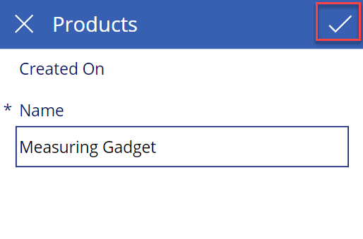](../media/save.png#lightbox)

1. Add a few more product rows.

1. You should now have at least three products.

   > [!div class="mx-imgBorder"]
   > [](../media/products.png#lightbox)

1. Close the application browser window or tab.

## Exercise 2: Create columns

In this exercise, you'll create two columns of data type choice: one for **Product visibility** and one for **Sales channels**.

> [!NOTE]
> Pay attention to which column is of data type **Choice** and which column is of data type **Choices**.

### Task: Create choices columns

In this task, you'll create two columns of data type **Choice**.

1. Go to the [Power Apps maker portal](https://make.powerapps.com/?azure-portal=true) and select the environment that you want to use for this lab.

1. Select **Solutions** and then select to open the **Contoso Choice Lab** solution that you imported.

1. Select to open the **Product** table.

1. Make sure that you have the **Columns** tab selected and then select **+ Add column**.

   > [!div class="mx-imgBorder"]
   > [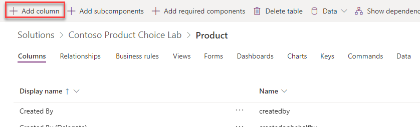](../media/add-column.png#lightbox)

1. Enter **Product visibility** for the **Display name**, select **Choice** for **Data type**, and then select the **Choice** dropdown list.

   > [!NOTE]
   > This data type is **Choice**.

   > [!div class="mx-imgBorder"]
   > [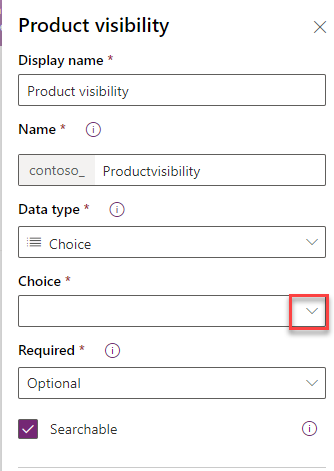](../media/choice-data.png#lightbox)

1. Select **+ New choice**.

1. Enter **Private** for the first item and then select **Add new item**.

   > [!div class="mx-imgBorder"]
   > [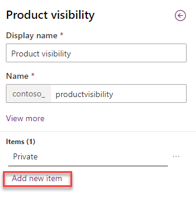](../media/add-new-item.png#lightbox)

1. Enter **Invite** for the second item and then select **Add new item**.

1. Enter **Public** and then select **Save**.

   > [!div class="mx-imgBorder"]
   > [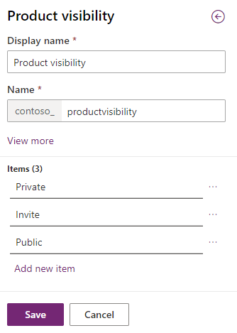](../media/public.png#lightbox)

1. Select **Done**.

1. Select **+ Add column** again.

1. Enter **Sales channels** for **Display name**, select **Choices** for **Data type**, and then select the **Choices** dropdown list.

   > [!NOTE]
   > This data type is **Choices**.

   > [!div class="mx-imgBorder"]
   > [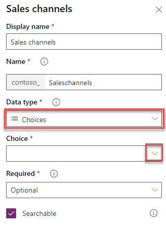](../media/choices-data.png#lightbox)

1. Select **+ New choice**.

1. Enter **Wholesale** for the first item and then select **Add new item**.

1. Enter **Retail** for the second item and then select **Add new item**.

1. Enter **Direct** and then select **Save**.

   > [!div class="mx-imgBorder"]
   > [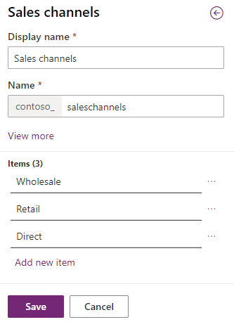](../media/save-choices.png#lightbox)

1. Select **Done**.

1. Select **Save table**.

1. Select **Solutions > Publish all customizations** and then wait for the publishing process to complete.

1. Don't navigate away from this page.

## Exercise 3: Modify form and gallery

In this exercise, you'll modify the **Edit** form and the gallery of the **Contoso Product Manager** application.

### Task: Edit application

In this task, you'll edit the **Contoso Product Manager** application.

1. Select to open the **Contoso Product Choice Lab** solution.

1. Select to open the **Contoso Product Manager** application.

   > [!div class="mx-imgBorder"]
   > [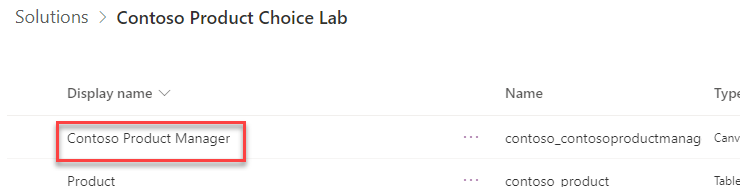](../media/manager.png#lightbox)

   The application should open in the app studio.

1. Select the **Data** tab, select the **More actions** ellipsis (**...**) button of the **Products** table, and then select **Refresh**. This action will refresh the data source and pick up the new columns that you added.

   > [!div class="mx-imgBorder"]
   > [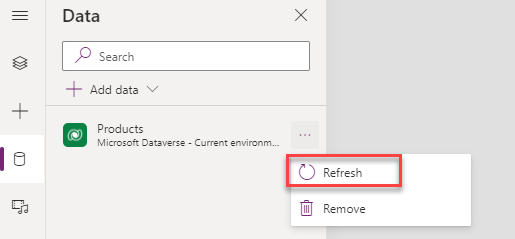](../media/refresh-data.png#lightbox)

1. Select the **Tree view** tab, expand **EditScreen1**, and then select **EditForm1**.

   > [!div class="mx-imgBorder"]
   > [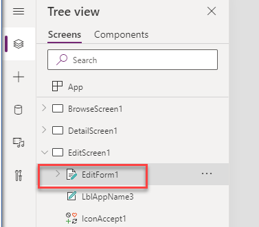](../media/edit-form.png#lightbox)

1. Select **Edit fields**.

   > [!div class="mx-imgBorder"]
   > [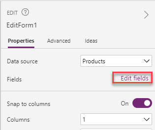](../media/edit-fields.png#lightbox)

1. Select the **More actions** ellipsis (**...**) button of the **Created On** column and then select **Remove**.

   > [!div class="mx-imgBorder"]
   > [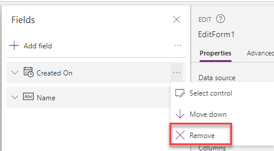](../media/remove.png#lightbox)

1. Select **+ Add field**.

   > [!div class="mx-imgBorder"]
   > [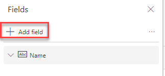](../media/add-field.png#lightbox)

1. Select the **Product visibility** and **Sales channel** columns and then select **Add**.

   > [!div class="mx-imgBorder"]
   > [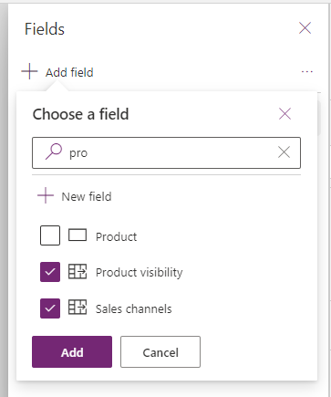](../media/add-fields.png#lightbox)

1. Close the **Fields** pane.

1. Expand **BrowseScreen1** and select **BrowseGallery1**.

   > [!div class="mx-imgBorder"]
   > [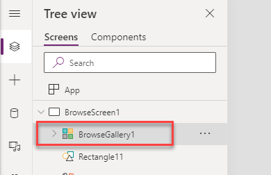](../media/browse.png#lightbox)

1. Select the **Edit** icon in the gallery.

   > [!div class="mx-imgBorder"]
   > [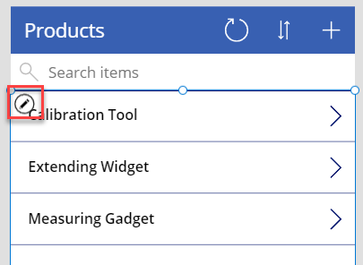](../media/edit-gallery.png#lightbox)

1. Change the **TemplateSize** to **230**.

   > [!div class="mx-imgBorder"]
   > [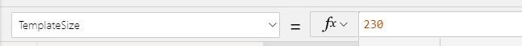](../media/size.png#lightbox)

1. Select the label inside the gallery and move it to the top of the template.
   > [!div class="mx-imgBorder"]
   > [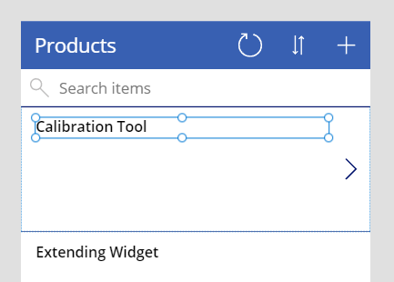](../media/top.png#lightbox)

1. While still editing the gallery, go to the **Insert** tab, select **Input**, and then select **Drop down**.

   > [!div class="mx-imgBorder"]
   > [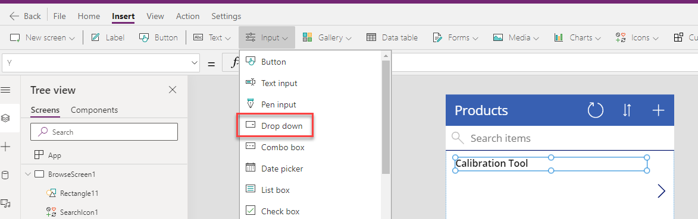](../media/drop-down.png#lightbox)

1. Resize and reposition the dropdown control and change the **Items** value of the dropdown list to the following formula.

   `Choices(Products.'Product visibility')`

   > [!div class="mx-imgBorder"]
   > [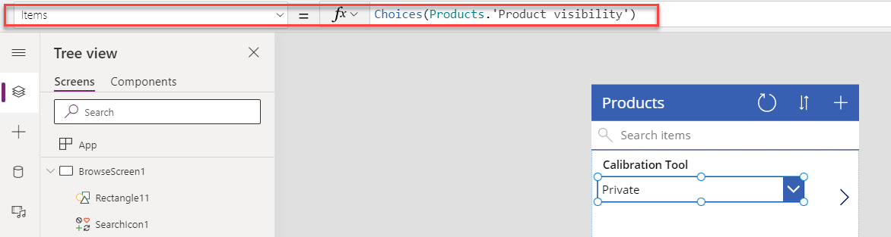](../media/items.png#lightbox)

1. Set the **Default** value of the dropdown control to the following formula.

   `ThisItem.'Product visibility'`

1. While still editing the gallery, go to the **Insert** tab and select **Label**.

1. Rename the label **Channels**.

1. Move the **Channels** label below the dropdown control and then resize it.

1. Set the **Text** value of the **Channels** label that you added to the following formula. This formula will concatenate the selected options.

   `Concat(ThisItem.'Sales channels',Text(Value),",")`

1. Make sure that you're still editing the gallery. Select **+ Insert > Rectangle**.

   > [!div class="mx-imgBorder"]
   > [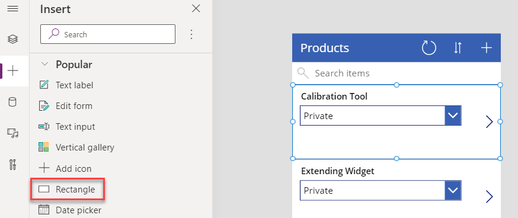](../media/rectangle.png#lightbox)

1. Set the **X** and **Y** values of the rectangle to **0**.

1. Set the **Width** of the rectangle to **6**.

1. Set the **Height** of the rectangle to **220**.

1. Set the **Fill** value of the rectangle to the following formula. This formula will give a different fill color for each choice of the **Product visibility** column value.

   `Switch(ThisItem.'Product visibility', 'Product visibility'.Private, Red, 'Product visibility'.Public, Green, 'Product visibility'.Invite, Blue, Black)`

1. Select the Gallery and then delete the **OnSelect** value.

   > [!div class="mx-imgBorder"]
   > [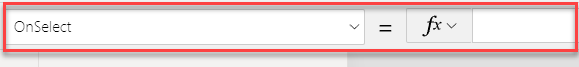](../media/on-select.png#lightbox)

1. Select **NextArrow2** inside the gallery.

   > [!div class="mx-imgBorder"]
   > [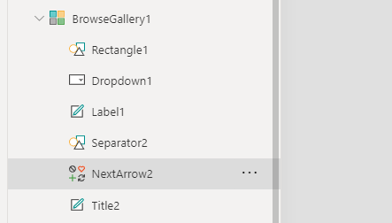](../media/next.png#lightbox)

1. Set the **OnSelect** value of **NextArrow2** to the following formula.

   `Navigate(DetailScreen1, None)`

1. Select **File > Save**.

   > [!div class="mx-imgBorder"]
   > [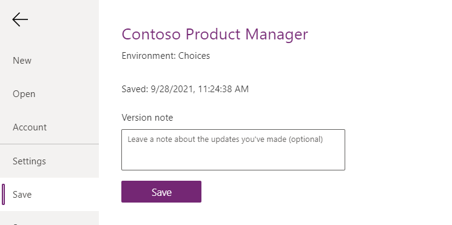](../media/file-save.png#lightbox)

1. Select the **back** button.

1. Select **Preview the application**.

   > [!div class="mx-imgBorder"]
   > [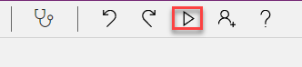](../media/preview.png#lightbox)

   The application should load.

1. Select the **Next** arrow for one of the products.

1. Select the **Edit** button.

1. Select **Sales channels**, select **Private** for **Product visibility**, and then select **Save**.

   > [!div class="mx-imgBorder"]
   > [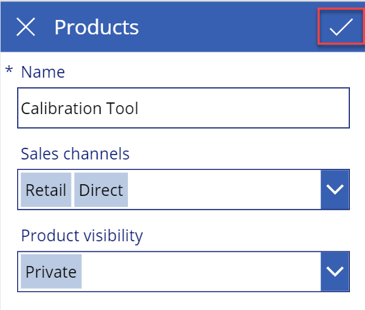](../media/save-changes.png#lightbox)

1. Select the **back** button.

1. Select to open another product.

1. Select **Edit**.

1. Select **Sales channels**, select **Public** for **Product visibility**, and then select **Save**.

1. Select the **back** button.

1. Select to open another product.

1. Select **Edit**.

1. Select **Sales channels**, select **Invite** for **Product visibility**, and then select **Save**.

1. Select the **back** button.

1. The gallery should look like the following image. When you're done viewing the results, close the preview.

   > [!div class="mx-imgBorder"]
   > [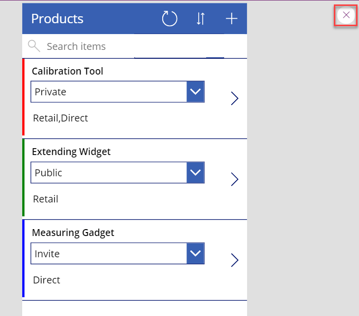](../media/products-preview.png#lightbox)

1. Don't navigate away from this page.

## Exercise 4: Use filters

In this exercise, you'll filter the gallery rows by product visibility.

### Task: Use a filter

In this task, you'll filter the gallery rows by product visibility.

1. On **BrowseScreen1**, select **TextSearchBox1**.

   > [!div class="mx-imgBorder"]
   > [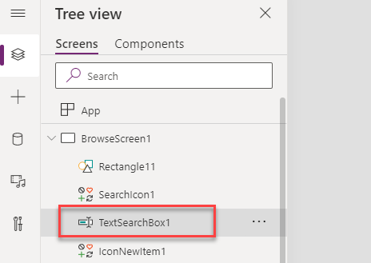](../media/text-search.png#lightbox)

1. Change the **Width** of the search box to the following formula.

   `Parent.Width/2`

1. Go to the **Insert** tab, select **Input**, and select **Drop down**.

   > [!div class="mx-imgBorder"]
   > [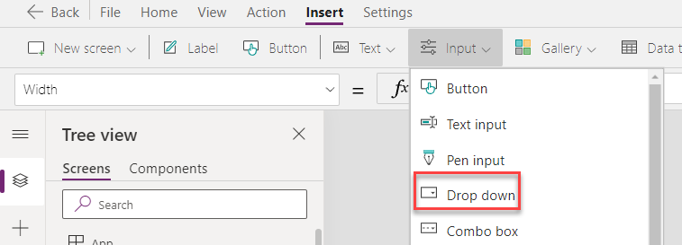](../media/drop.png#lightbox)

1. Rename the dropdown item to **Visibility filter**.

   > [!div class="mx-imgBorder"]
   > [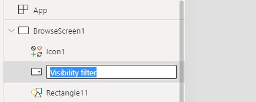](../media/visibility.png#lightbox)

1. Resize and reposition the **Visibility filter** and then place it to the right of the search box.

   > [!div class="mx-imgBorder"]
   > [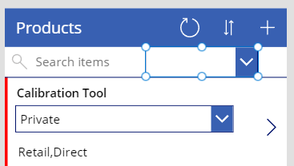](../media/resize.png#lightbox)

1. Set the **Items** value of the **Visibility filter** to the following formula.

   `Choices(Products.'Product visibility')`

1. Set the **AllowEmptySelection** value of the **Visibility filter** to **true**.

1. Set the **Default** value of the **Visibility filter** to the following formula.

   `Blank()`

1. Go to the **Insert** tab, select **Icons**, and then select **Cancel**.

1. Resize and reposition the **icon** and then place it to the right of the dropdown arrow.

   > [!div class="mx-imgBorder"]
   > [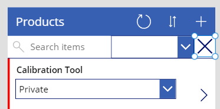](../media/icon.png#lightbox)

1. Set the **OnSelect** value of the icon to the following formula.

   `Reset('Visibility filter')`

1. Set the **Visible** value of the icon to the following formula.

   `If(IsBlank('Visibility filter'), false,true)`

1. Select **BrowseGallery1** and then change the **Items** value to the following formula. This formula changes the existing formula to include a Filter() function that uses the user-selected values.

    ```powerappsfl
    SortByColumns(
        Search(
            Filter([@Products],IsBlank('Visibility filter'.Selected) || 'Product visibility' = 'Visibility filter'.Selected.Value),
            TextSearchBox1.Text,
            "contoso_name"
        ),
        "contoso_name",
        If(
            SortDescending1,
            Descending,
            Ascending
        )
    )
    ```

   > [!div class="mx-imgBorder"]
   > [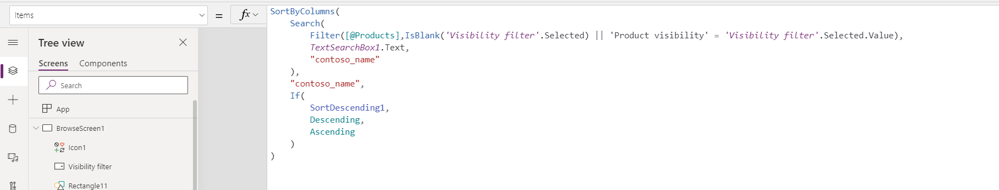](../media/formula.png#lightbox)

1. Select **Preview the application**.

1. Change the **Visibility filter** to **Private**. The gallery should show only the private products.

   > [!div class="mx-imgBorder"]
   > [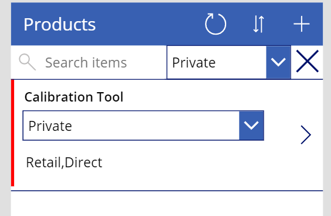](../media/filtered.png#lightbox)

1. Select the **X** icon. The gallery should show all products.

   > [!div class="mx-imgBorder"]
   > [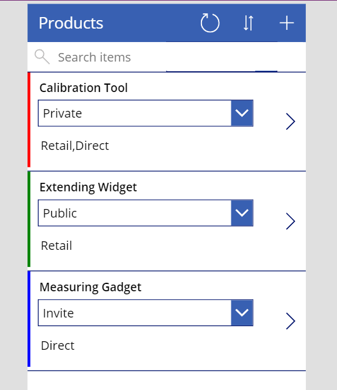](../media/all.png#lightbox)

1. Close the preview.

1. Don't navigate away from this page.

## Exercise 5: Use the Patch() formula

In this exercise, you'll use the Patch() formula to update product table rows.

### Task: Use the Patch() formula

In this task, you'll use the Patch() formula.

1. Expand **BrowseGallery1** and select the **Dropdown1** control.

   > [!div class="mx-imgBorder"]
   > [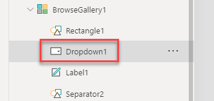](../media/drop-down-1.png#lightbox)

1. Set the **OnChange** value of the dropdown control to the following formula. This formula will update the row when the value of the dropdown control changes.

   `Patch(Products,ThisItem,{'Product visibility':Self.Selected.Value})`

1. Select the gallery and then select the **Edit** icon.

   > [!div class="mx-imgBorder"]
   > [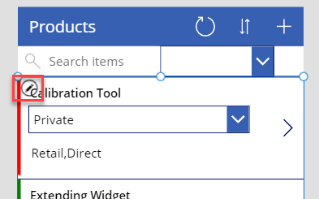](../media/edit-icon.png#lightbox)

1. Go to the **Insert** tab, select **Icons**, and then select **Cancel**.

1. Place the icon in the lower right.

   > [!div class="mx-imgBorder"]
   > [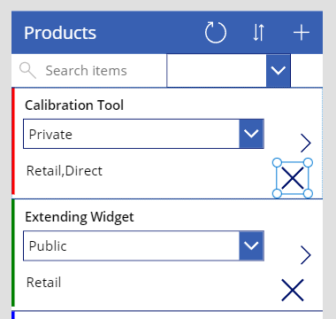](../media/bottom.png#lightbox)

1. Set the **Visible** value of the icon to the following formula.

   `If(IsBlank(Channels.Text),false,true)`

1. Set the **OnSelect** value of the icon to the following formula. This formula will remove all selected sales channels when the icon is selected.

   `Patch(Products,ThisItem,{'Sales channels':Blank()})`

1. Select **File > Settings**.

1. Select **Upcoming features > Experimental** tab and then turn on the **Formula-level error management** toggle.

   > [!div class="mx-imgBorder"]
   > [](../media/on.png#lightbox)

1. Close the **Settings** window.

1. Select **Preview the app**.

1. Change the product visibility of one of the products. The product should update.

   > [!div class="mx-imgBorder"]
   > [](../media/preview-visibility.png#lightbox)

1. Select the **X** icon of the first product. The sales channels of the product should be cleared, and the **X** button should become hidden.

   > [!div class="mx-imgBorder"]
   > [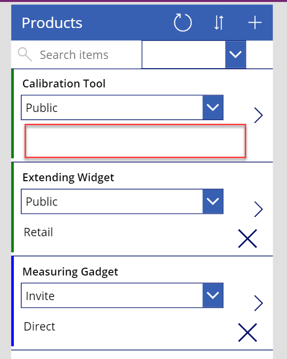](../media/clear.png#lightbox)

1. Close the preview.

1. Select **File > Save**.
