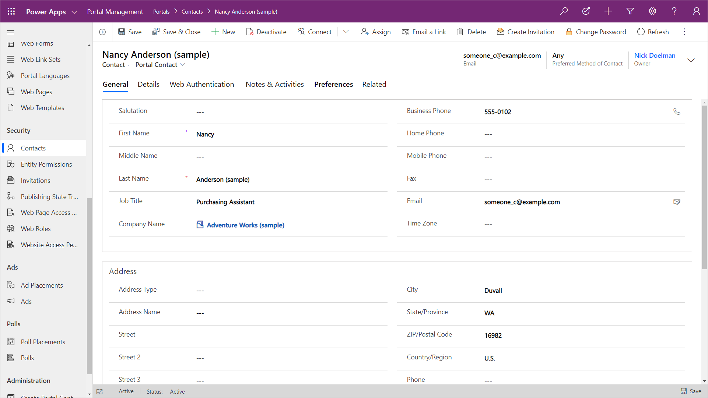
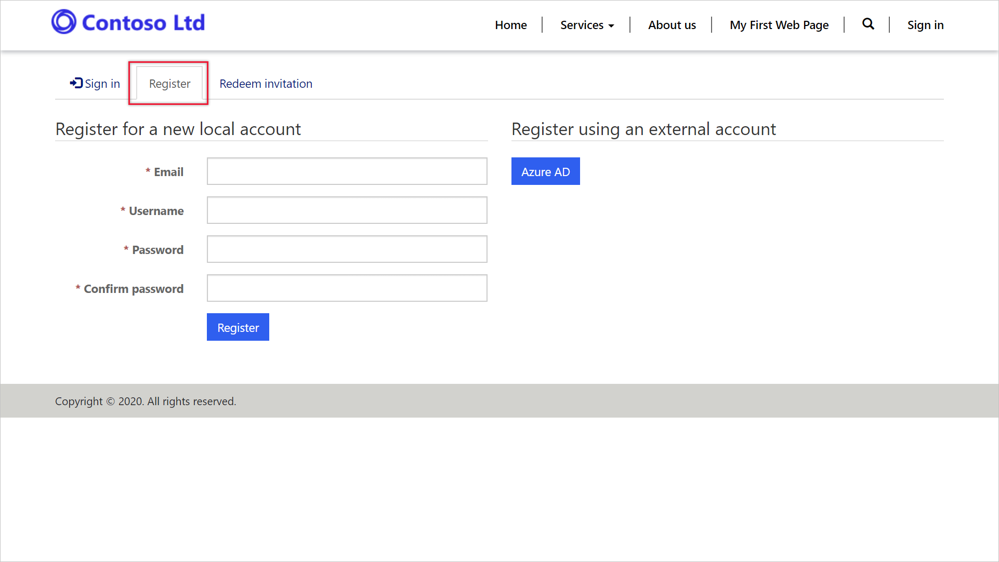
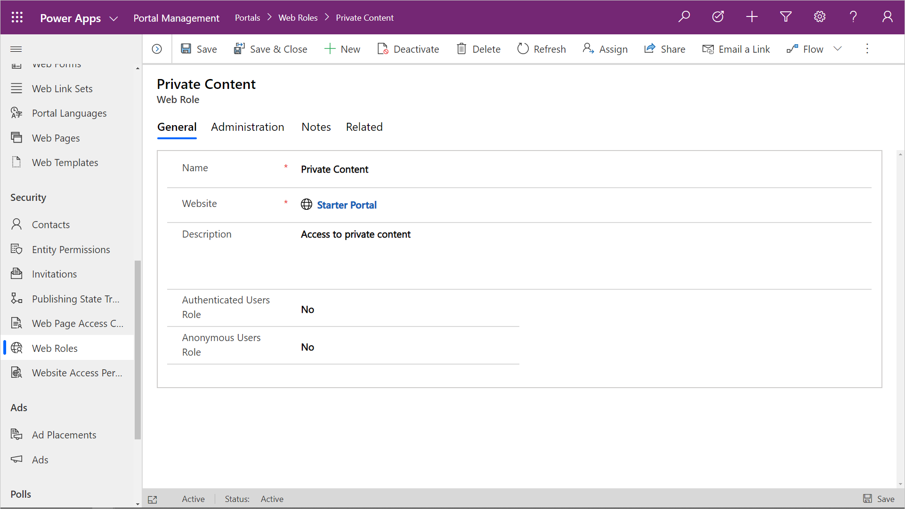

## CDS customer entities

Power Apps portals security is configured primarily around  the Common Data Service (or Dynamics 365) **contact** record.  The **contact** record represents a person in which an organization has a relationship with.  In the Dynamics 365 first party apps, a contact record can represent a stakeholder such as customer, partner, supplier, supporter or as the employee of organizational stakeholders (organizations are typically represented using the **account** entity).

[Customer entities](https://docs.microsoft.com/powerapps/developer/common-data-service/customer-entities-account-contact/?azure-portal=true)

> [!NOTE]
> For portals configured for internal staff access (such as the Employee portal) Common Data Service **system users** will also need a **contact** record to access the portal.

## Contact record

<!--image of contact record -->
> [!div class="mx-imgBorder"]
> 

A portal may surface public information and content that can be viewed by anonymous users that do not need to authenticate.  An example would be an online newsletter or an event schedule surfacing details from the Common Data Service.

However there may be private or protected information that should only be made accessible to specified authenticated users of the portal.  An example would be member-only protected content or private information such as invoices.

A portal user will need to log in using an authentication process in which the portal application will recognize the visitor as a specific CDS contact.  The portal can then surface protected and private static and dynamic content to that portal user.

[Set up portal authentication](https://docs.microsoft.com/powerapps/maker/portals/configure/configure-portal-authentication/?azure-portal=true)

A contact can be recognized as a portal user either by accepting an invitation from the portal that is associated with an existing contact or by registering as a new contact.

You need to consider strategies in adding contacts to a Power Apps portal.  If you are starting a new initiative where you are building a new audience, you would allow new portal users to register and create new contact records.

If you have an existing customer base with thousands of contacts already in your Dynamics 365 app, you would want to invite these existing contacts to the portal and avoid creating duplicate contact records.

Allowing or not allowing portal visitors to register as a new contact is configured using portal site setting *Authentication/Registration/Enabled* set to *true* or *false*.

## Accounts

A common relationship in Dynamics 365 and Common Data Service Power Apps is the **contact** as a child entity of an **account** record representing a employee-employer relationship.  This relationship may have an impact with configuring **entity permissions** as the contact may be provided access to content based on the permissions granted to the **account** record.

<!--image of portal user registering-->
> [!div class="mx-imgBorder"]
> 

## Web role

Once a portal user has an associated contact you will still need to assign **web roles** that will be linked to **web page access control rules** and **entity permissions** that will determine information the portal user can access.

A **web role** record can only be created in the Portal Management app.  A **web role** has the following properties;

| Property | Details |
| --- | --- |
| Name | The name of the web role.  This should be descriptive of the purpose or audience that will be assigned the web role. |
| Website | The website to which this web role belongs. |
| Description | A description of the purpose of the web role and other descriptive information. |
| Authenticated Users Role | A boolean field that indicates that the linked **entity permissions** or **web page access control rules** will be automatically applied to all authenticated portal users. |
| Anonymous Users Role |  A boolean field that indicates that the linked **entity permissions** or **web page access control rules** will be automatically applied to all anonymous portal users. |

**Web roles** are assigned using the Portal Management app by relating an existing **contact** to a **web role**.  **Web roles** can also be assigned to a **contact** from a **portal invitation** record.

**Web roles** can be configured to automatically provide access to either all authenticated users or all anonymous users.

> [!div class="mx-imgBorder"]
> 
