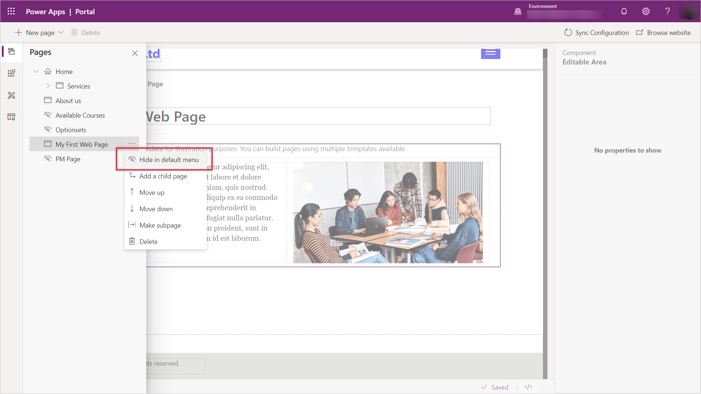
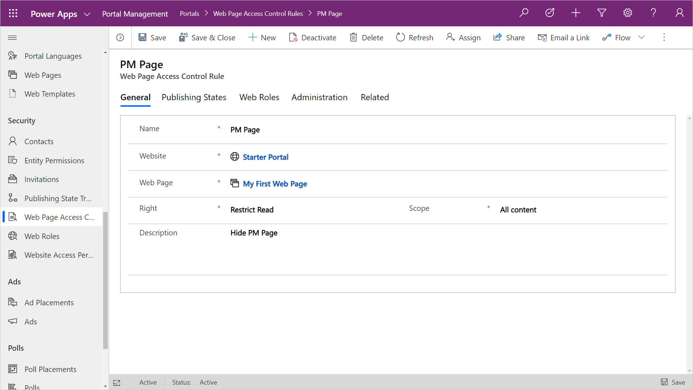
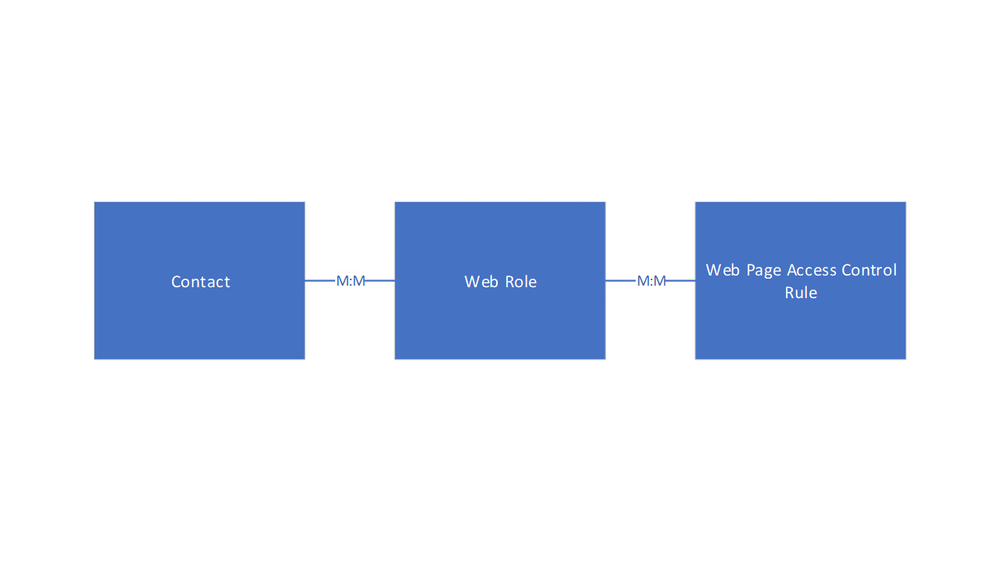

## Web Page Content

A web site is common way for an organization to provide content to a public facing audience.  You can create web pages to display overall organization information, offerings of products and services or educational content.

They are situations in which this content should only be made available for specific authenticated portal users.  An example would be page providing member only content or specific instructions or offers.

By default, when a maker creates a new web page using the Portals Studio or in the Portal Management app, the page is publicly available and added to the default menu.  The page can be hidden from the default menu, however it will still be accessible from the URL.

<!--image hide page in default menu-->

> [!div class="mx-imgBorder"]
> 

## Web Page Access Control Rule

The **web page access control rule** entity is a portal metadata record that can be linked to a specific **web page** that can determine the visibility to that page.

> [!div class="mx-imgBorder"]
> 

The **web page access control rule** record has the following properties;

| Property | Details |
| --- | --- |
| Name | This can be any name to describe the rule, ideally it should note the web page being referenced |
| Website | This references the website to where the rule will reside |
| Webpage | This lookup references the web page to apply the rule |
| Right | The right will determine the level of access a portal user will have to the specific web page.  The *Restrict Read* means that the portal visitor is allowed to view the page, but cannot direct edit the page.  The *grant change* right means that the user can view the page and if they have they have access to the front side editing tools they will be able to change the actual content. |
| Description | This field allows a maker to add a description of the purpose and scope of the rule. |

Once an access control is defined for a web page, the page will not be accessible on the portal and by default it will not appear on any menu navigation.

> [!VIDEO https://www.microsoft.com/en-us/videoplayer/embed/RE4AjtR]

> [!NOTE]
> The menu link (**WebLink**) to a page with an access rule can be made visible to all portal visitors by selecting the *Disable Page Validation* on the WebLink record in the Portal Management app.

The **web page access control rule** record can then be linked to a **web role** that will provide access to any related contact records to be able to access the particular web page.

> [!div class="mx-imgBorder"]
> 
