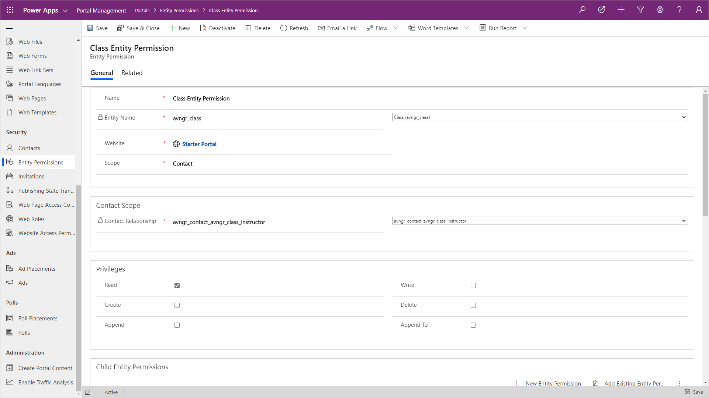
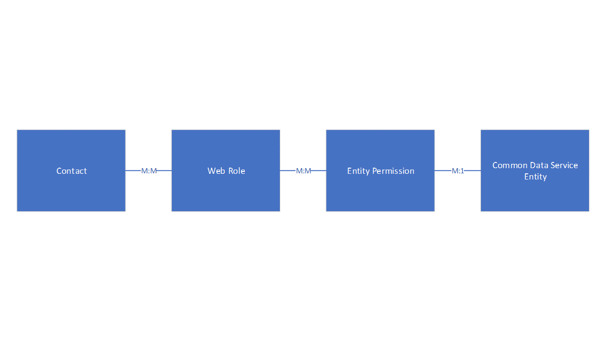
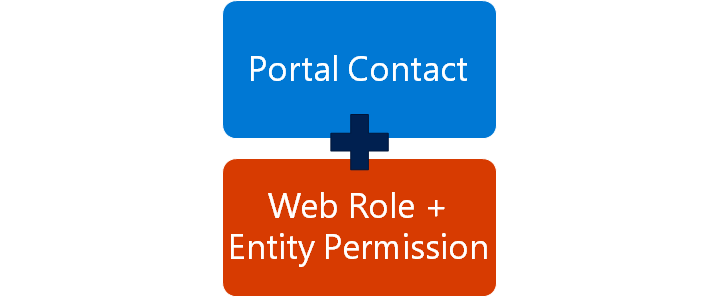
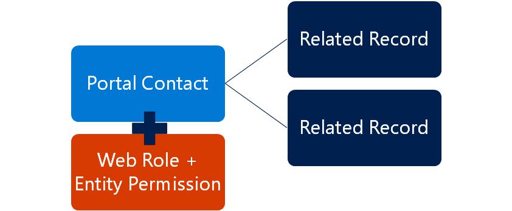
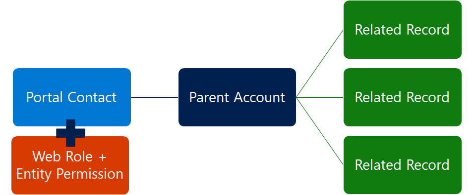
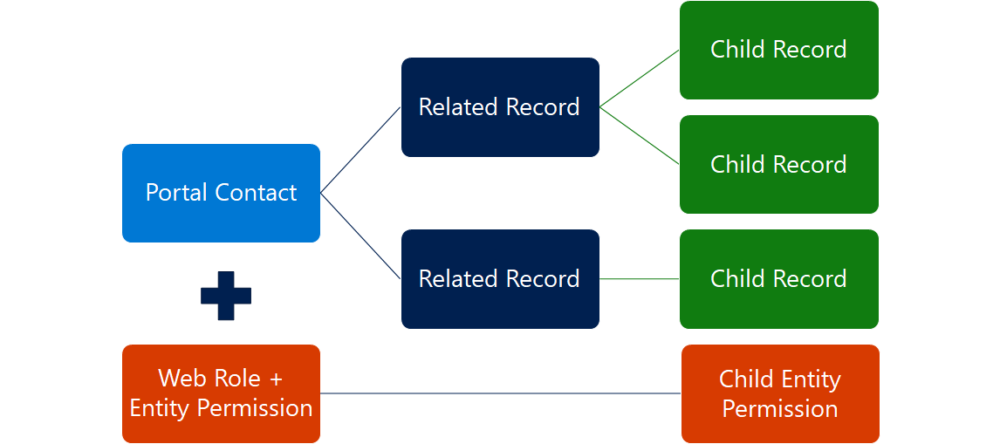
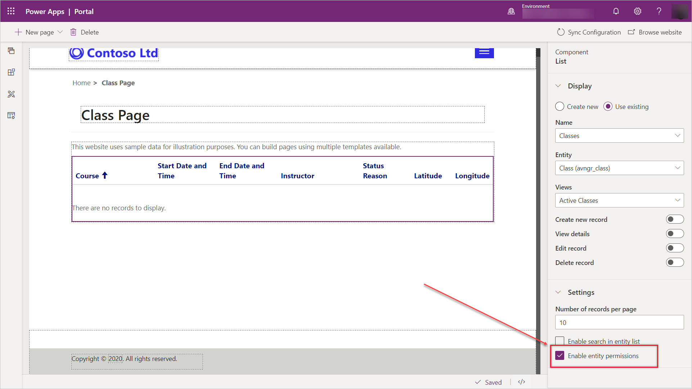

Entity permissions define the access and scope a portal user has to a particular Common Data Service or Dynamics 365 entity on the portal.  CDS records can be accessed on a Power Apps portal using an **entity form**, **entity list**, **web form** or surfaced using *Liquid* tags in web page content or **web templates**.

> [!div class="mx-imgBorder"]
> 

An **entity permission** is created in the Portal Management app and associated to a specific **web role** to allow portal user access.
> [!div class="mx-imgBorder"]
> 
## Create entity permission

The following are the steps when creating a new Entity Permission record:

1. Determine the entity that will be secured.
1. Define scope.
1. For any scope other than Global select the relationships that define that scope.
1. Determine the privileges that are being granted to the role via this permission.

> [!IMPORTANT]
> Rights are cumulative. If a user is in a role that grants Read, and another that grants Read and Update, the user will have Read and Update rights for any records that overlap between the two roles. There is no mechanism to reduce the permission scope or remove a privilege by assigning another role.

Entity Permission record includes the following common attributes:

| Attribute                             | Description                                                  |
| ------------------------------------ | ------------------------------------------------------------ |
| Entity Name                           | Name of the Entity that we are securing on the portal.       |
| Scope                                 | Defines which records can be accessed                        |
| Account/Contact/Parental Relationship | Defines relationship from portal user, parent account, or related record to record to be secured |
| Parent Entity Details                 | The Entity Name and Entity Permission that defines permission to the parent entity |
| Privileges                            | Defines what privileges are being granted by this permission set: Read, Write, Create, Delete, Append, Append To |

Let's take a close look at how these attributes are used to define scope and identify the records the portal user has access to.

## Global scope

If an Entity Permission record that has global scope is associated with a web role, any contact in that role will have specified access to all records of the defined entity in Common Data Service.

For example, if lead entity is granted Read privilege with Global scope, all users in assigned web roles will be able to see all leads. This permission will be automatically respected by any entity lists, essentially showing all records according to the model-driven views that have been defined for that list.

> [!div class="mx-imgBorder"]
> 

Global scope is most frequently used with Read privilege to provide access to the reference data, for example list of countries or currencies, and so on.

## Contact scope

With Contact scope, a signed-in user in the role for which the entity permission record is defined will have the rights granted by that permission only for records that are related to that user's contact record via  selected CDS relationship.

On an entity list, this means that a filter will be added to whatever model-driven views are surfaced by that list, which only retrieves records directly linked to the current user. Depending on the scenario, this relationship can be thought of as ownership or management rights.

> [!div class="mx-imgBorder"]
> 

For example, a set of privileges can be granted to a web role allowing Contact scope access to the orders using customer relationship. That means that any portal user with that role will have access to a subset that can be thought of as *My Orders*.

## Account scope

With Account Scope, a signed-in user in the role for which the permission record is defined will have the rights granted by that permission only for records that are related to that user's parent account record via selected CDS relationship.

> [!div class="mx-imgBorder"]
> 

For example, if set of privileges is granted to a web role allowing Account scope access to the cases using customer relationship between an account and case entities. That means that any portal user with that role will have access to a subset that can be thought of as *My Account's Cases*. 

## Parental scope

Parent scope is designed to cover most complex scenarios where a portal user requires full access to the records but this access must be limited to a specific scope. For example, for the users who have access to Cases (e.g. *My Cases*) we would like to grant permissions to access Notes related to the cases but restrict access to the notes only to the cases the user already has access to.

The Parent Permission record defines a permission and scope for an entity (Cases in our example). With that permission in place, a child permission is created that defines a relationship from another entity (Notes in our example) to the entity defined in the parent relationship (Cases).

> [!div class="mx-imgBorder"]
> 

Users in a web role with access to records defined by parent entity permissions will also have rights as defined by the child permission record to records related to the parent record.

## Self scope

Self Scope allows you to define the rights a user has to their own **contact** record. This allows users to use entity forms or web forms to make changes to their own **contact** record linked with their profile.

Default Profile Page has a special built-in form that allows any user to change their basic contact info, and opt in or out of marketing lists. If this form is used in your portal, users won't require this permission to use it. However, they'll require this permission to use any other custom entity forms or web forms that target their contact record.

In order to apply **entity permissions** to **entity list** or **entity form** components, a maker will need to specify to use **entity permissions** is settings when configuring the component in the Portal Studio.

> [!div class="mx-imgBorder"]
> 

**Entity permissions** are automatically applied to data that is retrieved using *Liquid* tags.

<!--VIDEO EntityPermissions.mp4-->
> [!VIDEO https://www.microsoft.com/en-us/videoplayer/embed/RE4AjtN]

To learn more about Entity Permissions see [Add record-based security by using entity permissions for portals](https://docs.microsoft.com/powerapps/maker/portals/configure/assign-entity-permissions/?azure-portal=true).
