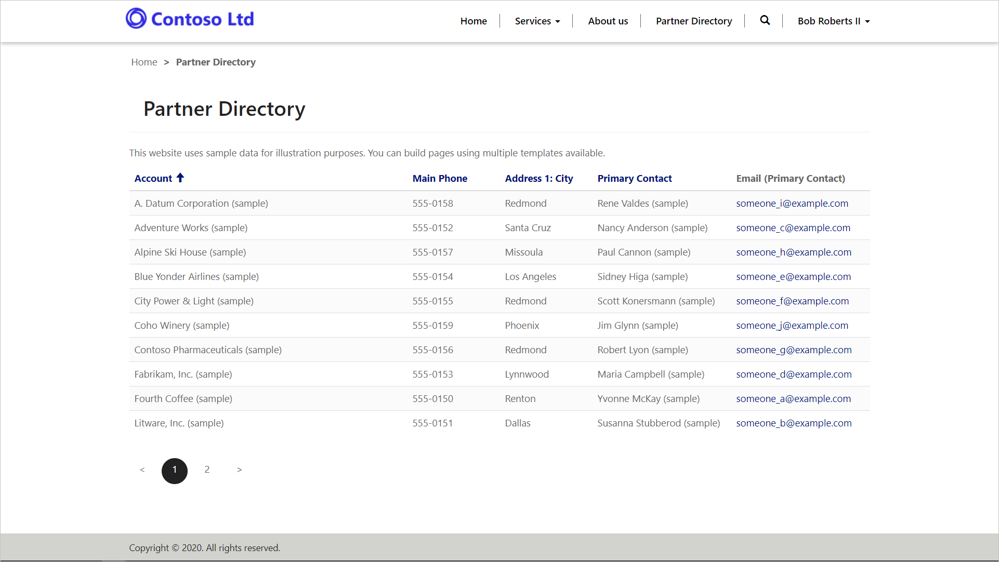

The purpose of this hands-on-lab is to configure entity permissions to secure access to Common Data Service records.

The exercises work best when you have some sample data to work with. Depending on if the environment you are working with, you may want to install some sample data to assist with exercises. The Power Platform does provide the ability to add sample data as needed. If the environment you are working in does not have any sample data installed, follow steps in [Add or remove sample data](https://docs.microsoft.com/power-platform/admin/add-remove-sample-data/!azure-portal=true) to install the sample data into your environment.

## Learning objectives

At the end of these exercises, you will be able to accomplish the following:

* Open the Portal Studio to configure an entity list to use entity permissions
* Create and assign a web role
* Create an entity permission record
* Link the entity permission to the web role and associate the web role to a CDS contact

**Estimated time to complete this exercise: 10 to 15 minutes**

## Before we begin

### Prerequisites

For this exercise you will need to have the following in your environment:

1. A Power Apps portal provisioned. If you do not have a Power Apps portal available, follow [Create Portal](https://docs.microsoft.com/powerapps/maker/portals/create-portal/?azure-portal=true) instructions to create one.
1. Access to the Power Apps maker portal.

## Scenario

Your organization has provisioned a Power Apps portal and would like to create a directory of partner organizations. After initial provisioning of the portal pages, entity lists to manage the partner directory, it's been discovered that access to the data has not been restricted, as initially planned, and directory is publicly available.

The business would like to restrict access to the data to the authenticated users only.

### High level steps

To finish the exercise you need to complete the following tasks.

* Add a web page with a list component showing the **account** entity.
* Enable **entity permissions** to restrict the viewing of accounts to authenticated users only.
* Register a new user on the portal using local authentication.
* Create a **web role** record.
* Create an **entity permission** record providing global read access to the **accounts** entity.
* Link the portal user to the **web role** and the **web role** to the **entity permission**.
* Confirm that the authenticate user has access to the list of **accounts**.

### Detailed steps

#### Launch Portal Studio

1. Navigate to the Power Apps maker portal at [https://make.powerapps.com](https://make.powerapps.com/?azure-portal=true).
1. Make sure correct environment is selected in the environment selector in the top right-hand corner.
1. From the list of Apps, locate your portal app (Type = Portal).
1. Click on the ellipsis (...) and choose **Edit**.  This will launch the Portal Studio.

#### Create webpage

1. From the command bar, choose **+ New Page**, then **Fixed Layouts** and finally **Page with title** template.
1. In the properties pane, add the following values:
    * **Name** Partner Directory
    * **Partial URL** partnerdirectory

#### Add entity list

1. On the canvas, select the page copy component and from the toolbelt, click on the **Components** icon and add the **List** component.
1. Add the following values:
    * **Name** Partner List
    * **Entity** Account
    * **Views** Active Accounts
1. Expand **Settings**.
1. Select **Enable entity permissions**.
1. Click in the canvas to save.

#### Browse website

1. Click on the **Browse website** to view the page.
1. Note that you will see a message that you do not have permissions to view records.

#### Add portal user

1. Click on the **Sign in** menu item.
1. Click on **Register** tab.
1. Enter in an *email*, *username* and a *password*.
1. Press **Register**.
1. The portal profile page will appear.
1. Enter in a *First Name* and *Last Name*, scroll down and choose **Update**.
1. Close the portal.

#### Add web role and assign contact

1. Navigate to the Power Apps maker portal at [https://make.powerapps.com](https://make.powerapps.com/?azure-portal=true).
1. Make sure correct environment is selected in the environment selector in the top right-hand corner.
1. From the list of Apps, locate and open the Portal Management app (Type = Model-driven).
1. In the **Security Area** choose **Web Roles**.
1. Add a new **Web Role** record, enter the following values:
    * **Name** *Partner List Web Role*
    * **Website** *Starter Portal*
1. Save the record.
1. Click on the **Related** tab.
1. Choose **Contacts**.
1. Select **Add Existing Contact**.
1. From the list on the right hand side, choose the contact that you registered on the portal.
1. Select **Add**.

#### Create entity list

1. In the Portal Management app, choose **Entity Permissions**.
1. Add a new **entity permission** record, enter the following values:
    * **Name** *Account Entity Permission*
    * **Entity Name** *Account*
    * **Website** *Starter Portal*
    * **Scope** *Global*
1. In the **Privileges** section select the **Read** checkbox.
1. Save the record.

#### Associate web role

1. In the *Account Entity Permission* record, scroll down to the *Web Roles* section.
1. Select **Add Existing Web Role**.
1. From the right hand lookup, choose the *Partner List Web Role*.
1. Click **Add**.

#### Verify access

1. Navigate to the Power Apps maker portal at [https://make.powerapps.com](https://make.powerapps.com/?azure-portal=true).
1. Make sure correct environment is selected in the environment selector in the top right-hand corner.
1. From the list of Apps, locate your portal app (Type = Portal).
1. Click on the ellipsis (...) and choose **Edit**.  This will launch the Portal Studio.
1. Select **Browse website**.
    > [!NOTE]
    > Browsing the website within the Portal Studio will refresh the portal cache.
1. Select **Sign in** and enter the username and password for the portal user you created earlier.
1. Navigate to the **Partner Directory** page, you should be able to view the list of account records.
    > [!div class="mx-imgBorder"]
    > 

1. Click the *username* and then select **Sign-out**, the page should display a message about not having permissions to view records.
