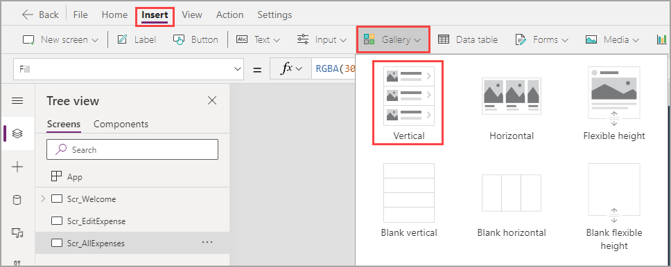
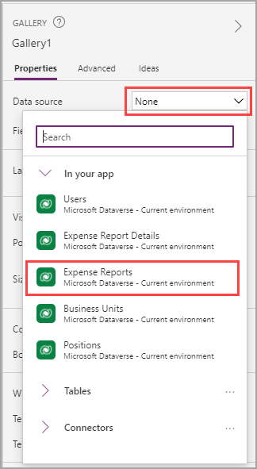
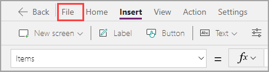
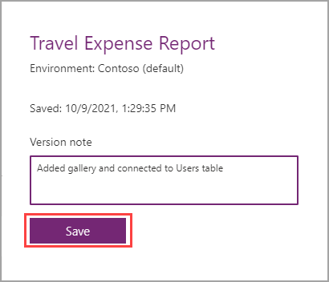

Adding the data doesn't mean that your users can view it in your app. You need to add a control to display it. Two main controls that display repeating rows of data are the data table and the gallery.

## Decide how to display your data

Data tables are useful in that they can quickly display data in a way that appears similar to a Microsoft Excel spreadsheet. The disadvantages are that you can't edit data or do many customizations, even on individual columns (such as allowing various column widths). A gallery is much more customizable. You can include buttons to take actions on specific lines of data and format fields exactly the way that you want them. The drawback to using galleries is the larger effort in creating and customizing them. Also, you can't scroll both horizontally and vertically because galleries only allow one or the other.

For this solution, you'll use a gallery because you will be customizing the view beyond what a data table allows and will be taking action on your data.

## Add a gallery

To add a gallery, follow these steps:

1. Ensure that you are on **Scr_AllExpenses**, select the **Insert** tab on the ribbon, and then select the **Gallery** dropdown menu, where you will have the option of selecting **Vertical** or **Horizontal**. For this solution, it makes more sense to display in a **Vertical** gallery.

   > [!div class="mx-imgBorder"]
   > 

    After inserting your gallery, you can view several lines of placeholder data. Similar to the image, you need to point the gallery to the correct data.

1. Select the **Data source** dropdown menu on the **Properties** pane and then select **Expense Reports**.

   > [!div class="mx-imgBorder"]
   > 

1. Rename your gallery to **Gal_ExpenseReports_AllExpenses**.

    Your gallery is currently empty. You'll add data soon so that you can observe what happens. In the meantime, you know that expense reports won't need an image, so you can update the layout of your gallery.

1. In the **Properties** pane, select the **Layout** dropdown menu and then select **Title and subtitle**.

   > [!div class="mx-imgBorder"]
   > 

1. Select **File** in the ribbon and then select **Save** to save your app before continuing further.

   > [!div class="mx-imgBorder"]
   > 

   > [!div class="mx-imgBorder"]
   > 

While Microsoft Power Apps will save every two minutes, it's a good idea to save frequently. One reason is that you can add version notes after development milestones to track your progress. Now, you can restore a previous version if some major errors occur. Furthermore, you never know where you are in the two-minute cycle and should save in case a problem arises with your internet or computer.
