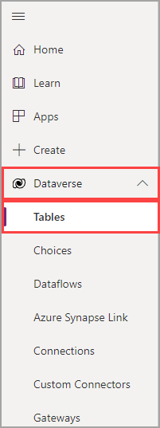
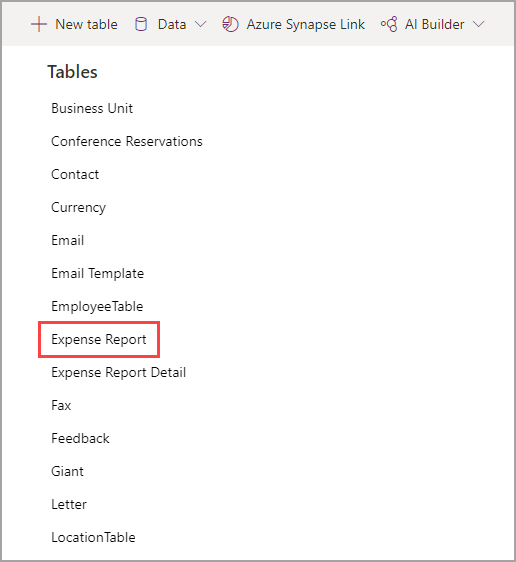
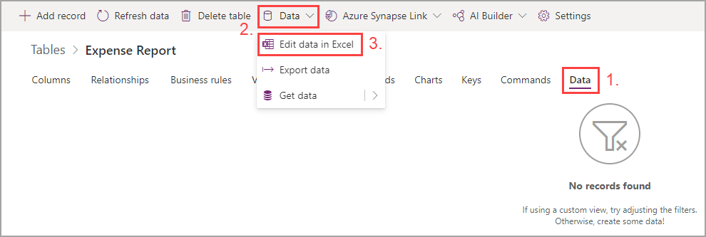
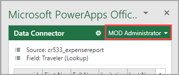
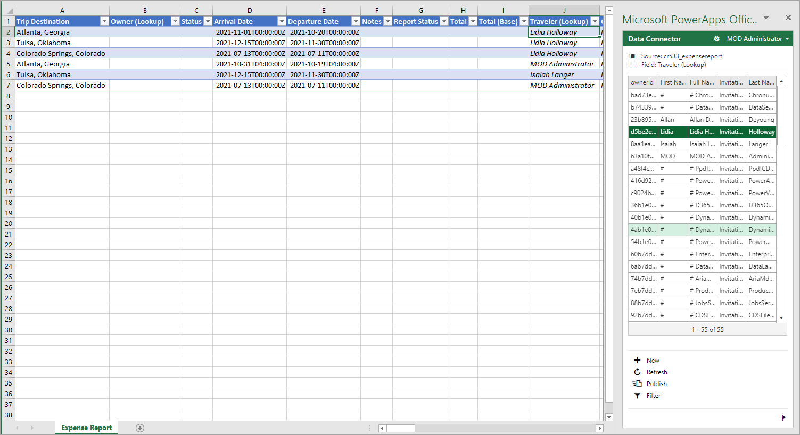
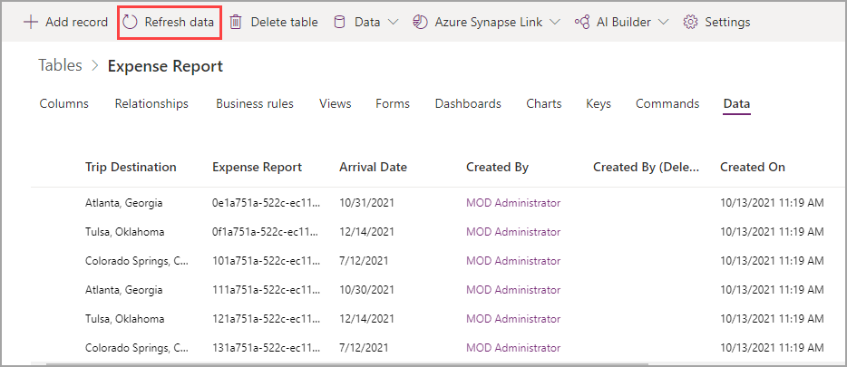

To add Dataverse data to your app, follow these steps:

1. In a new browser tab, go to [make.powerapps.com](https://make.powerapps.com/?azure-portal=true).

1. Select **Dataverse/Data > Tables**.

   > [!div class="mx-imgBorder"]
   > 

1. Select your **Expense Report** table.
   
   > [!TIP]
   > You might need to change the view to custom tables.

   > [!div class="mx-imgBorder"]
   > 

1. In the **Expense Report** table, select the **Data** tab, which should show that you don't have records. Select the **Data** dropdown menu on the ribbon and then select **Edit data in Excel**.

   > [!div class="mx-imgBorder"]
   > 

1. After Excel has loaded, select to **Enable Editing**. Make sure that you're signed in to the correct tenant by checking the editing pane in the upper-right corner.

   > [!div class="mx-imgBorder"]
   > 

   Afterward, you can edit the sheet as you would any other Excel sheet. The **Data Connector** panel on the right will display options and information for various fields, such as a date picker for your arrival and departure date fields. You can also select the **Traveler** field in the spreadsheet.

   > [!div class="mx-imgBorder"]
   > 

6. After filling in the **Trip Destination**, **Arrival Date**, **Departure Date**, and **Traveler** fields, you can select **Publish** to push your changes to Dataverse. Add a few more rows of data with different users because you'll be filtering based on that field. You don't need to fill in the **Report Status** field at this point. Choice fields can be difficult to edit this way, so wait until you can edit in the canvas app for that field.

   > [!NOTE]
   > If you don't have users in your User table, follow the preceding steps to populate that table first.

7. After you have published, return to Dataverse and refresh your data. The data that you added in Excel should now display.

   > [!div class="mx-imgBorder"]
   > 
