> [!VIDEO https://www.microsoft.com/videoplayer/embed/RWQA7j]

Now that you've added the data source to Power Apps, added a gallery, and populated Dataverse, you should be ready to display data. Return to your canvas app and go to the **Scr_AllExpenses** screen. If you had this screen open in another tab, notice that the gallery hasn't populated yet. Power Apps caches your data source and doesn't always have the most up-to-date version if you're making changes.

To fix this issue, follow these steps:

1. Select the **Data** button on the left menu and then locate **Expense Reports**.

1. Select the ellipsis (**...**) menu beside **Expense Reports** and then select **Refresh**.

   > [!div class="mx-imgBorder"]
   > [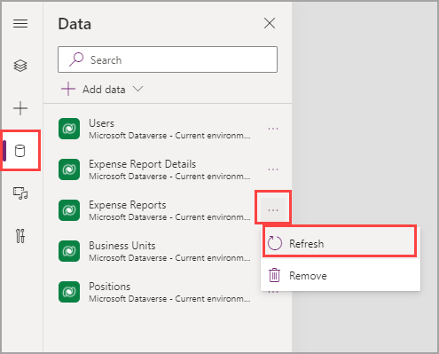](../media/refresh-2.png#lightbox)

    The Expense Report data should populate in the Gallery.

1. Return to the **Tree view**, where you can select various controls. (**Hint:** The **Tree view** icon resembles stacked papers.)

1. Drag your Gallery to occupy a small portion of the screen at the top. If you want to know which properties are affected, in the **Position** area, set the **Y** property to **236**, and in the **Size** area, set the **Height** property to **900**. The gallery should look similar to the following screenshot.

   > [!div class="mx-imgBorder"]
   > [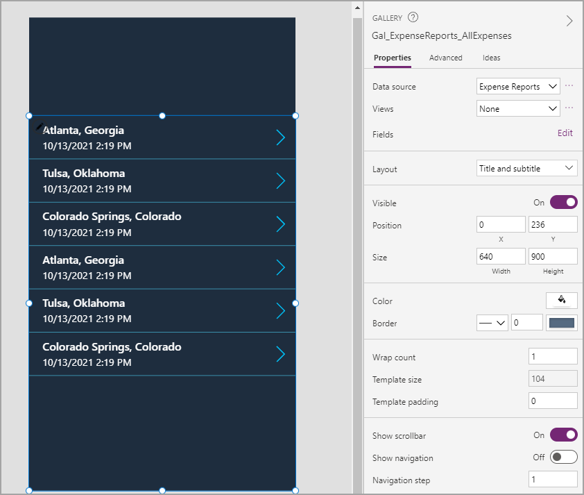](../media/height.png#lightbox)

Next, you need to display more useful information. The location is useful, but you only have one date showing in your gallery and it's unclear whether this date is the departure date or arrival date.

1. Select **Subtitle2** and then review the **Text** property in the **Properties** tab. Your gallery might have assigned a different field, but this one is displaying **ThisItem.'Created On'**. All information from your table in your gallery will start with **ThisItem**, which is specifying the row. For this reason, you can only manipulate the first line and must use logic to get lines to perform differently. This topic will be explained later; for now, change this field to the departure date.

1. In the **Text** property, enter **ThisItem.'Departure Date'**, as shown in the following screenshot.

   > [!div class="mx-imgBorder"]
   > [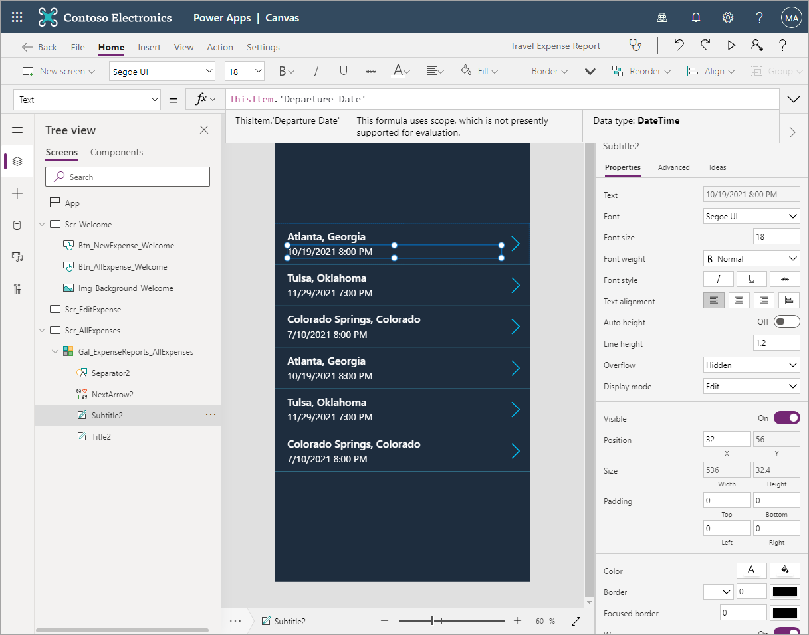](../media/departure.png#lightbox)

    Two issues have occurred with this departure date. First, time is displaying, which isn't necessary for this exercise. Second, your users still won't be able to discern which date is displayed. Now, you will need to manipulate some text. Often, the **Text** function is what you need when attempting to format.

1. Update the **Text** property with **Text(ThisItem.'Departure Date', DateTimeFormat.ShortDate)**.

    Now, you should have the same information as before but in the format that you want. To add strings of text together, use an ampersand (**&**), and to define text in your formula bar, use quotation marks (as you might have noticed when you built the first screen). Combine these principles to create the departure and arrival dates to appear as a date range.

1. Update your formula to the following code. After you've completed updating the formula, the **Subtitle2** text should match the following screenshot. **Text(ThisItem.'Departure Date', DateTimeFormat.ShortDate) & " - " & Text(ThisItem.'Arrival Date', DateTimeFormat.ShortDate)**

   > [!div class="mx-imgBorder"]
   > [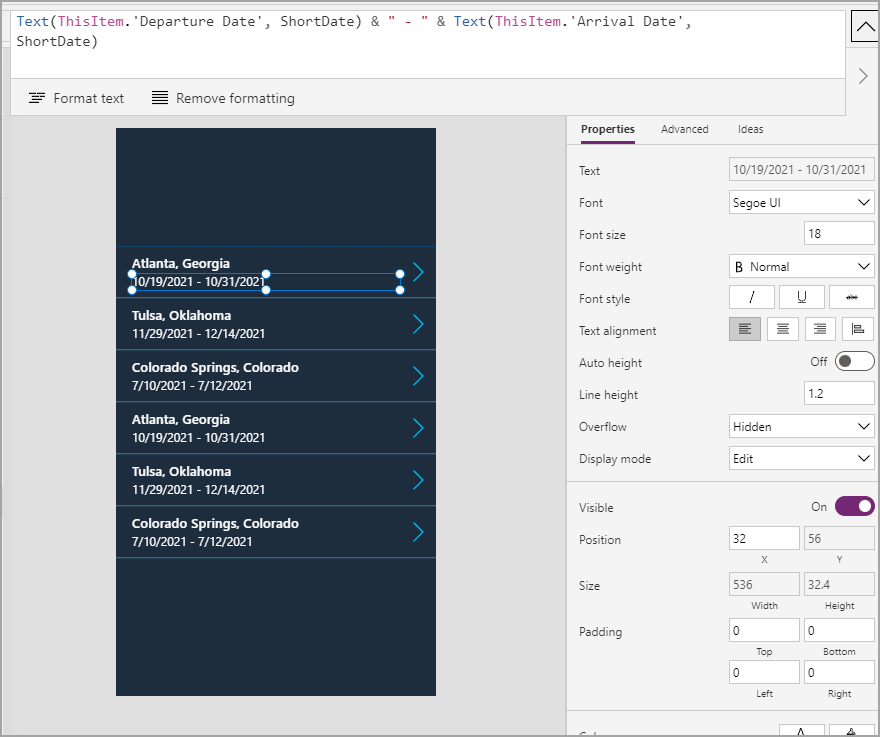](../media/formula.png#lightbox)

    The **DateTimeFormat** part of the formula will disappear when you click out of the formula bar. This situation happens for some functions and won't negatively affect your code. When you click back into the formula bar, the entire formula will appear.

Now that you have the gallery looking the way that you want, you need to add more rows of data. Travelers only need to view their own records. Currently, you can view everyone's expense reports. To filter the data, alter the **Items** property of the gallery. First, you need to capture the information for the signed-in user.

1. The **App** control is shown above all other controls in the **Tree view**. Select **App**, and in the property dropdown menu, select **OnStart**.

   > [!div class="mx-imgBorder"]
   > [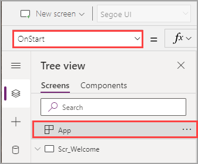](../media/on-start.png#lightbox)

    This property allows you to enter one or more functions that will run when the app is started. In this case, you will collect the signed-in user's information. You could call this data source at any instance in the app, but it's best to call it only once and then store it for future use in the app. Whenever you call a data source (in this case, from your Microsoft Azure Active Directory), it creates a performance burden in your app and uses resources. For this reason, it's better to call as few times as possible, especially with something that won't change for the entire app instance, such as user data.

    To store information for later use, you can set a variable. Essentially, a variable is information in different formats such as text, date, number, and a record (or a row of data). In traditional coding, you would often need to define the type of variable that you're using. However, Power Apps figures out that variable type for you. Make sure that, when you set a variable, you always use the same type (or definition) for that variable in the future.

1. Define the variable by entering the following formula in your **OnStart** property: **Set(VarUser, User())**.

   > [!div class="mx-imgBorder"]
   > [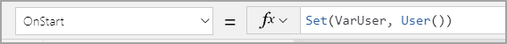](../media/variable.png#lightbox)

    **VarUser** is the name of the variable and **User()** is the definition, which in this case, is a function gathering information from Azure AD. You can use any name for your variables; however, similar to the controls, it's best to start variables with **var** or some other nomenclature that will help you recall them later.

    Your users won't have to prompt the **OnStart** property to trigger, but when you change the property while building, you have to trigger it.

1. Trigger the variable by selecting the ellipsis (**...**) next to **App** and then select **Run OnStart**.

   > [!div class="mx-imgBorder"]
   > [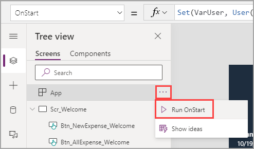](../media/run.png#lightbox)

    Now that your variable is populated, you can use it to filter your gallery.

1. Select **Gal_ExpenseReports_AllExpenses** in the **Tree view** and then make sure that the **Items** property is visible in the dropdown menu.

1. Replace **Expense Reports** with **Filter('Expense Reports', Traveler.'Primary Email'=VarUser.Email)**.

    Your data is now filtered down to items where you're listed as the traveler.

   > [!div class="mx-imgBorder"]
   > [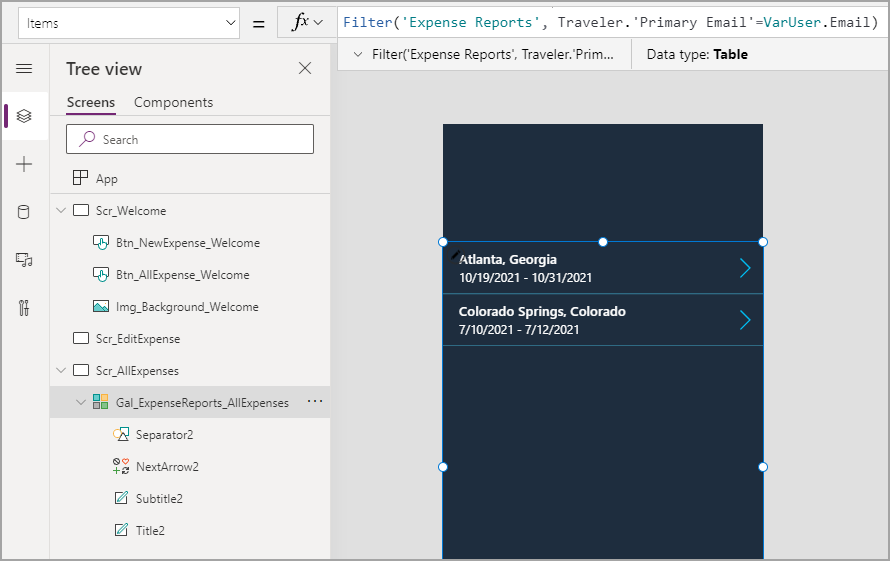](../media/filter.png#lightbox)

    As you enter formulas, Power Apps will prompt you with the correct language and will offer suggestions as you go. This feature will help you learn formulas and how to write expressions. Additionally, notice that you needed to drill down on your traveler information to find the email. Because it's a lookup column, it contains all information in the Users table. Consider the period as being similar to a shovel that helps you to dig deeper into whatever you're referencing. You had to do the same for **VarUser** because it contains all information from the **User()** function that has full name, email, and photo.

Now, your gallery has the exact appearance that you want. However, you still need to add a few items to the page to make it more useful and to improve user experience (UX). Your next task is to add a title so that users know that they are on the correct screen.

1. Click in the empty space above your gallery and then select the **Insert** tab.

1. Select **Label** to add a new label to your screen.

1. Change the following properties of your **Label** control by using the **Properties** pane or the **Advanced** pane.

    - **Text**: All Expense Reports

    - **Size**: 24

    - **FontWeight**: Semibold

    - **X**: 0

    - **Y**: 0

    - **Align**: Center

    - **Height**: 92

    - **Width**: 640

    - **Fill**: RGBA(85, 106, 129, 1)

    When you're finished setting those label properties, rename your label to follow the nomenclature that you've learned. Your screen should resemble the following image.

   > [!div class="mx-imgBorder"]
   > [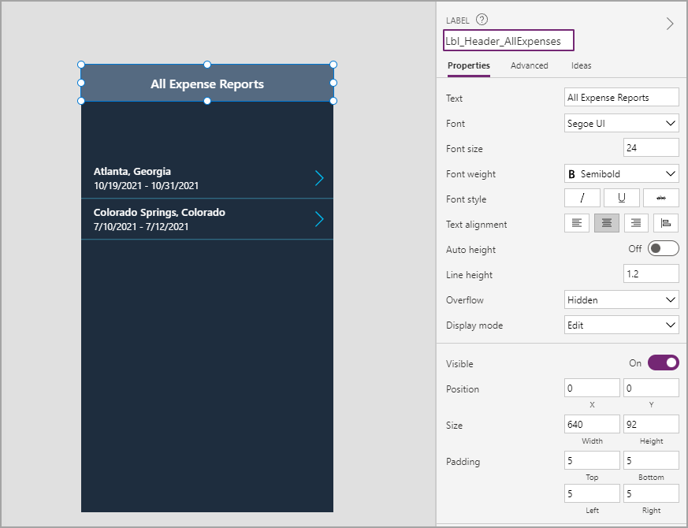](../media/label.png#lightbox)

    Now, you need a way to return to the home screen. You can take action on a button, but you can also use many controls for actions. One of these controls is an icon.

1. While on the **Insert** tab, select the **Icons** dropdown menu. You can add the icon that you need, or you can select an available one and then change the icon in the properties. Some developers prefer this method because it allows them to search through the icons rather than scrolling to find the one that they want.

1. For this exercise, use the **Back** icon to indicate that pressing this icon will return you to the homepage.

   > [!div class="mx-imgBorder"]
   > [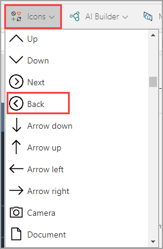](../media/back.png#lightbox)

1. Change the following properties of your **Back** icon by using the **Properties** pane or **Advanced** pane.

    - **X**: 9

    - **Y**: 21

    - **Height**: 50

    - **Width**: 64

    - **Color**: RGBA(255, 255, 255, 1)

    - **OnSelect**: Back()

    While you could have used the **Navigate()** function, you are using the **Back()** function, which takes the user to the screen that they were on immediately before the current screen. You can use either function, but you're using **Back()** in this exercise so that you can become familiar with another useful function.

1. Rename your icon to **Icn_Back_AllExpenses**.

   > [!div class="mx-imgBorder"]
   > [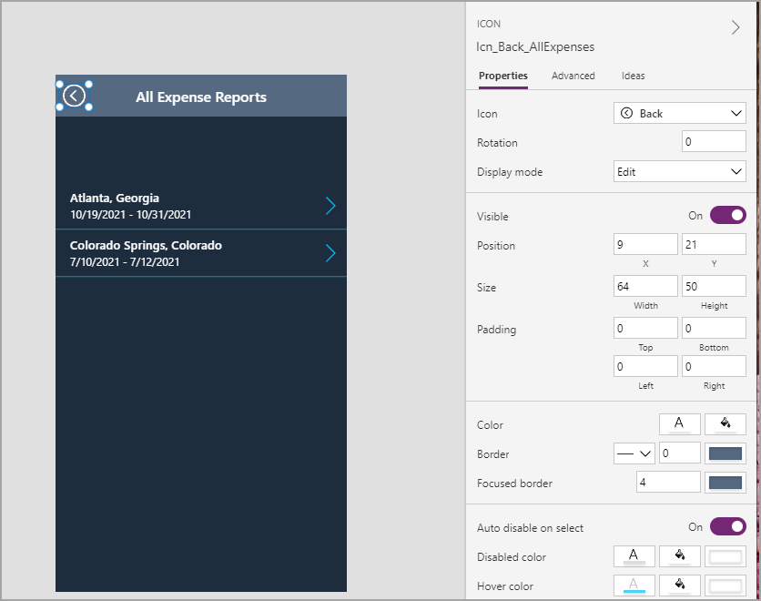](../media/icon.png#lightbox)

    Another component that you can add to enhance the user experience is a destination filter so that users can quickly find the expense report that they're looking for.

1. Add another label to the screen and then set the following properties:

    - **Text**: Trip Destination

    - **Size**: 18

    - **X**: 0

    - **Y**: 92

    - **Height**: 144

    - **Width**: 640

    - **Fill**: ColorFade(Lbl_Header_AllExpenses.Fill, 30%)

    - **PaddingTop**: 20

    - **PaddingLeft**: 40

    - **VerticalAlign**: VerticalAlign.Top

1. Rename your label **Lbl_TripDestination_AllExpenses**.

    The **ColorFade()** function is used for the **Fill** property and references the **Fill** property of the first label that you created. Referencing other controls is common throughout canvas apps, which is why the names of your controls are so important. The **ColorFade()** function makes a color lighter or darker by a certain percentage. Positive percentages will display a lighter color and negative percentages will display a darker color. This function can be useful when you are designing apps.

    You might notice that this label has an odd appearance. The reason is because you will be overlaying a dropdown menu. You could include a rectangle behind the label and dropdown menu, but the more controls that you have, the longer it will take to load your screen. For this reason, try to use as few controls as possible, combining where you can.

    After you have added and set up your new label, it should resemble the following image.

   > [!div class="mx-imgBorder"]
   > [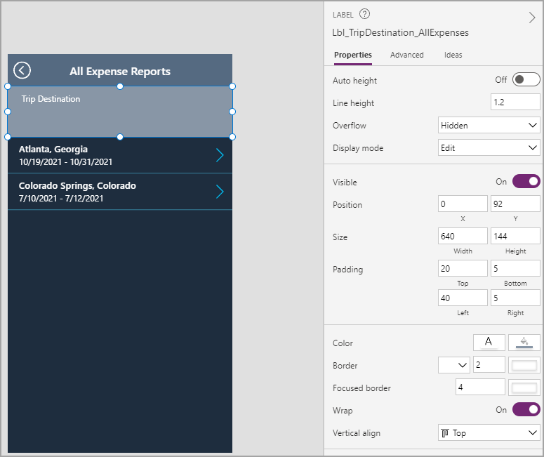](../media/destination.png#lightbox)

1. While still on the **Insert** tab, select the **Input** dropdown menu and then select the **Drop Down** control.

1. Change the following properties of your **Drop Down** control by using the **Properties** pane or **Advanced** pane.

    - **X**: 35

    - **Y**: 162

    - **Height**: 50

    - **Width**: 560

    - **Fill**: Lbl_Header_AllExpenses.Fill

    - **ChevronBackground**: Lbl_Header_AllExpenses.Fill

    - **Size**: 16

    - **AllowEmptySelection**: true

    - **Items**: Distinct(Filter('Expense Reports', Traveler.'Primary Email'=VarUser.Email), 'Trip Destination')

    Different properties exist for the **Drop Down** control than exist for other controls. You'll realize this factor as you become familiar with more controls. Additionally, this procedure used the **Distinct()** function, which selects one field from a table and removes duplicates. As a result, if you visited the same location multiple times, the location would only appear once on the dropdown menu.

1. Rename your **Drop Down** control to **Ddn_Destination_AllExpenses**.

    Your app should appear similar to the following image.

   > [!div class="mx-imgBorder"]
   > [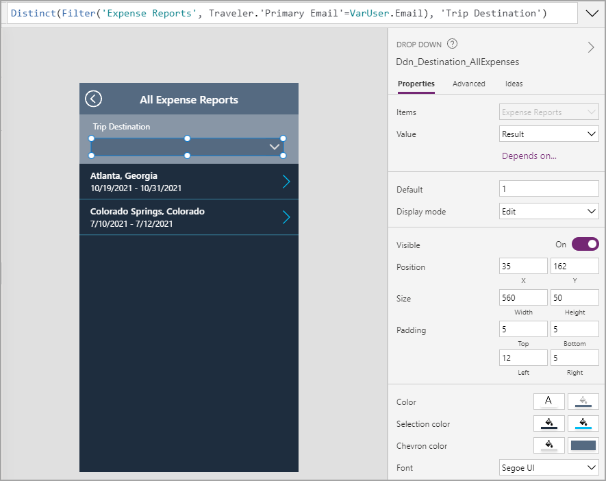](../media/drop-down.png#lightbox)

    Your final task on this screen is to ensure that the gallery filters according to the selection from the dropdown control.

1. Change the **Items** property of your gallery as follows: 

    ```powerappsfl
    If(
         IsBlank(Ddn_Destination_AllExpenses.Selected.Result),
         Filter(
             'Expense Reports',
             Traveler.'Primary Email' = VarUser.Email
         ),
         Filter(
            'Expense Reports',
            Traveler.'Primary Email' = VarUser.Email,
             'Trip Destination' = Ddn_Destination_AllExpenses.Selected.Result
         ) 
    )
    ```

    You can expand your formula bar so that you have more room to type. Select **Format text** when you've finished the formula to make it cleaner and simpler to read.

   > [!div class="mx-imgBorder"]
   > [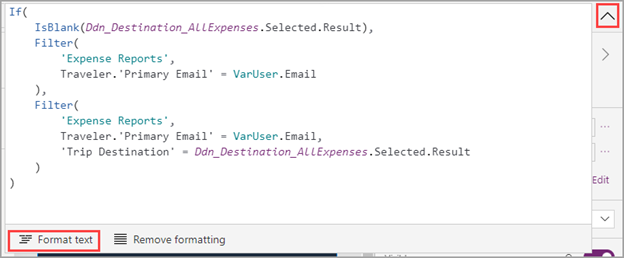](../media/format.png#lightbox)

This formula has become complex, so this section will explain in detail. You've wrapped your initial items property in an **If()** statement, which allows you to specify different outcomes depending on one or more conditions. In this case, the logical test (or condition) is whether the dropdown control is blank or not. If the dropdown control is blank (true value), the items for the gallery will only be filtered by the user. Alternatively, if the dropdown control isn't blank (false value), then the items for the gallery will be filtered by the user and the destination.

> [!NOTE]
> Occasionally, when you reset the **Items** property of a gallery, certain labels switch to looking at different fields. If some of your data appears as if it has disappeared, make sure that the **Text** property of your labels is correct.

To test the gallery filter, put your app in **Play** mode in the upper-right corner.

   > [!div class="mx-imgBorder"]
   > [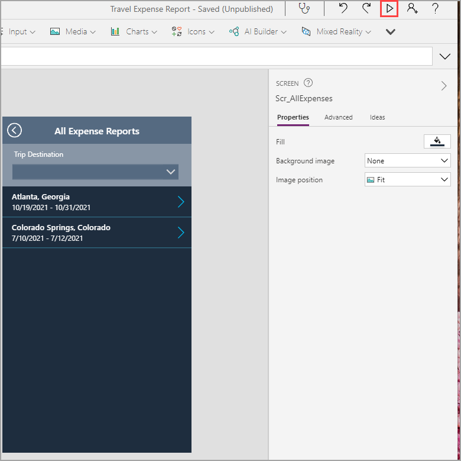](../media/play.png#lightbox)

You have completed setting up your screen to view all your Expense Report data.
