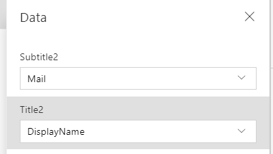

Action-based data sources differ from the more popular tabular data sources in that you use functions to interact with the data source instead of just reading and writing data. One important difference to note between tabular and action-based data sources is action-based data sources cannot be used with the Forms control. Forms only work with tabular data sources. This doesn't mean action-based data sources can only read data; most action-based data sources provide functions for updating the data as appropriate. An action-based data source can also be for things like sending emails or other notifications, not necessarily only for reading and writing data.

In the following examples you will learn how to add the Office 365 Users connector to your app, query for users, find the logged in user's manager, and finally update the logged in user's profile.

Add the Office 365 Users data source
------------------------------------

In this example, you will add the Office 365 Users data source, an
action-based data source, to an app. The process is the same as adding a
tabular data source.

1.  In the Power Apps Studio, select **View** from the top menu bar.

2.  On the menu bar, select **Data sources**.

3.  From the pop-out list, select **Add data source**.

4.  Select **New connection** in the pop-out list.

5.  In the search box, type "Office 365".

6.  The list of options will filter, select **Office 365 Users**.

7.  In the pop-out list, you will see an overview of the data source,
    select **Connect**.

You have now added the Office 365 Users data source to your
app. Next time that you want to use the data source in this app or any app,
the data source will be available from the **Add data source** screen in
step 3 above. You will not have to add a new connection to this data
source again.

Display a list of users in a gallery
------------------------------------

Now that you have the data source added to your app, you can display a list of the Office 365 users in a gallery.

1.  On the menu bar, select **Insert**.

2.  Select **Gallery**.

3.  From the flyout menu, select **Vertical**.

4.  In Gallery panel, to the right of Data source, select **None**.

Notice that your Office 365 users data source does not show up. That is
because the gallery only shows tabular data sources. You
can still use your action-based connecting with a gallery, it just takes
a different process.

1.  In the formula bar, there's an **Items** property. Delete
    **CustomGallerySample** from the formula bar.

    

2.  Type in the following for the **Items** property:

     ```powerappsfl
     Office365Users.SearchUser()
     ```

3.  In the gallery panel, change the **Layout** to **Title** and **Subtitle**.

4.  Set the **Title** label to **DisplayName**

5.  Set the **Subtitle** label to **Mail**.

    

Now your gallery shows all of your Microsoft 365 users' DisplayNames and Mail properties just like you were using a tabular data source. This is because that function of the Office365Users data connection returns tabular data. You could use the output of this data with any function, like SortByColumns or Sum, that accepts a table of data as an input.

Find the email address of the logged in user's manager
------------------------------------------------------

Another common use of the Office 365 data source is to query the user's
manager. With tabular data sources, you would use the LookUp function to
find this type of information. With this action-based data source, you
use a function to directly query the information as shown in the example
below.

1.  Click an area outside of your gallery from the previous example.

2.  Select the **Insert** link on the menu bar.

3.  Select **Label**.

4.  In the formula bar, delete "Text".

5.  In the formula bar, type the following formula:

    ```powerappsfl
    Office365Users.ManagerV2(User().Email).mail
    ```
In the label, you will now see the current user's manager email address.
The following is a breakdown of the formula.

| **Formula argument** | **Formula input**    | **Notes**       |
| :------------------- | :------------------- |:----------------|
| id                 | User().Email                | User() is a built-in function that returns information about the current logged in user including FullName, Email, and Image.            |     
| .property                 | .mail                 | The function returns the whole user record for the manager. To display only the email address in a Label, use the dot (.) notation.            |     
                                             
                               
Update the logged in user's profile info
----------------------------------------

Another way you might use an action-based connector is to update data.
With a tabular data source, you could update directly using a Form or a
Patch function. Those capabilities do not work with action-based data
sources. Instead, for each action-based data source, you are dependent
on the functions provided by that connector for your options. The
following example shows how to update your Microsoft User Profile
by using the provided function.

1.  On the canvas, select the **Insert** menu option.

2.  Add a **Button**.

3.  For the **OnSelect** property of the button, set the formula to

    ```powerappsfl
    Office365Users.UpdateMyProfile({aboutMe: "Project manager with 5 years of technical project management experience."})
    ```
That will update your Microsoft 365 Profile. The following is a breakdown of the formula.

| **Formula argument** | **Formula input**    | **Notes**       |
| :------------------- | :------------------- |:----------------|
| Optional  | {aboutMe: \" Project manager with 5 years of technical project management experience."} | Additional optional parameters: birthday, interests, mySite, pastProjects, schools, skills |

Another example would be to update the profile by referencing a **text input** 
control on the screen.  If you had a text input control on the
screen named textinput1, the formula would update to:

```powerappsfl
Office365Users.UpdateMyProfile({aboutMe: TextInput1.Text})
```
The Office 365 Users action-based data source is a rich data source and
commonly used in many apps. You should take some time to get more
familiar with this data source. To learn more about this and all of the
available data sources, see [Connectors](https://docs.microsoft.com/connectors/).

These examples demonstrate how to integrate an action-based data source
into your app. The concepts can be similar to tabular data sources, like when displaying users in a gallery, but also
different, like when writing back to a user's profile.

In the next unit, you will learn more about Power Automate and how to
integrate it with your Power Apps apps. 
