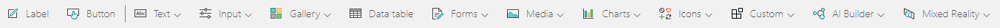
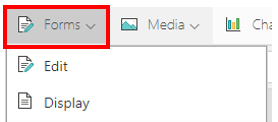
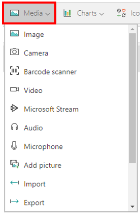
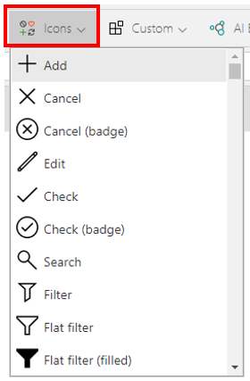

In Power Apps, you can add a variety of user interface (UI) elements to your canvas app and configure aspects of their appearance and behavior directly from the toolbar, Properties tab, or formula bar. These UI elements are called **Controls**. Many of the controls in Power Apps are just like the controls that you've used in other apps, such as labels, text-input boxes, drop-down lists, and navigation elements.

You can find all the controls available in Power Apps on the **Insert**
tab.

> [!div class="mx-imgBorder"]
> 

You can configure the appearance and behavior of a control by setting
one or more of its properties. Each type of control has a different set
of properties. Some properties, such as **Height** and **Width**, are
common to almost every type of control, but other properties, such as
**ChevronFill** are specific to only certain Controls.

In addition to the controls listed above, there are other types of
controls that you can add to enhance your apps:

**Galleries** - These controls are layout containers that hold a set of controls that show data from a data source. For more information about galleries, see [Work with data in a Power Apps canvas app](/learn/paths/work-with-data-in-a-canvas-app/?azure-portal=true).

> [!div class="mx-imgBorder"]
> 

**Data table** - The **Data table** control shows data from a data source
in a format that includes column headers for each field that the control
shows. As an app maker, you have full control over which fields appear
and in what order. Like the **Gallery** control, the **Data table**
control maintains a **Selected** property that points to the selected
row. Therefore, you can link the **Data table** control to other
controls.

**Forms** - These controls show details about your data and let you
create and edit items. for more information about forms, see
[Write data in a Power Apps canvas app](/learn/modules/write-data/?azure-portal=true).

> [!div class="mx-imgBorder"]
> 

**Media** - These controls let you add background images and sounds.
Controls include a camera button (so that users can take pictures from
the app) and a barcode reader for quickly capturing identification
information.

> [!div class="mx-imgBorder"]
> 

**Charts** - These controls let you add charts so that users can do
instant analysis. You can also add a Power BI Tile using this tab.

> [!div class="mx-imgBorder"]
> 

**Icons** - These controls include shapes, graphics, and symbols to
enhance the user interface. They are quickly recognizable by your users
to ease their interaction with the app. For more information about icon controls, see the **How to build the UI in a canvas app in Power Apps** module of this learning path.

> [!div class="mx-imgBorder"]
> 

**Custom** - Components are reusable building blocks for canvas apps so that app makers can create custom controls to use inside an app, or across apps using a component library. Components can use advanced features such as custom properties and enable complex capabilities.

> [!div class="mx-imgBorder"]
> 

In this module, you will learn about some of these controls and their properties to see how you can incorporate them into your app to enhance the overall functionality. Before developing your app, take a moment to determine the functionality that you want to provide and then select the control that best fits those needs. The more familiar you are with controls and how to work with them. the easier it will be to design your app.

In some cases, certain controls are almost interchangeable, and in those
cases, you can use the control that you prefer. For example, the **Dropdown**
and **Combo box** are similar controls. One key difference between them
is that a **Combo Box** allows you to search for items as well as
select multiple items. The **Dropdown** control does not support this
functionality. 
