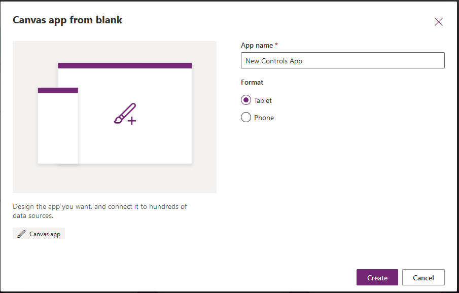
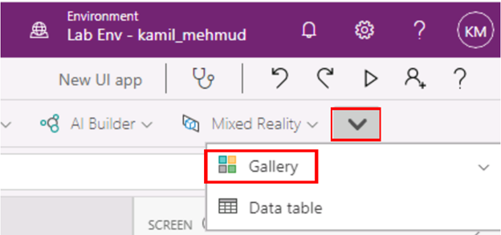
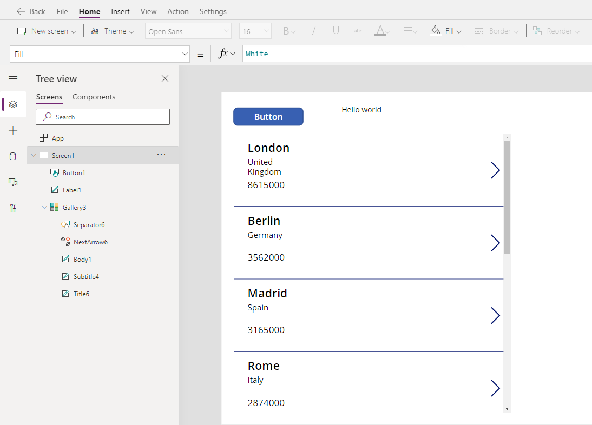
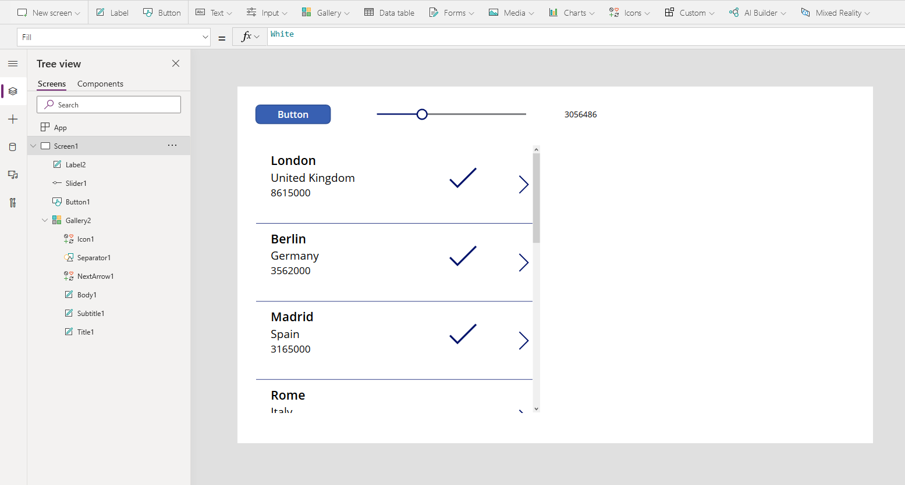

### Creating the collection of data

In this tutorial you will use multiple controls mentioned in the previous units to create a unit canvas app that will change as you interact with the controls. This will give you an idea of the capabilities of controls and how you can fit them to your needs.

1. Sign-in to [Power Apps](https://make.powerapps.com/?azure-portal=true). If using the virtual environment, skip to step 2.

1. On the Home screen select **Canvas app from blank**

	

1. Name your app **New UI App** and click **Create**.

	

1. Select the **Insert** tab and add a button, and set its **OnSelect** property to this formula:

	```powerappsfl
	ClearCollect(CityPopulations, {City:"London", Country:"United
	Kingdom", Population:8615000}, {City:"Berlin",
	Country:"Germany", Population:3562000}, {City:"Madrid",
	Country:"Spain", Population:3165000}, {City:"Rome",
	Country:"Italy", Population:2874000}, {City:"Paris",
	Country:"France", Population:2273000}, {City:"Hamburg",
	Country:"Germany", Population:1760000}, {City:"Barcelona",
	Country:"Spain", Population:1602000}, {City:"Munich",
	Country:"Germany", Population:1494000}, {City:"Milan",
	Country:"Italy", Population:1344000})
	```

    To copy and paste the text in the  virtual environment, select the **Commands** button on the top left corner of the screen, select **Type text**, then select **Type clipboard text**. Paste the copied text in the window.
    
    

1.  Press and hold **Alt Key**, and select the **Button** control. (This
    will create your collection and store all the information.).

1.  Select the **Gallery** dropdown at the top and choose **Blank vertical** gallery and choose **CityPopulations** from the data source pop up.

    

1.  With the gallery selected, in the right pane, change the layout from
    blank to **Title, subtitle, and body**.

1.  Select the last or third Label in the first item of the gallery, and change the **Text** property to
    **ThisItem.Population**.

	

1. Select the **Input** dropdown and choose **Slider**.

1. Change the **Maximum** property of the slider to 10000000.

1. Insert a **Label** and change the **Text** property to **Slider1.Value**.

1. Select the first item in the gallery, and click **Icons** from the top bar and choose the **Check**.

	> [!NOTE]
	> You should see multiple check marks appear in each cell of the gallery. This is as intended since a gallery repeats the format for all items the same as the first item. If you don't see multiple check marks, make sure you have selected the first item in the gallery and insert a **Check** icon again.

1. Change the **Visible** property of the check icon to:

	```powerappsfl
	If(ThisItem.Population > Slider1.Value, true, false)
	```
	
	

As you change the slider you should see check marks appear and disappear per item in the gallery since you set the visibility to change depending on the slider control. Essentially, you made a gallery that shows whether a city's population is greater or not than the slider value. Here is a video of all the controls in action.

> [!VIDEO https://www.microsoft.com/videoplayer/embed/RWyuWD]

