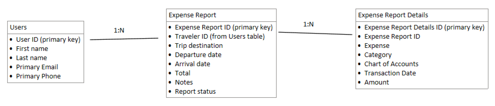

The Transform existing process to a canvas app module (link to module) explains how you can transfer a Microsoft Excel expense report to a canvas app solution, including a new data model. As a reminder, the following screenshot shows the resulting data model from that module.

> [!div class="mx-imgBorder"]
> 

The notations above the lines represent the type of relationships between tables with a one-to-one relationship (1:1), a one-to-many relationship (1:N), and a many-to-many (M:N) relationship. Dividing the information into multiple tables allows for a more dynamic and flexible data model. Additionally, Microsoft Dataverse has been chosen as a data source for the canvas app solution because, among many other benefits, Dataverse offers two key advantages for the scenario. The first advantage is that you can define and exploit the relationships in your data model within Dataverse. As a result, you can be assured that the relationship will be maintained. The second advantage is Common Data Model, which is a series of tables that are predefined and, in some cases, populated in Dataverse to represent the most common tables that are needed by businesses. Likely, you will need some Common Data Model predefined tables in your business solutions. This module doesn't explore all those tables, but the Users table will be covered in the next unit.
