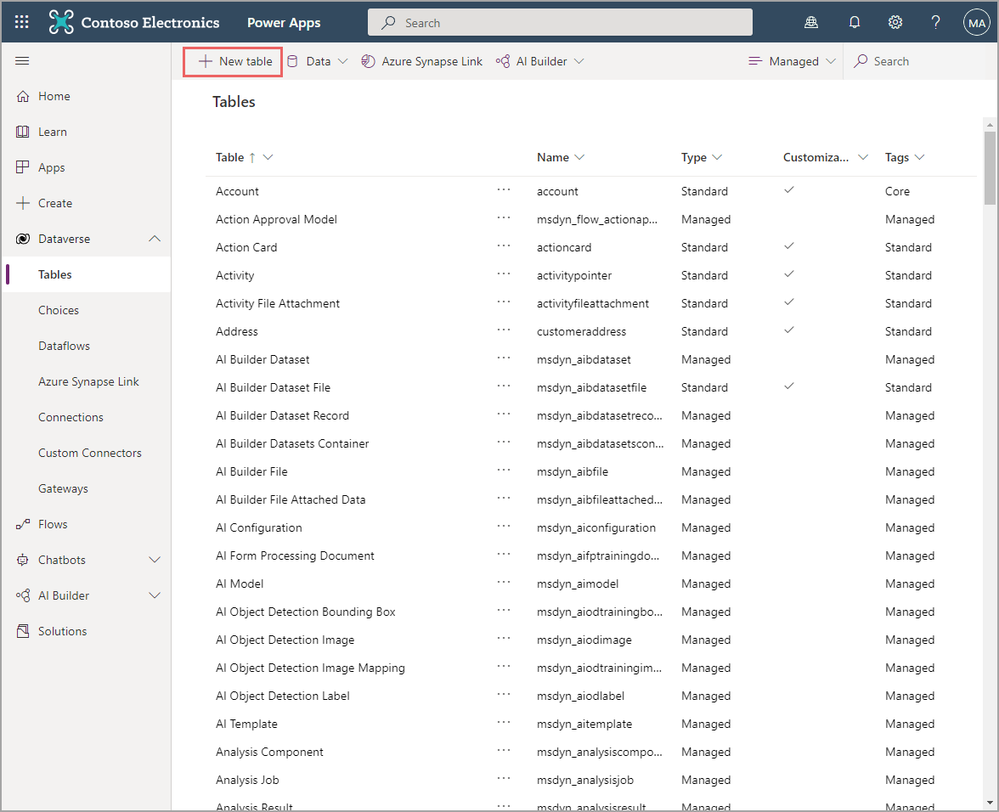
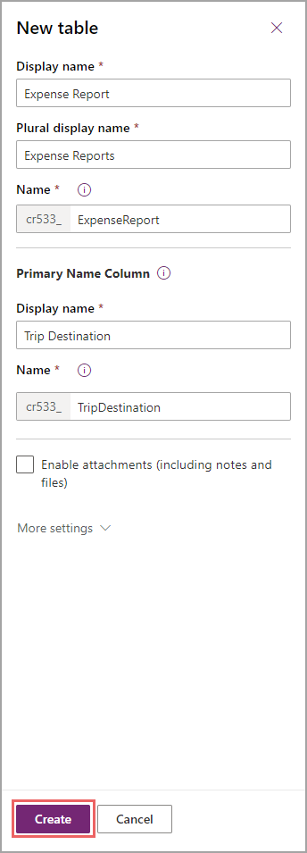
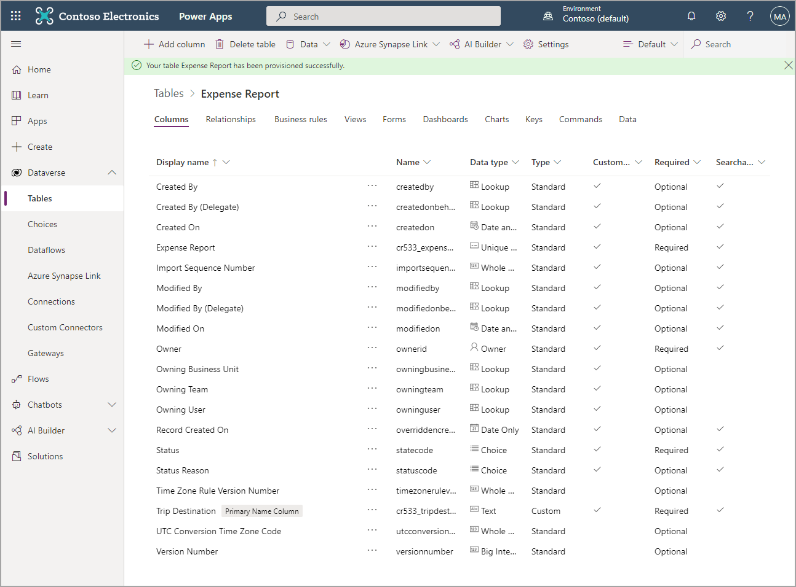
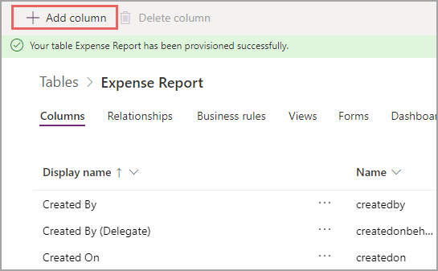
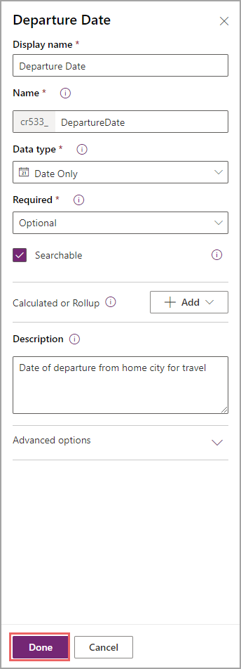
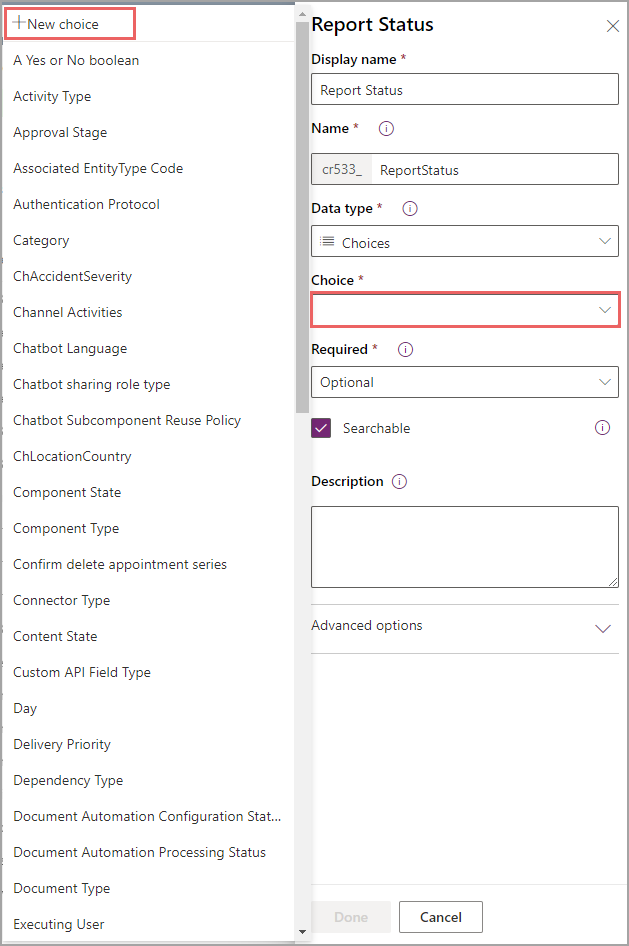
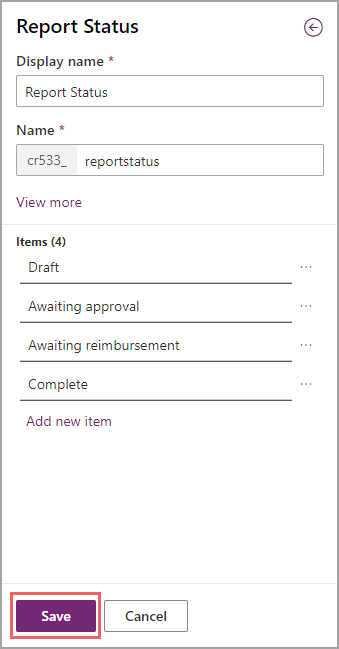
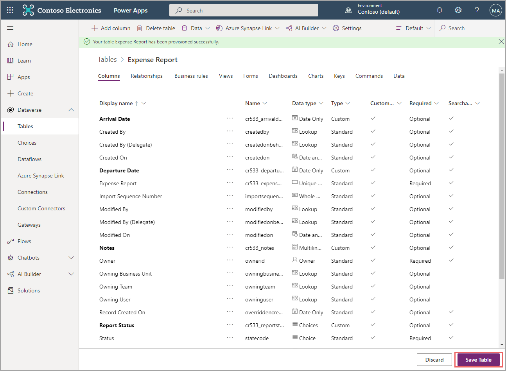

While using predefined tables in Dataverse is quick and simple, you might not always find one that fits your business needs. In this exercise, you will use the Expense Report table to practice creating a custom table.

### Create a new table

To create a new table in Dataverse, follow these steps:

1. In your browser, go to [http://make.powerapps.com](http://make.powerapps.com/?azure-portal=true), expand **Dataverse/Data**, and then select **Tables**.

1. Select **+ New table** at the top.

    > [!div class="mx-imgBorder"]
    > 

    A flyout menu will open, asking questions about your new table. The **Display name** field is shown first on the screen in Dataverse. You will use the plural name in model-driven apps and when you're writing to Dataverse through Microsoft Power Automate. However, for this exercise, you will keep your display name singular and your plural name as something that makes logical sense. Dataverse will try recommending names for you, but the names aren't always ideal. The next field is **Name**, which is a system table name. All custom tables begin with a series of letters and numbers, which will differ from tenant to tenant. This information can't be changed. Your system name should be similar to your display name but with no spaces or symbols other than an underscore. As you enter your display name, other names will populate. In this case, you don't need to change the other names, but you should always ensure that they make sense.

    After your table information, the information for the **Primary Name Column** is included. This column is not the **ID** column, but it will act as a primary field for users to distinguish records. This exercise will use trip destination because it's easily distinguishable for users. If you want to expand this table to all expense reports and not solely to travel-related expense reports, you would use something else, such as a title column. The **Primary Name Column** will always be a text column. Additionally, the column has a display name and a system name; make sure that you follow the same rules in this scenario as you did for the table name.

    Now, you can include attachments. If your scenario includes taking pictures of receipts or plane tickets, you might want to select the **Enable attachments** feature. The subject of attachments isn't covered in this learning path. You can enable attachments after creating the table, so you don't need to know on creation of the table whether your solution requires this functionality.

1. Enter the table information to match the following screenshot and then select **Create**.

    > [!div class="mx-imgBorder"]
    > 

    After several seconds, your table will appear. Before you continue, wait until you receive the message that your table has been provisioned successfully.

    > [!div class="mx-imgBorder"]
    > 

Dataverse has created several columns to help you organize and secure your information. All columns won't be used in this exercise; however, take a moment to look through them in case you need to use them later.

### Create the columns

Now that you have created the table, you need to add a few more columns for your solution:

1. Select **+ Add column** in the upper-left corner.

    > [!div class="mx-imgBorder"]
    > 

    A flyout menu similar to the one that you used to create a table will appear. Fill out the **Display name** and system **Name** fields as you did previously. In the **Data type** field, you will define a data type. Defining a data type is important for data validation or to ensure that your users only enter the correct data into that column. For example, if you have an expense date, you don't want someone to enter "three weeks ago" into the field. This information would not be valuable for accounting. Instead, you need to ensure that the user enters an actual date. For more information about the various types of data that's allowed in Dataverse, see [Types of columns](/powerapps/maker/data-platform/types-of-fields/?azure-portal=true#).

    In the **Required** field, you can make any column required, meaning that the user must populate that field before saving the record. Make sure that users won't need to save as a draft before you make all fields required instead of optional. Additionally, you can write similar data validation inside your canvas app, such as making sure that some fields are populated before users save as a draft but that more fields are populated before users can push the expense report to the next stage.

    For more information, see [Getting started using Dataverse](/learn/paths/get-started-cds//?azure-portal=true#).

    The **Description** area allows you to describe the column or your decisions in defining it.

1. Enter the following column information and then select **Done**.

    - **Display name** - Departure Date

    - **Name** - DepartureDate

    - **Data type** - Date Only

    - **Required** - Optional

    - **Description** - Date of departure from home city for travel

    > [!div class="mx-imgBorder"]
    > 

1. Create the following extra columns:

    - **Display name** - Arrival Date

        - **Name** - ArrivalDate

        - **Data type** - Date Only

        - **Required** - Optional

        - **Description** - Date of return to home city from travel

    - **Display name** - Total

        - **Name** - Total

        - **Data type** - Currency

        - **Required** - Optional

        - **Description** - Total expenses from trip

    - **Display name** - Notes

        - **Name** - Notes

        - **Data type** - Multiline Text

        - **Required** - Optional

        - **Description** - Any notes or additional information on trip and expenses

    For the final field, you will add a **Choice** column.

1. Select **+ Add column** and enter **Report Status** in the **Display name** field and **ReportStatus** in the **Name** field.

1. On the **Data type** dropdown menu, select **Choices**.

1. A new **Choice** field will appear. Select the dropdown menu under **Choice** and then select **+ New choice**.

    > [!div class="mx-imgBorder"]
    > 

1. Under the new flyout menu, add the following choices:

    - Draft

    - Awaiting approval

    - Awaiting reimbursement

    - Complete

1. Select **Save**.

    > [!div class="mx-imgBorder"]
    > 

1. Ensure that the **Required** field is set to **Optional** and then select **Done**.

    All newly created columns will display in bold. If you exit without saving the table, none of your changes will be reflected.

1. Select **Save Table** in the lower-right corner.

    > [!div class="mx-imgBorder"]
    > 

You have now created your first custom table in Dataverse. Now, you can use the previous steps to create your Expense Report Details table with the information that is provided in the following section. To assess how much you've learned, try going through the steps without looking back.

### Table information

Create a new table called **Expense Report Details** by using the following details:

- **Display name** - Expense Report Detail

- **Plural display name** - Expense Report Details

- **Name** - ExpenseReportDetail

- **Primary name column display name** - Expense

- **Primary name column name** - Expense

### Column information

Now, create custom columns for this table by using the following columns and details information:

- **Display name** - Category

  - **Name** - Category

  - **Data type** - Text

  - **Required** - Optional

  - **Description** - Category of expense

- **Display name** - Transaction Date

  - **Name** - Transaction Date

  - **Data type** - Date Only

  - **Required** - Optional

  - **Description** - Date transaction for expense

- **Display name** - Amount

  - **Name** - Amount

  - **Data type** - Currency

  - **Required** - Optional

  - **Description** - Amount of expense

When you are done adding these columns, don't forget to select **Save Table** to ensure that your work on this table is saved.
