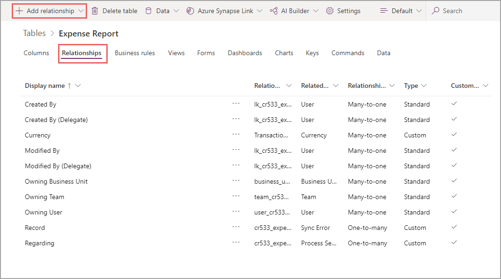
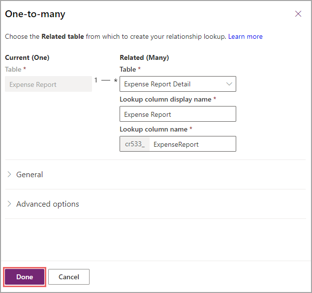
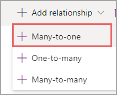
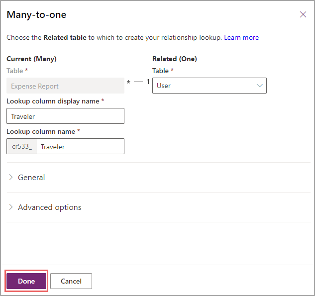
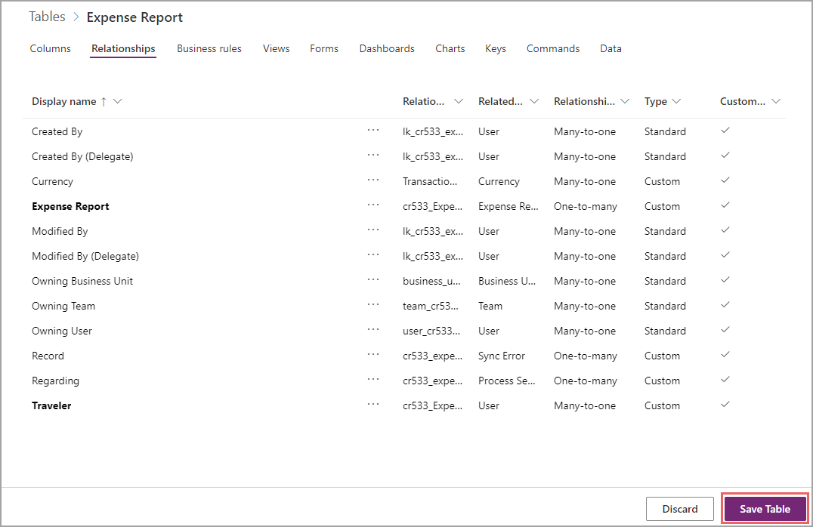

Now we have all the tables we are going to use and have columns inside of them, we need a way to relate those tables. Notice we didn't add any of the user information in the Expense Report table or any of the Expense Report information in the Expense Report Details table. Thankfully, Dataverse makes connecting all of these tables easy.

### Relate expense report to expense report details

As always, in your browser, start out by visiting [http://make.powerapps.com](http://make.powerapps.com/?azure-portal=true).

1. Expand **Dataverse** and select on **Tables**.

1. Choose the **Expense Report** table you created in the last unit. If you can't see it, try changing the view to Custom.

1. Once you are in the table, select on the **Relationships** tab. You should see some out of the box relationships, which help Dataverse work.

1. Select **+ Add relationship** to create a new one.

    > [!div class="mx-imgBorder"]
    > 

    Dataverse will ask you which type of relationship you would like. As discussed in the previous module and the first unit of this module, we are creating a **One-to-many** relationship. This is because there is one expense report for many details (or line items).

1. Select **+ One-to-many**.

    After selecting your relationship, a fly out menu will appear to request a table to which you can relate your Expense Reports.

1. Select the dropdown and select your other custom table, **Expense Report Details** (hint: it's in alphabetical order).

    After you select a table, Dataverse will pop a few more fields up. These fields define what the name is of the column in your Expense Report Details, which is a lookup to your Expense Report table. It's fine to keep the automatically populated column name, but feel free to change it if you feel it will be confusing.

1. Select **Done**.

    > [!div class="mx-imgBorder"]
    > 

    Now that we know how to define a one-to-many relationship, we could go to the User table and do the same since there is one user for many Expense Reports, or we can also do that here.

1. Select **+ Add relationship**, and this time, choose **Many-to-one**.

    > [!div class="mx-imgBorder"]
    > 

1. In the flyout menu, select the **User** table from the dropdown. Notice that now the lookup column display name pops up on the Expense Report side. This will always happen on the *many* side of the relationship.

1. Although we didn't need to rename the lookup column for the other relationship, we'll call this column "**Traveler**" for clarity and then select **Done**.

    > [!div class="mx-imgBorder"]
    > 

1. As always, nothing is permanent in Dataverse until you select **Save Table** so go ahead and select that now.

    > [!div class="mx-imgBorder"]
    > 

After a few seconds, your relationships are defined. You can switch to the **Columns** tab where you'll now see the column **Traveler**. In addition, there will be a new **Expense Report** column in your Details table.

Congrats! You have successfully defined relationships inside of Dataverse, allowing you to relate information inside of your app.
