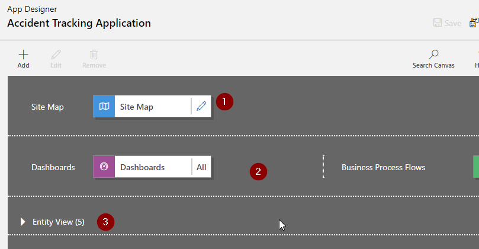
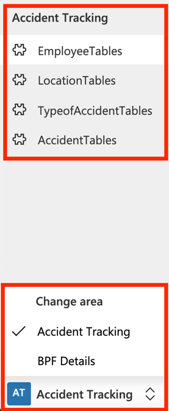
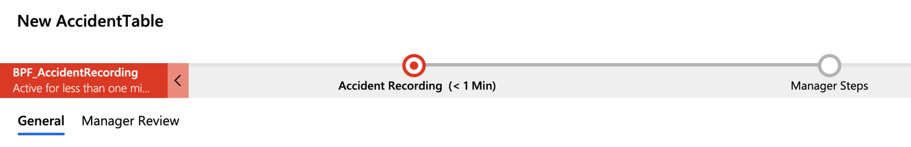
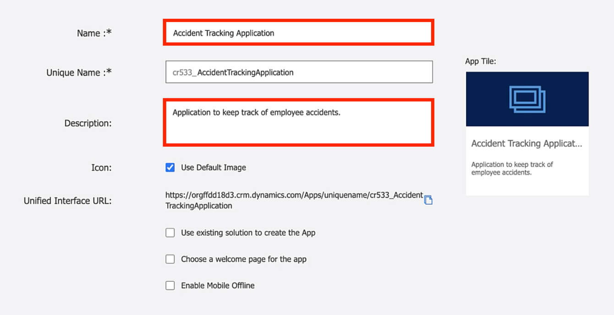
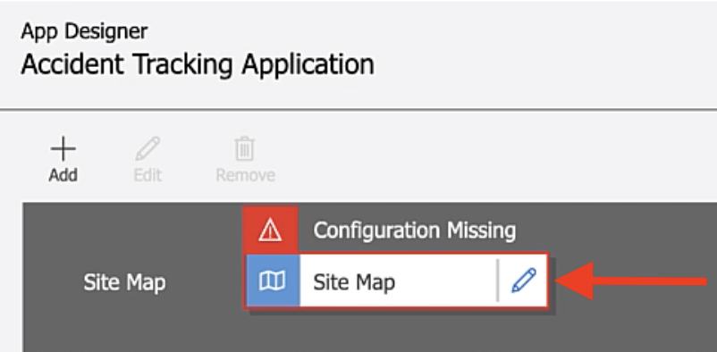
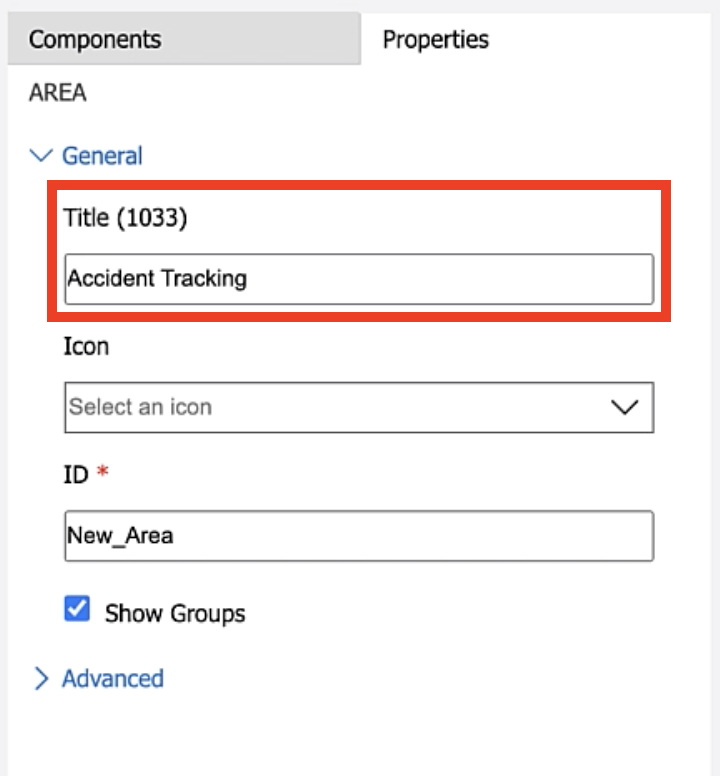
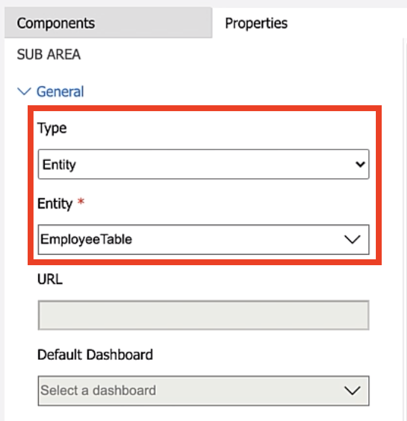
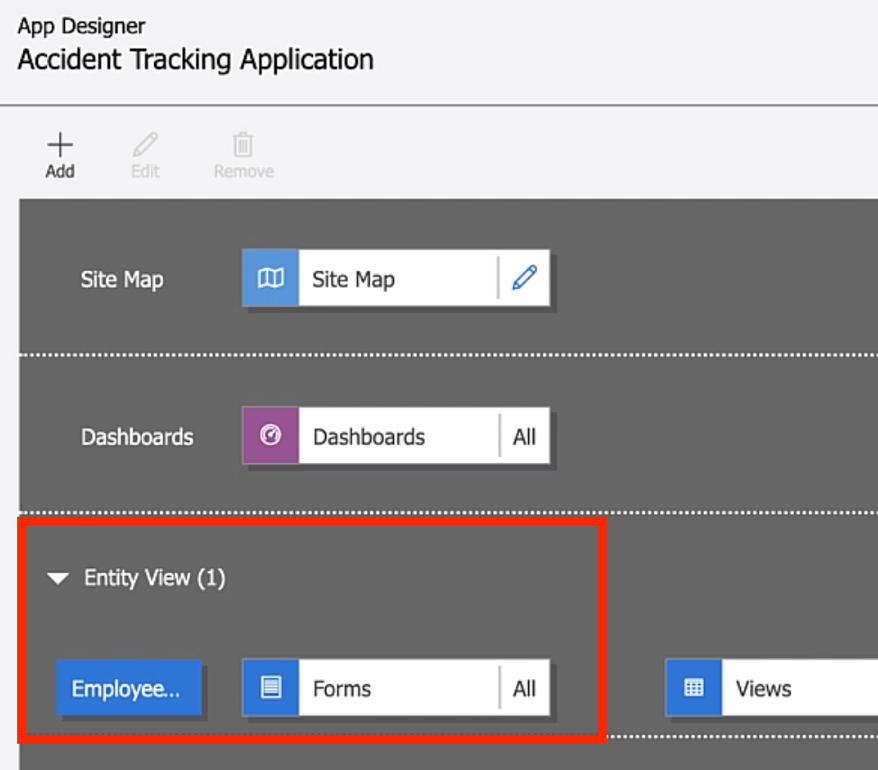
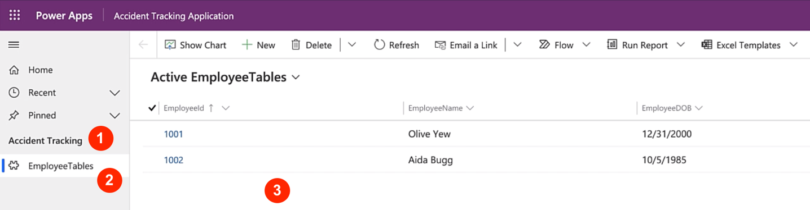

In this module, we will continue our work on the accident tracking application. You can download the package file (insert link) to access the application work built thus far.

Using a Microsoft Excel workbook to track accidents gave users a one stop to view, review and add new accidents records. The goal of building a model-driven app is to achieve the same concept. It will package all of the tables, views, and forms into a business application where users can do all the activities related to accident tracking.

The best way to get familiar with the classic app designer is to jump right into building an app. During the app creation process, you'll learn more about the different components of model-driven apps and how to work with the **App Designer**.

The **App Designer** is where all the components of the app come together to put the tables, views, and forms we created into one single cohesive business application. The concept of the model-driven app is to have one business application where app users can review and update all the records related to a business process. In our example we'll create a model-driven app where users can view and update employees, locations, accident types, and report accidents efficiently.

Let's review the components of the **App Designer**:

> [!div class="mx-imgBorder"]
> 

- **Site Map** - This is where the general navigation of the model driven app will be designed. The site map represents the order and menus that appear on the left side of a model-driven app.

    > [!div class="mx-imgBorder"]
    > 

- **Dashboards and Business Process Flows** - Dashboards allow you to present data using charts and visuals. Business process flows are a visual guide that helps user navigate a business process. We'll talk more about BPF in the next module

    > [!div class="mx-imgBorder"]
    > 

- **Entity View** - This section will list out all of the tables being used and referenced in the model-driven app

## Create a new model-driven app

1. To get started, navigate to [make.powerapps.com](https://make.powerapps.com/?azure-portal=true) and sign in with your Microsoft credentials.

1. Select **Apps** and then **+ New app**.

1. Select **Model-driven** apps from the drop-down.

1. Select **Classic app designer** and then select **Create**.

1. Give your app a name. Power Apps will give your app a unique name by default, you can choose to change it. We'll call ours **Accident Tracking Application**.

1. Give your app a description to help users understand the general purpose and usage of the app.

    > [!div class="mx-imgBorder"]
    > 

1. Select **Done**.

This will create the model-driven app and take you into the classic app design experience.

1. The first piece that you must define is the **Site Map.** The site map is the general navigation menu of your app. It sits on the left of the screen and it divides the app into sections that will make business sense. In the next steps, you'll see where this component sits in the app.

1. Select the pencil icon within the **Site Map** to configure it.

    > [!div class="mx-imgBorder"]
    > 

1. Select **New Area** and in the left give it a meaningful name. We'll call it **Accident Tracking**.

    > [!div class="mx-imgBorder"]
    > 

1. Select **New Group** and give it a better name. We'll call it the same as the area, **Accident Tracking**.

1. Now, select **New Subarea** (This is where we'll get to choose which entity to associate with our model driven app).

1. On the right menu, under **Type,** select **Entity (Entity = Table)**.

1. From the **Entity** list, select our **EmployeeTable**.

    > [!div class="mx-imgBorder"]
    > 

1. Select **Save and Close**.

1. At this point in the main designer experience, you'll see under **Entity View,** our **EmployeeTable** being listed.

    > [!div class="mx-imgBorder"]
    > 

1. Let's take a moment to review the look of our newly create app. Once you're done, select **Save**.

1. Now select **Publish** so that we can play a preview of our app.

1. Select **Play** to review what we have so far.

    > [!div class="mx-imgBorder"]
    > 

1. In the screenshot above, one is the **Group**.

1. Represents the **Sub Area,** the employee table we selected.

1. Displays the **Active Employees** view we modified in an earlier section.
