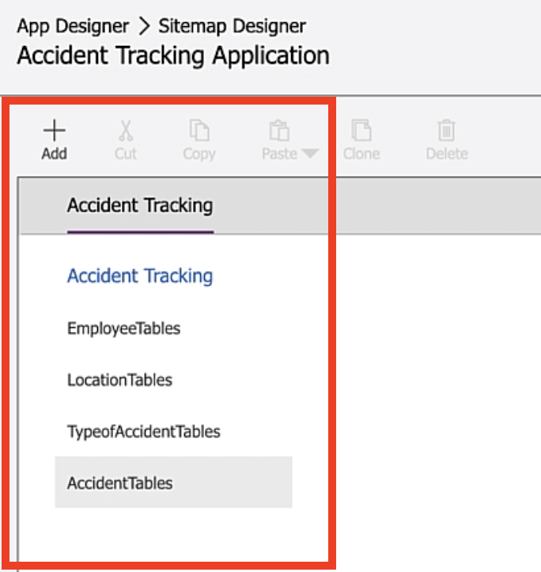
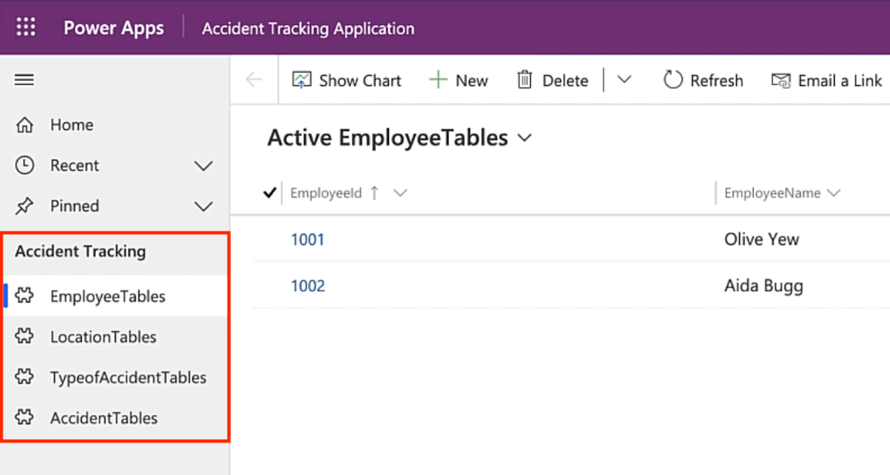

In this exercise, you'll add the other tables that you created in prior modules.

>[!NOTE]
> If you haven't completed the previous modules within this learning path, download the [packaging files](https://github.com/MicrosoftDocs/mslearn-developer-tools-power-platform/tree/master/power-apps/create-model-driven-app). These files contain the completed work on the accident tracking app thus far.

1. Return to your browser tab with the **App Designer** open to continue where you left off in the previous section. If you've closed the **App Designer** browser tab, go to [make.powerapps.com](https://make.powerapps.com/?azure-portal=true), and under **Apps**, find your **Accident Tracking Application**, select the ellipsis (**...**), and then select **Edit**.

    > [!div class="mx-imgBorder"]
    > 

1. Select **Site Map** to navigate to the site map designer.

1. Select the **Employees** sub area, and then under **Components**, drag the new **Sub Area** below your **EmployeeTables** sub area.

1. Select **Entity** as the **Type**.

1. Find **LocationTable** in the entity list.

1. Repeat the same process to add **TypeofAccidentTable** and the **AccidentTable**.

    > [!div class="mx-imgBorder"]
    > 

1. Select **Save and Close** in the sitemap designer.

1. Select **Save** in the app designer.

1. Select **Publish** to review the changes.

1. Select **Play** to view the model-driven app.

    > [!div class="mx-imgBorder"]
    > 
