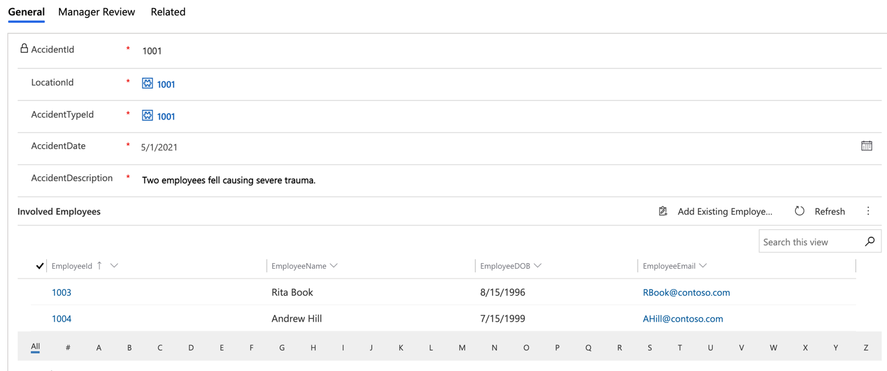
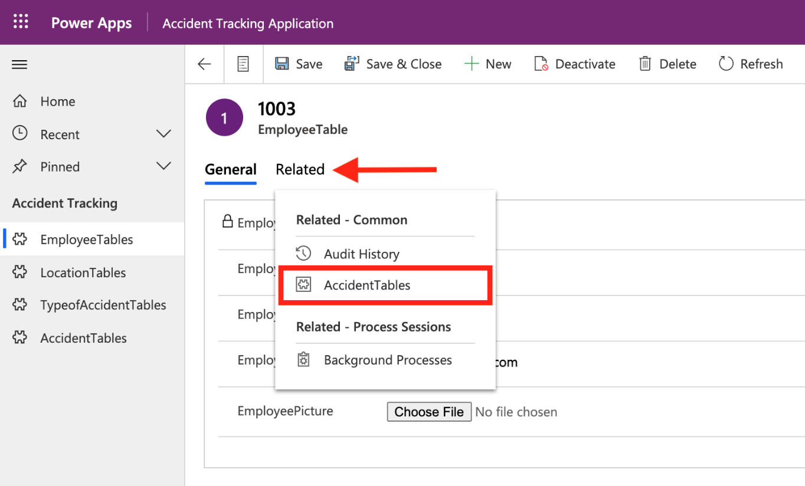
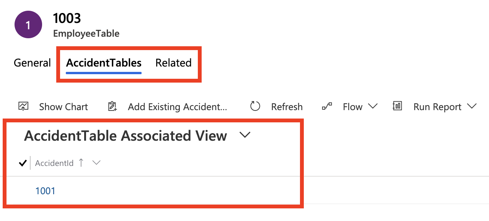
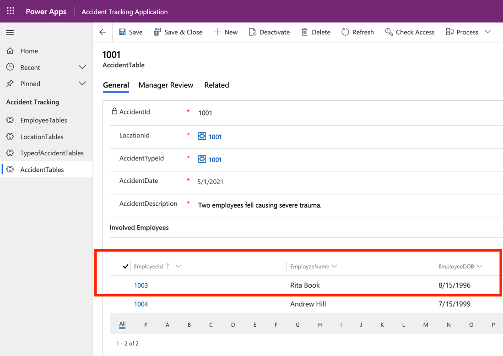

An important aspect of model-driven apps is the data model and how the different tables relate to each other. This section reviews how those relationships help simplify data navigation and allow users to view the following information:

- Accidents that an employee has been involved in

- Accidents that have occurred in a particular location

- A list of all accidents

Finding the related records for the preceding information is possible because of the table relationships that are built during your data modeling module. In the next exercises, you'll accomplish this task by using the **Related** view in model-driven apps.

## Create new records by using model-driven apps

To observe how the app functions, start by creating new records:

1. Under **Apps**, find and select **Accident Tracking Application**.

1. Select the **Employees** sub area and then select **New**.

   This step will direct you to the main form that you modified in the previous unit. In the next steps, you will create two new employees.

1. Create the first new employee with the following information:

    - **EmployeeName** - Rita Book

    - **EmployeeDOB** - 8/15/1996

    - **EmployeeEmail** - RBook@contoso.com

1. Select **Save** and then add a new employee picture file.

    **EmployeePicture** - Choose a picture

1. Create the second new employee with the following information:

    - **EmployeeName** - Andrew Hill

    - **EmployeeDOB** - 7/15/1999

    - **EmployeeEmail** - AHill@contoso.com

1. Select **Save** and then add a new employee picture file.

    **EmployeePicture** - Choose a picture

1. Create a new location. Go to **LocationTable** from the app and then select **New**:

    - **LocationName** - Contoso East

    - **LocationCountry** - USA

1. Create a new type of accident. Go to **TypeofAccidentTable** from the app and then select **New**:

    - **AccidentName** - Head Trauma

    - **AccidentSeverity** - 5

1. Create two new accidents. Go to **AccidentTable** from the app and then select **New**:

    - **LocationId** - From the dropdown menu, select **Contoso East**.

        > [!TIP]
        > If you press the **Enter** key while on the dropdown menu, the location names will be revealed instead of their IDs.

    - **AccidentTypeId** - From the dropdown menu, select **Head Trauma**.

    - **AccidentDate** - 5/1/2021

    - **AccidentDescription** - Two employees fell causing severe trauma.

1. Select **Save**.

    After the record has been saved, the subgrid should appear, allowing you to add the involved employees.

1. Select **Add Existing Employee**, and then press **Enter** in the **Look for records** box to reveal the employee names. Select **Rita Book** and **Andrew Hill** from the list.

    > [!div class="mx-imgBorder"]
    > 

1. Select **Save**.

## View related records from model-driven apps

In this section, you'll learn how to navigate in the app to find information with related data. Previously, you created relationships between your tables to help make this process easier.

For example, you can create a many-to-many relationship between your **EmployeeTable** and **AccidentTable** because multiple employees can be involved in multiple accidents. In this scenario, you want to review the accidents that **Rita Book** has been involved in.

1. Go to **EmployeeTable** from the model-driven app.

1. Select the record for **Rita Book**.

1. Select **Related > AccidentTables**.

    > [!div class="mx-imgBorder"]
    > 

   You will be directed to a view that lists the accidents that **Rita Book** has been involved in.

    > [!div class="mx-imgBorder"]
    > 

1. Select any record to bring up the accident details.

    > [!div class="mx-imgBorder"]
    > 

You can also complete this related action from the **LocationTable** to view all accidents that have occurred in that location. The reason is because of the one-to-many relationship that you built in a previous module between **LocationTable** and **AccidentTable**. By using the same concept, you can use the related action to view the accidents that belong to a particular accident type. These actions are standard from model-driven apps if relationships exist between the tables.
