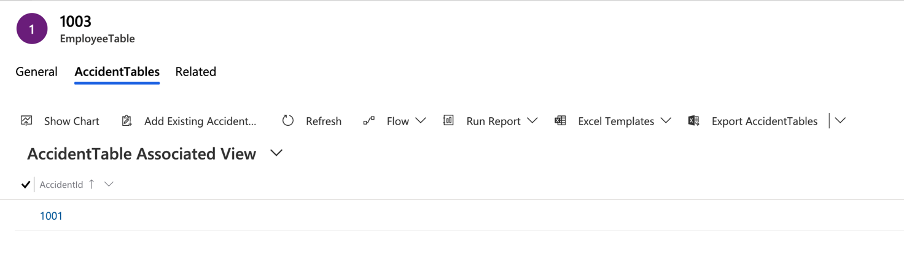
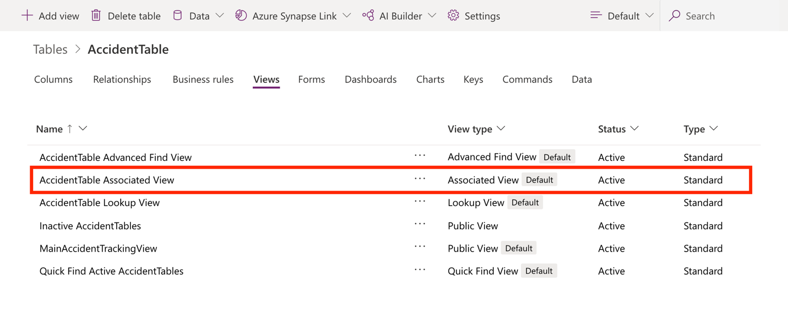
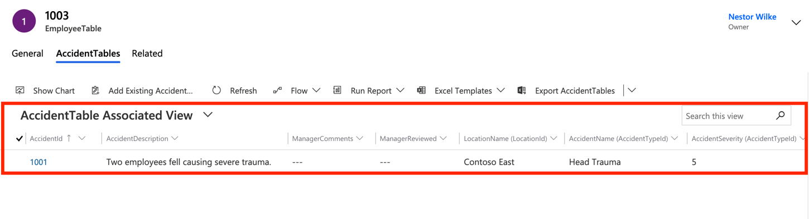

In the previous section, we saw that using the related action, we could view the accidents an employee has been involved in. What if we wanted to modify that view to add more details about the accident? That way a user wouldn't have to select each accident to view the details.

> [!div class="mx-imgBorder"]
> 

From the picture above, you may notice the name of that view is actually **AccidentTable Associated View**. We need to modify the view to add more details about the accident, to do this, follow the steps below.

1. Navigate to **Tables** in Dataverse.

1. Find the **AccidentTable** in the list of tables.

1. Select **Views** and then find **AccidentTable Associate View**.

1. Select the **AccidentTable Associate View** to open it the designer studio.

    > [!div class="mx-imgBorder"]
    > 

1. In the designer studio, select the following fields to add more detail to the view:

    - **AccidentDescription**

    - **ManagerComments**

    - **ManagerReviewed**

1. From the **Related** section, add the following fields:

    - **LocationName**

    - **AccidentName**

    - **AccidentSeverity**

1. Select **Publish**, to save, and finish the process.

1. Select **Back**, to return to Dataverse.

1. Select **Apps,** find, and select the **Accident Tracking Application**.

1. Navigate to **EmployeeTables** and then select the **Rita Book** record.

1. Select **Related** and then select **AccidentTables**.

    The view we updated should be visible along with all the fields.

    > [!div class="mx-imgBorder"]
    > 

As you can see from the exercise above, the moment you update the view the results were shown in our model-driven app. Changes in table views and forms automatically reflect in model-driven apps.
