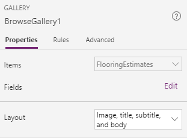
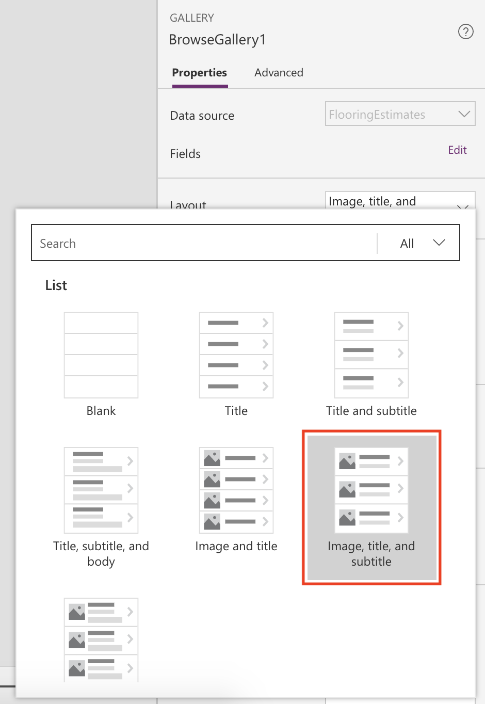
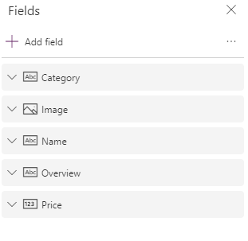

In the previous module, you generated the Flooring Estimates app and started to explore its default design. While the default screens make a useful app out of the box, you'll often want to customize a generated app to suit your needs.

This unit explains basic changes for each screen in the app. You can do a lot more to customize an app, but the best way to start learning is to take a generated app and make common customizations. This will allow you to become familiar with the controls, layouts, and functions.

## Browse screen
The Flooring Estimates app already shows an image and some text for each product, but the layout could be better. 

To improve the layout, use the following procedure: 

1. On the Screens pane on the left, select **BrowseGallery1**.

    The selection box around the gallery confirms your choice.

    

1. On the right pane, open the Data pane by selecting the drop-down menu next to **Layout**.

    

1. Select a different layout, such as the one that shows the image, the title, and the subtitle but not the body.

    

1. Select the category of the item at the top of the gallery.

    

1. Change **ThisItem.Category** to **ThisItem.Name** in the formula bar.

1. Repeat the previous two steps but change the other **Label** control to show the price of each item.

    

Changing the layout of a gallery and the types of data that it shows is that simple, and you might find that it's fun, too.

## Details screen

On the details screen, you want to change the order of the fields. The controls on this screen differ from the controls on the
browse screen, so the process for changing them is also slightly different.

1. On the Screens pane on the left, select **DetailScreen1 > DetailForm1**.

1. On the right pane, select **Edit fields**.

    

1. Drag the **Name** field to the top of the list of fields and then drag the **Image** field to the bottom.

    

## Edit/create screen

On the screen where your users edit and create entries, you want to make it easier for them to enter information in a text box.

1. On the Screens pane on the left, select **EditScreen1 > EditForm1**.

1. On the right pane, select **Edit fields**.

1. Expand **Overview**.  Select the drop-down arrow for the **Control type** and then select **Edit multi-line text**.

    A multi-line edit control will simplify your user's ability to add more than a few words in this field.

A few basic steps can greatly improve the appearance and experience of using an app, and PowerApps Studio provides many options for customizing those apps.
