For a user, a navigation menu gives an overall perspective of the services an app has to offer. So it's also important to have such a menu available throughout the app. From the maker standpoint, the menu needs to be easy to make and easy to update.

## Overview of a navigation menu

A navigation menu can be built using individual buttons or using a collection in a gallery. Adding individual buttons takes more time and effort to align their X and Y positions and to match their height and width. However, button navigation is still required for scenarios where only one or two buttons are needed. Below is an example of a home screen for a Device Request app that has two buttons.

> [!div class="mx-imgBorder"]
> [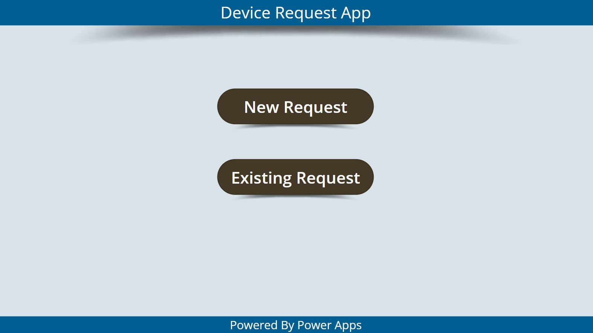](../media/buttons-menu.jpg#lightbox)

When a navigation menu contains multiple options, then using a combination of a collection (or data source) and a gallery is a better option. This way formatting the X and Y location and the height and width is automatically taken care of.

> [!div class="mx-imgBorder"]
> [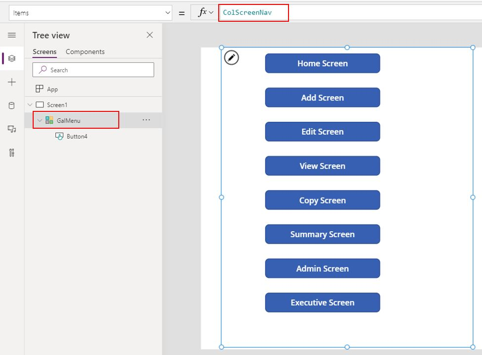](../media/collection-gallery.jpg#lightbox)

## Use a data source

Having the menu content connected to the data source gives the flexibility to modify the menu without having to modify the app design in the canvas studio. Take, for example, Microsoft Lists. The menu can be added as items in the list as shown below.

> [!div class="mx-imgBorder"]
> [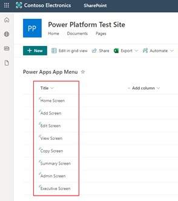](../media/sharepoint-list-items.jpg#lightbox)

This list is then connected to Power Apps as a SharePoint data source.

> [!div class="mx-imgBorder"]
> [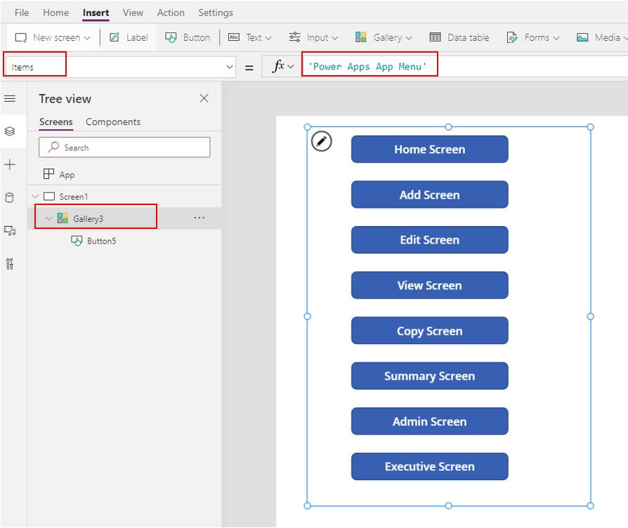](../media/sharepoint-list-navigation.jpg#lightbox)

## Use a collection

You also have the flexibility to create a collection inside the canvas app using the **App OnStart** property. Then you can populate that collection in a gallery as a menu like a list in Microsoft Lists.

> [!div class="mx-imgBorder"]
> [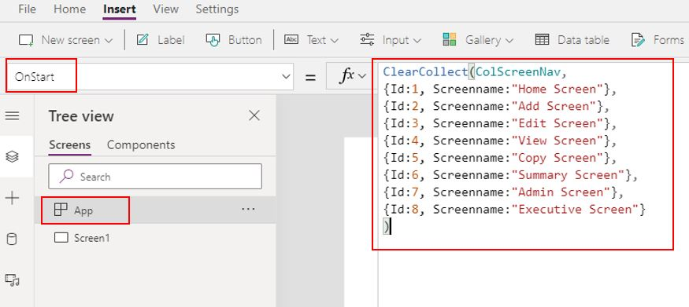](../media/collection-app-start.jpg#lightbox)

Next, add a **Vertical** gallery.

> [!div class="mx-imgBorder"]
> [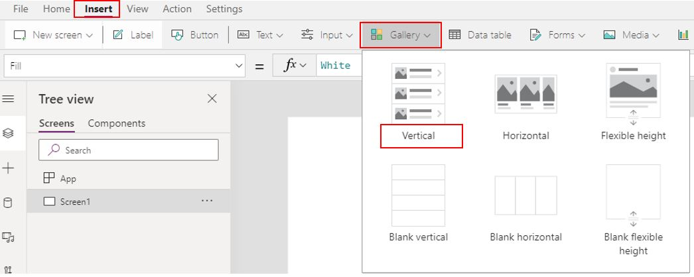](../media/vertical-gallery.jpg#lightbox)

With **Gallery1** selected, select **ColScreenNav**. That will replace the default **CustomGallerySample** in the **Items**.

> [!div class="mx-imgBorder"]
> [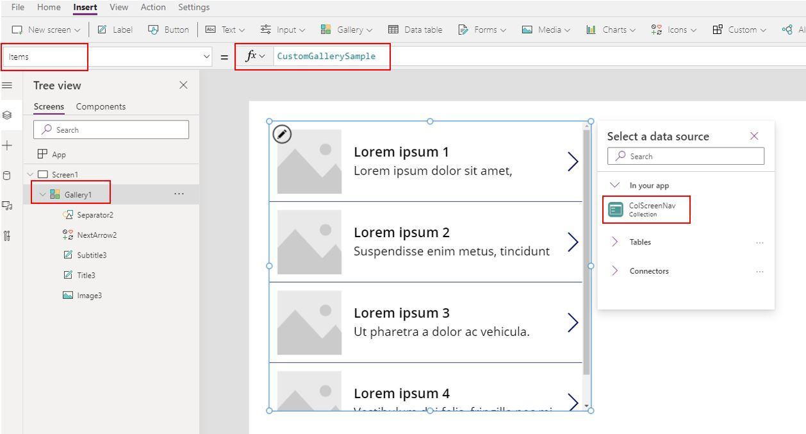](../media/add-collection.jpg#lightbox)

Next, add a button inside the gallery and change its **Text** property to **ThisItem.ScreenName**.

> [!div class="mx-imgBorder"]
> [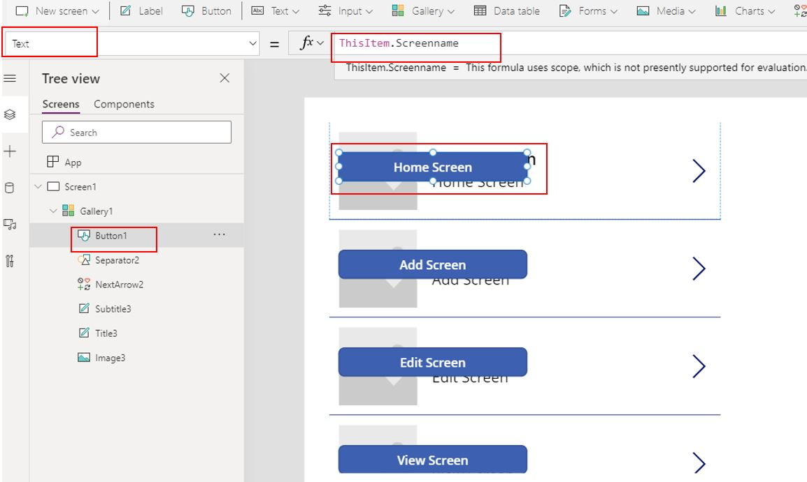](../media/add-button.jpg#lightbox)

You can now delete the remaining controls inside **Gallery1** except **Button1** and also resize the **Template size**.

> [!div class="mx-imgBorder"]
> [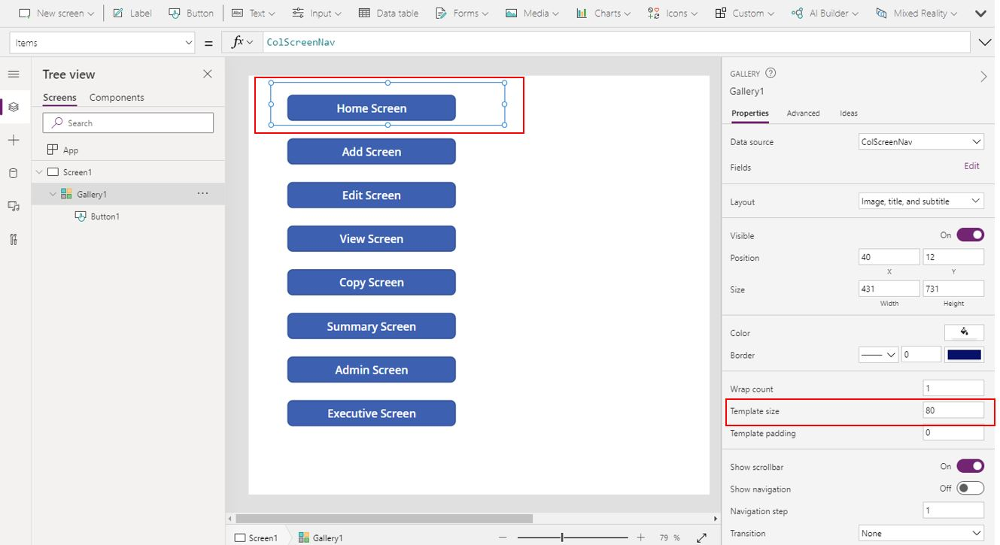](../media/clear-vertical-menu.jpg#lightbox)

> [!div class="mx-imgBorder"]
> [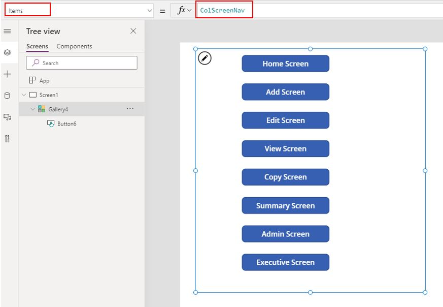](../media/collection-gallery-menu.jpg#lightbox)

A similar process can be followed to create a horizontal menu using the Horizontal gallery.

> [!div class="mx-imgBorder"]
> [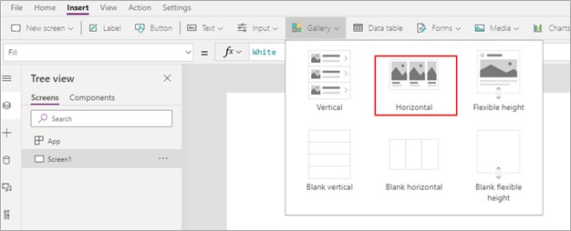](../media/horizontal-gallery.jpg#lightbox)
