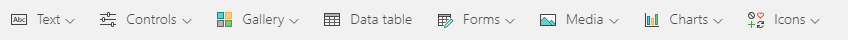

This unit examines the screens and other controls that define the behavior of apps that Microsoft PowerApps generates. All the details won't be covered; however, knowing more about how these apps work will help you build your own apps.

## Controls in PowerApps
A control is a UI element that produces an action or shows information. Many controls in PowerApps are similar to controls that you've used in other apps: labels, text-input boxes, drop-down lists, navigation elements, and so on.

In addition to these typical controls, PowerApps has more specialized controls, which you can find on the **Insert** tab.

A few controls that can add interest and impact to your apps include:

- **Galleries** - These controls are layout containers that hold a set of controls that show records from a data source.
- **Forms** - These controls show details about your data and let you create and edit records.
- **Media** - These controls let you add background images, include a camera button (so that users can take pictures from the app), a barcode reader for quickly capturing identification information, and more.
- **Charts** - These controls let you add charts so that users can perform instant analysis while they're on the road.

To see what controls are available, select the **Insert** tab, and then select each option in turn.

## Explore the browse screen

Each screen in the app has multiple controls, but one control takes up most of the screen space. The first screen in the app is the browse screen, which is named **BrowseScreen1** by default.

Controls in the browse screen that you'll want to become familiar with include:

- **BrowseGallery1** - This control takes up most of the screen and shows data from your data source.
- **NextArrow1** - When this control is selected, it opens the details screen.
- **IconNewItem1** - When this control is selected, it opens the edit/create screen.

## Explore the details screen
The details screen is named **DetailScreen1** by default. Some of its controls are as follows:

- **DetailForm1** - This control contains other controls and contains a data card for each field of the record that is being displayed. 
- **DataCard1** - This is a card control. Each card represents a single field of the record. In this case, it shows a flooring 
category from the Flooring Estimates table, as shown in the previous unit.
- **IconEdit1** - When this control is selected, it opens the edit/create screen so that the user can edit the current item.

## Explore the edit/create screen
The third screen in the app is **EditScreen1**. Some of its controls include:

- **EditForm1** - This control contains other controls and contains a data card for each field of the record that is being edited. 
- **DataCard8** - This is another card control that shows a flooring category from the Flooring Estimates table, as shown in the 
previous unit.
- **IconAccept1** - When this control is selected, it saves the user's changes.

