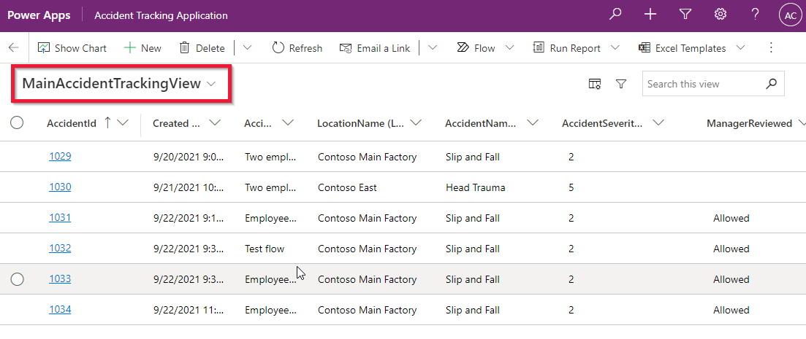
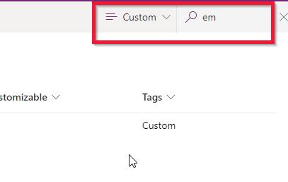
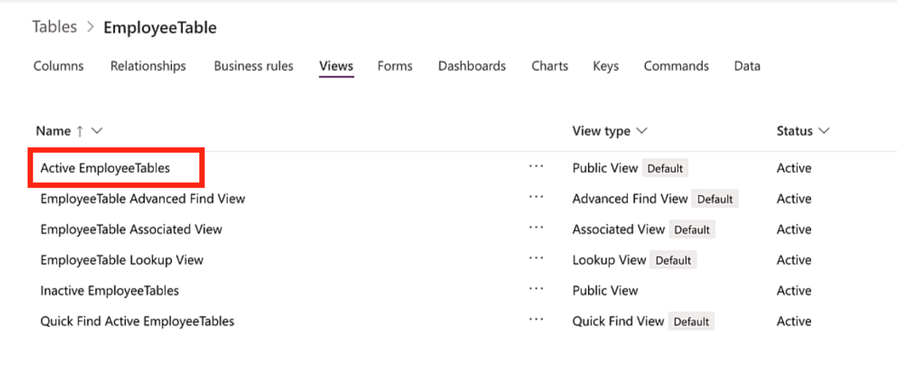
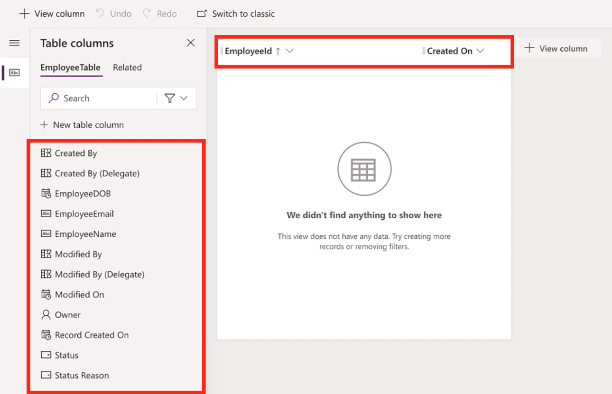
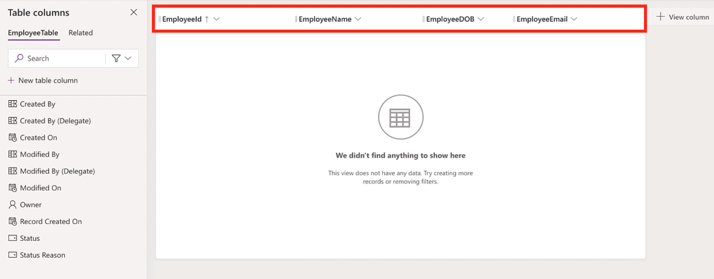
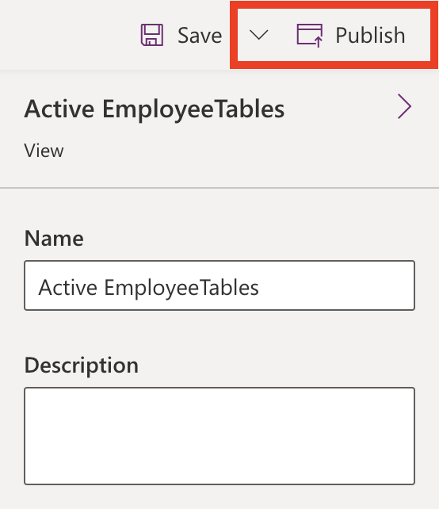

Using an Excel sheet as the method to track company accidents gave the user the ability to view and review logged accidents. It also had the ability to filter the Excel rows based on the cells criteria. The role of a table view is to give the user the same ability in the model-driven app. Views also give the user the ability to review accident records without the risks of overriding or deleting data, errors, which are common in Excel.

Before jumping right into the how's, let's take a moment to briefly review what is a view? And how does it help in model-driven app making.

Views define how a list of records for a specific table appears in your app. It defines the columns shown, the width, sort behavior, and default filters of the records shown in the list. Just like the name implies, think of views as a way to present data to the user for review only.

> [!div class="mx-imgBorder"]
> 

By default, the tables that we created in the previous module have a set of default views we can use to quickly and easily show meaningful data to the users. In this module we will focus on modifying these defaults views, but keep in mind that the same concepts would apply if you wanted to create a new custom view(s). For more information about Views in model-driven apps, see [Understand model-driven app views](/powerapps/maker/model-driven-apps/create-edit-views/?azure-portal=true).

Now that you have a better understanding of Views and some additional information, let's jump right into our first exercise and look at how to modify a default table view.

### Modify default table views

In this section and next exercises we will be modifying the standard views from the tables we created in the prior module. We will turn these views into the one place where app users will be able to review the data stored in the tables. We will make sure that the data being presented is organized and relevant to the app user. For example, we want to make sure the app user can review all the data relevant for an employee under one concise list.

Sign in into Power Apps and follow these steps to modify default views:

1. To get started, navigate to [http://make.powerapps.com](http://make.powerapps.com/?azure-portal=true) and sign in with your Microsoft credentials.

1. In the left navigation pane, expand the **Dataverse** menu, select **Tables.**

1. Scroll until you find the ***EmployeeTable*** we created in the previous module. You can also search for it by selecting **Custom** and then typing "**employee**" in the search bar.

    > [!div class="mx-imgBorder"]
    > 

1. Once you have located the *EmployeeTable*, select ***EmployeeTable*** and then select **Views**.

1. Find and click on the **Active EmployeeTables** view. You will then be redirected to the Dataverse view designer studio.

    > [!div class="mx-imgBorder"]
    > 

    > [!NOTE]
    > Under the View type, you may have noticed that there were several different types of views. To put it simply, the different view types essentially present the same information, but it might be filtered on active vs inactive employees or some other filters. The idea is that you can mix these views and allow users to select from them as pre-set filters to find relevant data more easily in the model-driven app. For our exercise we will modify one view.

1. In design mode, on the left side you will see a list of the columns from the *EmployeeTable* and then a main grid (like an Excel sheet) showing the selected columns.

    > [!div class="mx-imgBorder"]
    > 

    The goal will be to select the columns that will be relevant to users when they want to review employee information. We'll customize our view to include employee name, employee DOB, employeeId, and employee email.

1. By default, this view already has our ***EmployeeId*** column added and the ***Created On*** column. Select the Created On column and from the dropdown select **Remove**. The Created On column will no longer show up in our view.

1. Now add the ***EmployeeName*** column to the view, to do this, just click on it and then it should be added to the grid.

1. Repeat step 8 for ***EmployeeDOB** and **EmployeeEmail**.* Once done, your screen should look like the screenshot below with the fields showing on the grid:

    > [!div class="mx-imgBorder"]
    > 

    You can also choose to reorder them by dragging and dropping using the mouse.

1. In the top-right corner, select **Publish**, to save, and publish your changes.

    > [!div class="mx-imgBorder"]
    > 
