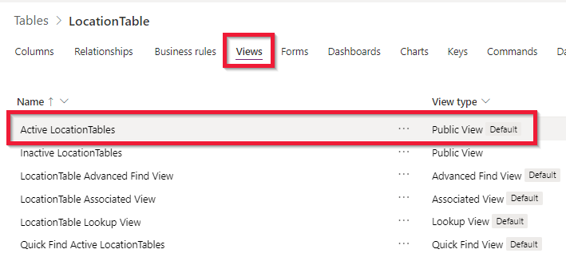
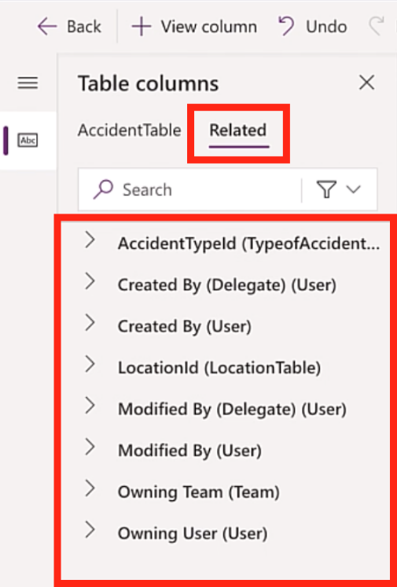
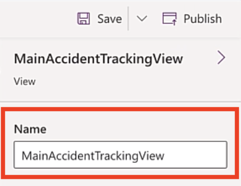

In this exercise, you will modify the views for **LocationTable** and **TypeofAccidentTable**. The end goal will be to modify the existing view and add the columns of data that are most relevant to the app user into one list.

>[!NOTE]
> If you haven't completed the previous modules within this learning path, download the [packaging files](https://github.com/MicrosoftDocs/mslearn-developer-tools-power-platform/tree/master/power-apps/customize-views-forms). These files contain the completed work on the Accident Tracking app thus far.

### Modify the view for LocationTable

Follow these steps to modify the view for **LocationTable**:

1. On the main menu, expand **Dataverse** and then select **Tables**.

1. Find and select the custom **LocationTable**.

1. Select **Views** and then select the **Active LocationTables** view. Once again, you will be redirected to the view designer studio.

    > [!div class="mx-imgBorder"]
    > 

1. By default, this view already has the **LocationId** column and the **Created On** column. Remove the **Created On** column from the view.

1. Select the **LocationName** column to add it to the grid. Repeat the same process for **LocationCountry**. The result should show the fields on the grid.

1. Select **Publish** to save and publish your changes.

### Modify the view for TypeofAccidentTable

To modify the view for **TypeofAccidentTable**, follow these steps:

1. On the main menu, expand **Dataverse** and then select **Tables**.

1. Find the custom **TypeofAccidentTable** and select it.

1. Find **Views** and then select the **Active TypeofAccidentsTables** view to open the view designer studio.

1. Select the **AccidentName** column. It should now be added to the grid. Repeat the same process for **AccidentSeverity**. The result should show the fields on the grid.

1. Select **Publish** to save and publish your changes.

### Modify the view for AccidentTable

The process for modifying the view for **AccidentTable** is the same as the previous exercises. The difference with this process is that you will use the relationships that were built in the previous module to display information in the same view from the related tables. Consider this process as similar to flattening the information to display in a tabular style view information for each accident, such as:

- Location name of the accident

- Type of accident name

- Type of accident severity

1. On the main menu, expand **Dataverse** and then select **Tables**.

1. Find the custom **AccidentTable** and then select it.

1. Select **Views** and then select the **Active AccidentTables** view to open the view designer studio.

1. Select the **AccidentDescription** column to add it to the grid. Repeat the same process for **ManagerComments**, **AccidentDate**, and **ManagerReviewed**. The result should show the fields on the grid.

1. To add fields from the related table, select **Related**. A list of tables that have a relationship with this table will display. By default, all tables in Dataverse have standard relationships with other standard tables, such as the User table.

    > [!div class="mx-imgBorder"]
    > 

1. Find and select **LocationTable**, which will expand to reveal the fields from the table. Select **LocationName** and **LocationCountry** from the list.

1. Find and select **TypeofAccidentTable**. Select **AccidentName** and **AccidentSeverity** from the list.

1. Change the name of this view to **MainAccidentTrackingView**.

    > [!div class="mx-imgBorder"]
    > 

1. Select **Publish** to save and publish your changes.
