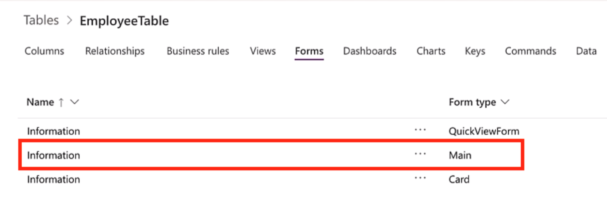
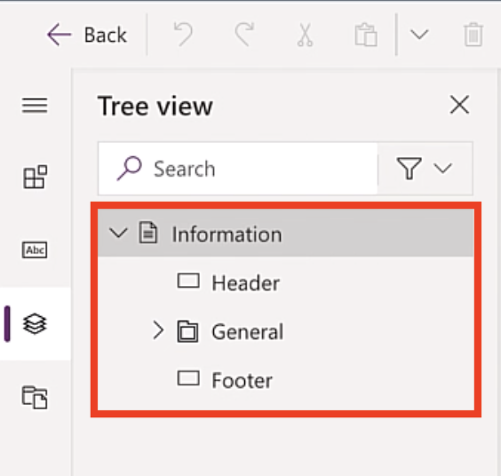
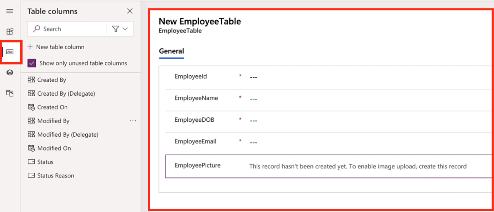
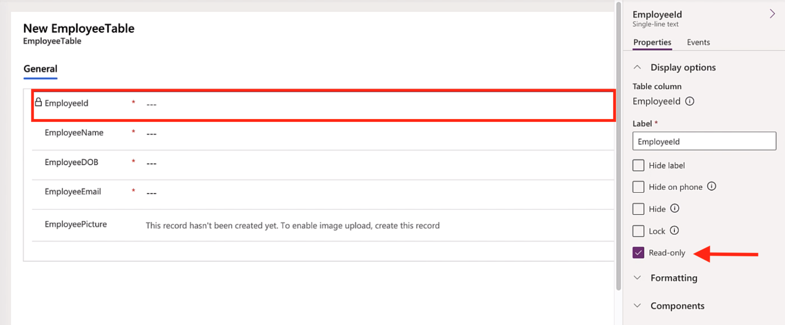
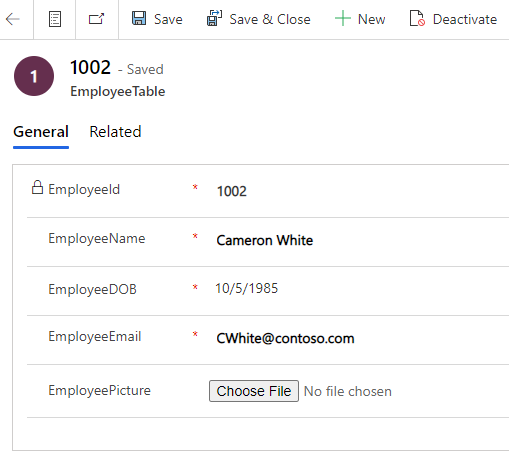
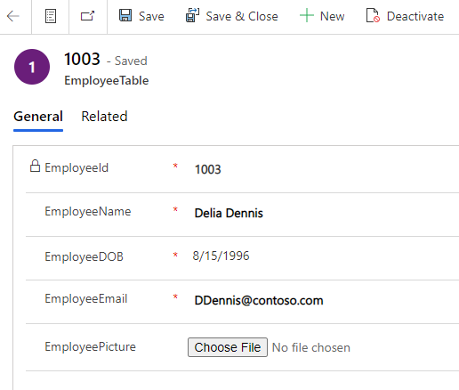

In the previous lesson we learned about table **views,** now it's time to learn about table **forms.**

### What are forms?

Using the Excel workbook to track accidents gave users the ability to log and modify accident reports. The user would insert a new row for new accidents or modify existing accidents directly in the spreadsheet. The goal of table forms is to give the user the ability to log new accidents, modify existing records or even delete records. Forms offer an easy way for users to enter data and solve issues such as data validation, which leads to incorrect data being collected.

**Forms** are the user interface that allows users of the application to interact with the data being stored in the underlying tables. By utilizing forms, the app maker can allow users to create new, edit, and delete records from the tables.

By default, all tables in Dataverse have standard forms, which you can use and implement into your solution, right now. But for many organizations, the standard out of the box forms will still need to be customized and modified to meet your business needs. When creating and or modifying forms, this is where you also want to think about the end-user experience, take some time to customize the users look and feel during the data entering experience.

In this section, we will customize these forms to display the fields that users will update when interacting with our model-driven app. The goal of forms is to allow the user to create, update, and delete records efficiently. This could mean grouping like kind fields into groups that make sense to the business user or simply putting them in order. In the next exercises, we will modify the **Main** form for all our tables. We will then utilize these forms as the main place where app users will interact with the data. The concept of **Forms** is vast, for more information, see the [Forms Docs](/powerapps/maker/model-driven-apps/create-design-forms/?azure-portal=true).

### Modify default table forms

Follow these steps to modify default views:

1. From Power Apps, on the main menu, expand **Dataverse** and select **Tables**.

1. Select the **Tables** menu and then search for the ***EmployeeTable*** we created in the previous module. You can search for it by selecting **Custom** and then typing "**employee**" in the search bar.

1. Select the table and then select **Forms**, find the **Main** information form, and then select it to navigate to the forms design experience.

    > [!div class="mx-imgBorder"]
    > 

1. In here, you will see on the left menu that a form is broken down into three sections, **Header, General, and Footer** section. These three components can be customized to make the data entry process more efficient, if needed.

    > [!div class="mx-imgBorder"]
    > 

1. We will first add the **Owner** (This is Dataverse standard field that quickly shows the user who was the user that created the record in the table) to the **Header** section of the table. To do this simply drag and drop the **Owner** field in the top right of the header.

1. The next step is to add the fields a user will enter for employees in the **General** section of the form. To do this click on the **Table columns** icon on the right, this will reveal the different fields in the *EmployeeTable.* Next using drag and drop place the fields in the **General** section. Put them in the following order:

    1. **EmployeeId**

    1. **EmployeeName**

    1. **EmployeeDOB**

    1. **EmployeeEmail**

    1. **EmployeePicture**

    > [!div class="mx-imgBorder"]
    > 

1. Since we want the ***EmployeeId*** field to be automatically numbered when a new employee record is created we will make that field **Read-only**. Select the ***EmployeeId*** field and on the right under the **Properties** check the **Read-only** check box.

    > [!div class="mx-imgBorder"]
    > 

1. To complete the changes, select **Publish** in the top right.

    Now let's test our form, we will create a few employee records.

1. Select **Back** on the top left to navigate back to the table's menu.

1. Select **Data** to reveal the records view of the table.

1. Select the **+ Add record** button on the top left to navigate to new main form. This form should look like the one we customized in the previous steps.

1. Now let's enter a new employee, see employee details below:

    - **EmployeeName:** *Cameron White*

    - **EmployeeDOB:** *10/5/1985*

    - **EmployeeEmail:** [*CWhite\@contoso.com*](mailto:CWhite@contoso.com)

1. Select **Save** and then you can add a new employee picture file.

    - **EmployeePicture:** Choose an image from your desktop

1. Add another employee, select **+ Add record**.

    - **EmployeeName**: *Delia Dennis*

    - **EmployeeDOB:** *8/15/1996*

    - **EmployeeEmail:** [*DDennis\@contoso.com*](mailto:DDennis@contoso.com)

1. Select **Save** and then you can add a new employee picture file.

    - **EmployeePicture:** Choose an image from your desktop

    > [!div class="mx-imgBorder"]
    > 

    > [!div class="mx-imgBorder"]
    > 
