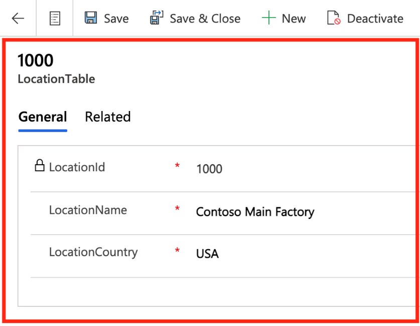
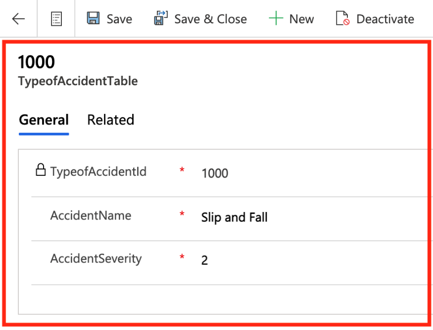
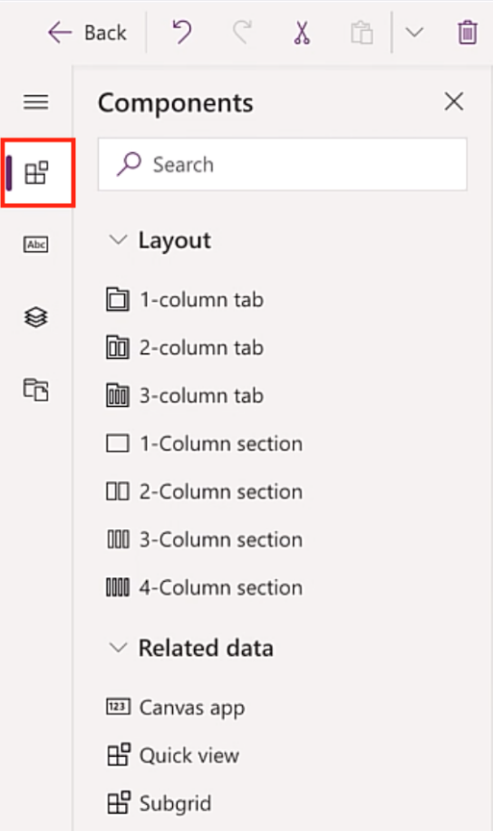
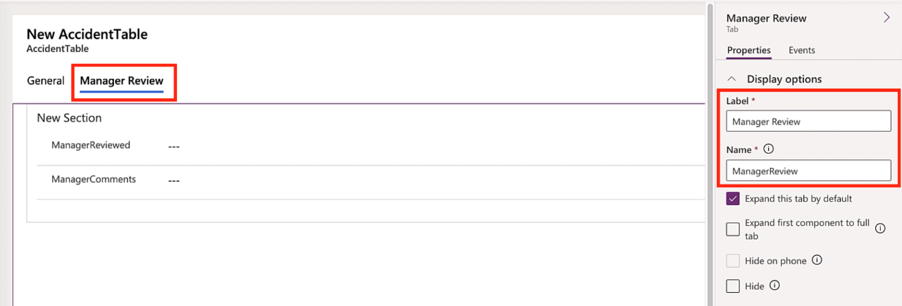
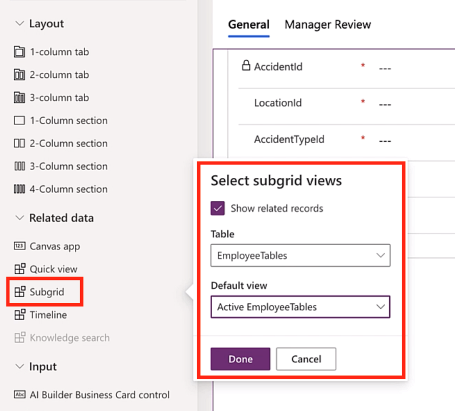
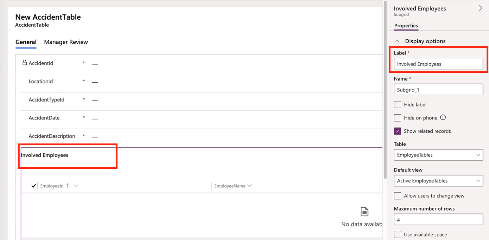
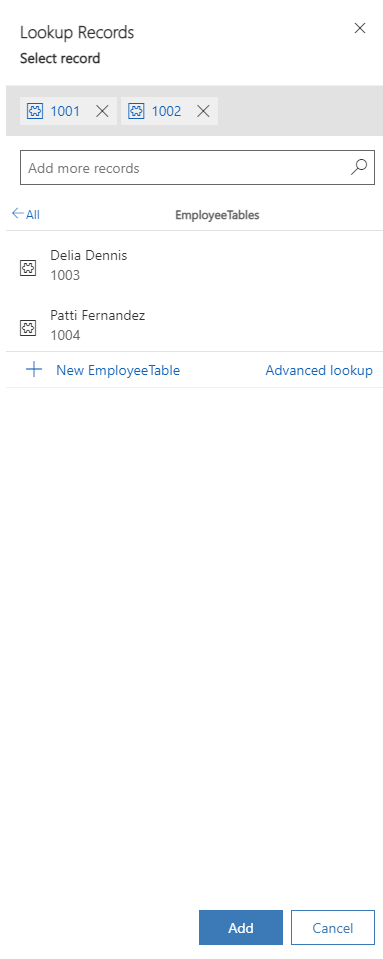
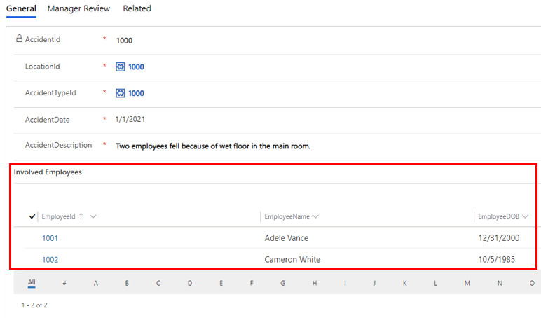

Modify the main form for the LocationTable. Sign in into Power Apps and follow these steps to modify default views:

1. From Power Apps, on the main menu, expand **Dataverse** and select **Tables**.

1. Search for the ***LocationTable*** we created in the previous module. You can search for it by selecting **Custom** and then typing "**location**" in the search bar.

1. Select the ***LocationTable*** and then click on **Forms**, find the **Main** information form, and then click on it to navigate to the forms design experience.

1. Add the **Owner** (This is Dataverse standard field that quickly shows the user who was the user that created the record in the table) to the **Header** section of the table. To do this simply drag and drop the **Owner** field in the top right of the header.

1. Add the fields a user will enter for locations in the **General** section of the form. To do this click on **Table columns** icon on the right, this will reveal the different fields in the *LocationsTable.* Next using drag and drop place the fields in the **General** section. Put them in the following order:

    1. **LocationId**

    1. **LocationName**

    1. **LocationCountry**

1. Set the ***LocationId*** field to be **Read-only**. Select the ***LocationId*** field and on the right under the **Properties** check the **Read-only** check box.

1. To complete the changes, select **Publish** in the top right.

    Now let's test our form, we will create a few location records.

1. Click **Back** on the top left to navigate back to the table's menu.

1. Click on **Data** to reveal the records view of the table.

1. Click the **+ Add record** button on the top left to navigate to new main form. This form should look like the one we customized in the previous steps.

1. Enter a new location, see location details below:

    - **LocationName:** *Contoso Main Factory*

    - **LocationCountry:** *Choose USA from the drop-down*

1. Click **Save**.

    > [!div class="mx-imgBorder"]
    > 

### Modify the main form for the TypeofAccidentTable

Sign in into Power Apps and follow these steps to modify default views:

1. From Power Apps, on the main menu, expand **Dataverse** and select **Tables**.

1. Search for the ***TypeofAccidentTable*** we created in the previous module. You can search for it by selecting **Custom** and then typing "**typeofaccident**" in the search bar.

1. Select the table and then click on **Forms**, find the **Main** information form, and then click on it to navigate to the forms design experience.

1. Add the **Owner** (This is Dataverse standard field that quickly show the user who was the user that created the record in the table) to the **Header** section of the table. To do this simply drag and drop the **Owner** field in the top right of the header.

1. Add the fields a user will enter for type of accidents in the **General** section of the form. To do this click on **Table columns** icon on the right, this will reveal the different fields in the *TypeofAccidentsTable.* Next using drag and drop place the fields in the **General** section. Put them in the following order:

    1. **TypeofAccidentId**

    1. **AccidentName**

    1. **AccidentSeverity**

1. Set the ***TypeofAccidentId*** field to be read-only. Select the ***TypeofAccidentId*** field and on the right under the Properties check the **Read-only** check box.

1. To complete the changes, click **Publish** in the top right.

    Now let's test our form, we will create a type of accident record.

1. Click **Back** on the top left to navigate back to the table's menu.

1. Now click on **Data** to reveal the records view of the table.

1. Click on **+ Add record** button on the top left to navigate to new main form. This form should look like the one we customized in the previous steps.

1. Enter a new type of accident, see accident details below:

    - **AccidentName:** Slip and Fall

    - **AccidentSeverity:** *Choose 2 from the drop-down*

1. Select **Save**.

    > [!div class="mx-imgBorder"]
    > 

### Modify the main form for the AccidentTable

The process for modifying this form is the same, the difference with this one is that we will create another **1-column tab** in the **General** area to group the general accident information fields. Then we will create an additional **1-column tab** in the **General** area to group the manager fields. We will also add a **Subgrid** to give the user the ability to add employees that were involved in a particular accident.

1. From Power Apps, on the main menu, expand **Dataverse** and select **Tables**.

1. Search for the ***AccidentTable*** we created in the previous module. You can search for it by selecting **Custom** and then typing "**accident**" in the search bar.

1. Select the table and then click on **Forms**, find the **Main** information form, and then click on it to navigate to the forms design experience.

1. Add the **Owner** (This is Dataverse standard field that quickly shows the user who was the user that created the record in the table) to the **Header** section of the table. To do this simply drag and drop the **Owner** field in the top right of the header.

1. Add the fields a user will enter for new accident records in the **General** section of the form. To do this click on **Table columns** icon on the right, this will reveal the different fields in the ***AccidentTable**.* Next using drag and drop place the fields in the **General** section. Put them in the following order:

    1. **AccidentId**

    1. **LocationId**

    1. **AccidentTypeId**

    1. **AccidentDate**

    1. **AccidentDescription**

1. Set the **AccidentId** field to be **Read-only**. Select the **AccidentId** field and on the right under the Properties check the **Read-only** check box.

1. Select the ***LocationId*** field and on the right under Properties, change the Default view from **LocationTable Lookup View** to **Active LocationTables**.

1. The Checkbox next to **Show all views** will clear itself, but you will want that enabled, so click the Checkbox. There are 2 checkboxes under the Default view dropdown, one for **Allow users to change view** and another for **Show all views**, both of these should be checked.

1. Repeat steps 7 and 8 for the ***AccidentTypeId field***, set the Default view to Active TypeofAccidentTables.

1. Now click on the **Components** section and then click on **1-column tab** to add a new tab in the general section.

    > [!div class="mx-imgBorder"]
    > 

1. In the Properties on the right, for the Label, enter ***Manager Review***. For the Name, enter **ManagerReview**.(It's essentially the same name for both, but since the Label is what shows on the view it should have a space. Whereas the Name, is a unique field used for referencing and generally it's best to avoid spaces for the Name.)

1. Add the following fields to it:

    - **ManagerReviewed**

    - **ManagerComments**

    > [!div class="mx-imgBorder"]
    > 

1. On the Form, select the ***General*** tab.

1. From the left, click the **Components** section, select **Subgrid** and then check the **Show related records** check box.

1. Find the ***EmployeesTable*** and then select the **Active Employees** as the **Default view**.

    > [!div class="mx-imgBorder"]
    > 

1. Click **Done** to add it. You should see it at the bottom of the form.

    > [!div class="mx-imgBorder"]
    > 

1. Give the Subgrid a more meaningful name, in the Label under Properties, enter ***Involved Employees**.*

1. Click **Publish**, to complete the form.

    Now let's test our form, we will create a new accident record.

1. Click **Back** on the top left to navigate back to the table's menu.

1. Click on **Data**, to reveal the records view of the table.

1. Click the **+ Add record** button on the top left to navigate to new main form. This form should look like the one we customized in the previous steps.

1. Enter a new accident record, see accident details below:

    - **LocationId:** From the dropdown, select Contoso Main Factory

    > [!NOTE]
    > If you press enter while on the drop down, it will reveal the Location names instead of their Id).

    - **AccidentTypeId:** From the drop-down select Slip and Fall

    - **AccidentDate:** 1/1/2021

    - **AccidentDescription:** Two employees fell because of wet floor in the main room.

1. Select **Save**.

1. Once the record is saved, the subgrid in the bottom should appear allowing you to add the involved employees.

1. Click on **Add Existing Employee,** press enter in the **Look for records** box to reveal the employee names. Select both Adele Vance and Cameron White from the list.

    > [!div class="mx-imgBorder"]
    > 

1. Select **Add**, at the bottom to add them.

1. You may have to click **Refresh**, for them to show up.

1. Select **Save**, to complete.

    > [!div class="mx-imgBorder"]
    > 
