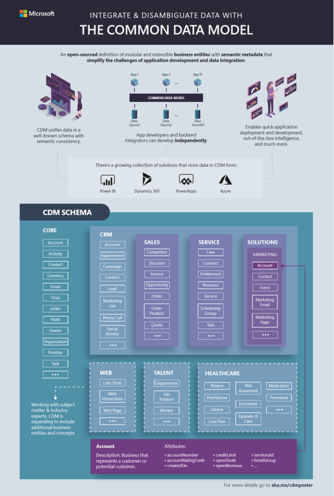

The Common Data Model standard defines a common language for business entities that cover the full range of business processes across sales, services, marketing, operations, finance, talent, and commerce for the customer, people, and product entities that are fundamental to a company's business processes. The goal of Common Data Model is to enable data and application interoperability that spans multiple channels, service implementations, and vendors. Common Data Model provides self-describing data (structurally and semantically), enabling applications to read and understand the data.

## Common Data Model overview

Common Data Model is a standard and extensible collection of schemas (entities, attributes, relationships) that represent business concepts and activities with well-defined semantics to facilitate data interoperability.

Additionally, Common Data Model has the following features:

- A shared data model allows applications and data integrators to interoperate through a unified definition of data
- A rich metadata system with standard entities, relationships, hierarchies, traits, and more
- Originated from Microsoft Dynamics 365/CRM apps, that are shown as open source, in GitHub with over 260 standard entities
- Multiple systems and platforms currently implement Common Data Model
- Internal and external partners, including Dataverse, Microsoft Power BI dataflows, Microsoft Azure data services, Informatica, and more.

## Where Common Data Model is used

When you provision a Dataverse environment, the core schema in Common Data Model is used to create the tables, columns, and relationships in the Dataverse database. Some core tables include: Account, Contact, Lead, and Task.

When you deploy a Dynamics 365 app such as Sales, the tables are created from the core schema, the CRM base schema, and the Sales schema.

The storage format that is defined by Common Data Model is also used in other tools such as dataflows, Power BI, and Microsoft Azure Data Factory. This feature permits interoperability between these tools, which helps make creating enterprise solutions simpler.

## Microsoft industry accelerators

For industry-specific tables, consider using Common Data Model. In addition to the metadata system, Common Data Model includes a set of standardized, extensible data schemas that Microsoft and its partners have published. This collection of predefined schemas includes entities, attributes, semantic metadata, and relationships. Microsoft is working closely with representatives from various industries to make Common Data Model more relevant to them by creating industry accelerators.

Industry accelerators are foundational components within Microsoft Power Platform and Dynamics 365 that enable ISVs and other solution providers to quickly build industry vertical solutions. The accelerators extend Common Data Model to include new entities to support a data schema for concepts within specific industries. Microsoft is currently focused on delivering accelerators for the following industries.

- Automotive
- Financial services, including banking and insurance
- Education, including higher education and K–12
- Nonprofit
- Manufacturing
- Media and entertainment

For more information, see [Overview of industry accelerators](/dynamics365/industry/accelerators/overview/?azure-portal=true).
