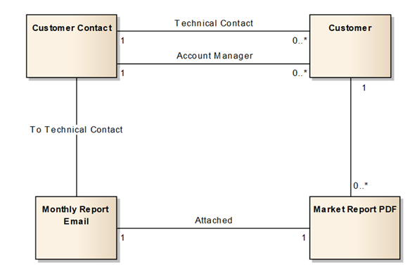
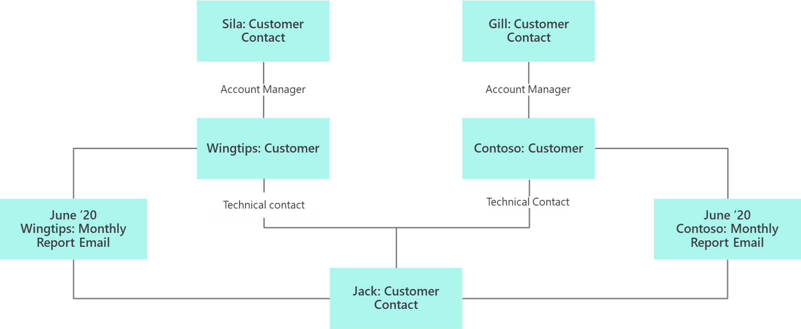

Data modeling on Microsoft Power Platform examines the whole data architecture picture and includes a logical glimpse of data from Dataverse, data lakes, and external sources by using connectors.

Multiple types and standards for data modeling are available, including Unified Modeling Language (UML), IDEF1X, and others. Specific data model standards are beyond the scope of this unit, but data models for Dataverse data structures generally fall into two general categories:

- Logical data models
- Physical data models

## Entity relationship diagrams

Logical data models are high-level diagrams that show how data flows through the system. Logical data models are frequently put together at the beginning of the project during discovery and before all columns have been defined. Generally, the logical data model diagram uses the business names of the entities, not the schema names.

Logical data model diagrams depict the flow of data in a solution without worrying about the physical implementation.

Physical data models are lower level than logical data models. They generally include column-level detail and, more precisely, design relationships. The physical data model is created when the high-level logical design is translated to physical entities.

Physical data model diagrams should include showing Dataverse, Microsoft Azure Data Lake Storage, Analysis Services Connector, or other data store boundaries.

You can also create object diagrams. Object diagrams show what you want to know and, more importantly, what you don't want to know. Object diagrams need to be done in modeling sessions with domain experts.

## Data modeling strategies

Consider the following guidelines for building a data model:

- **Start with core tables and relationships** - Often, teams will become sidetracked with the whole problem; however, it's ultimately easier to solve small parts of the challenge and then look at it holistically later.
- **Over normalization** - Teams that have people with strong data architect backgrounds tend to build a Dataverse data model as if they were building a traditional SQL Server database. This approach can lead to poor user experience and requirements for extra processing. Solution architects need to work with such people to determine the cause and effect of relationships in the user experience to help them understand the goal.
- **Current needs** - An excellent feature of Dataverse is that it can be incrementally built by using an agile process; however, having insight into the short and long-term future helps establish a foundation. Make sure that you don't become immersed in trying to identify every future requirement that you can think of.
- **Proof of concept** - Dataverse simplifies the process of creating an environment, trying a model, throwing it away, and trying again. Occasionally, challenging two teams with the same data modeling problem can produce useful results.

## Data model influencers

The data model can be influenced by a series of factors:

- **Security requirements** - Solution architects should always push for simplification, but these simplifications can drive requirements onto the data model.
- **User experience** - A concept that's easily forgotten is that as you add normalization and relationships, you will create new constructs that users need to navigate in the apps.
- **Data location and retention** - Not all data is allowed to be stored. Often, data from services can't be cached, and companies have internal policies that govern use of data. Some data is protected by government laws or might have specific requirements for storage, for example, identifiable information, credit card numbers, and so on.
- **Self-service reporting** - If it takes a data architect to navigate the data model, chances are that many tools from Power BI and Export to Excel will be less valuable to the user. Most self-service features of Dataverse allow navigation of one level of relationship.
- **Existing systems** - Consider whether the systems are legacy systems, if an API exists, or whether the data can be accessed or copied.
- **Localization** - Assess whether the requirements are multiregional, multilingual, or multicurrency.
