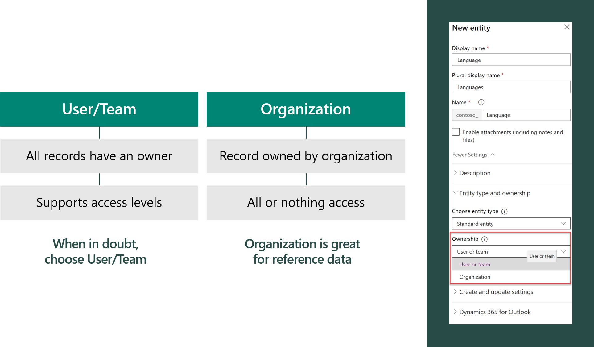
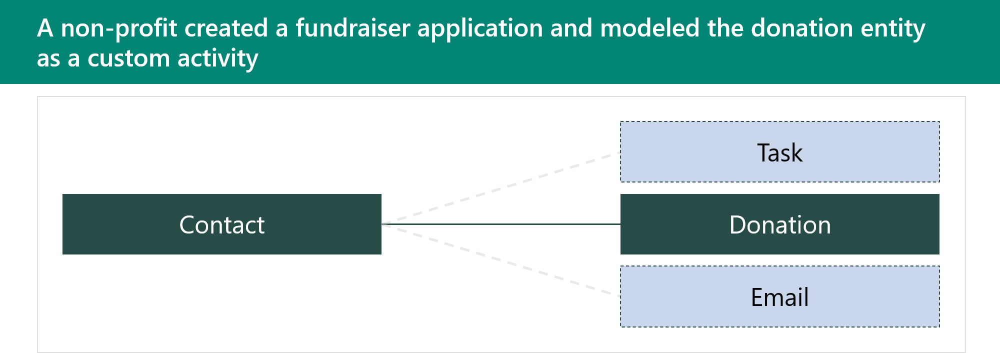
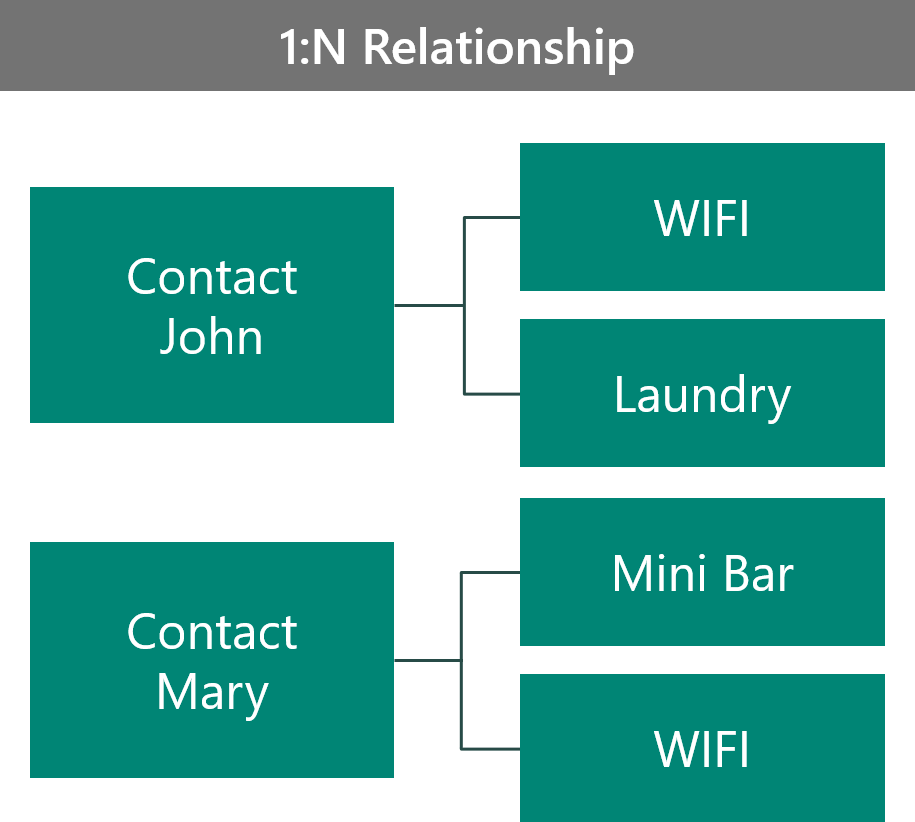
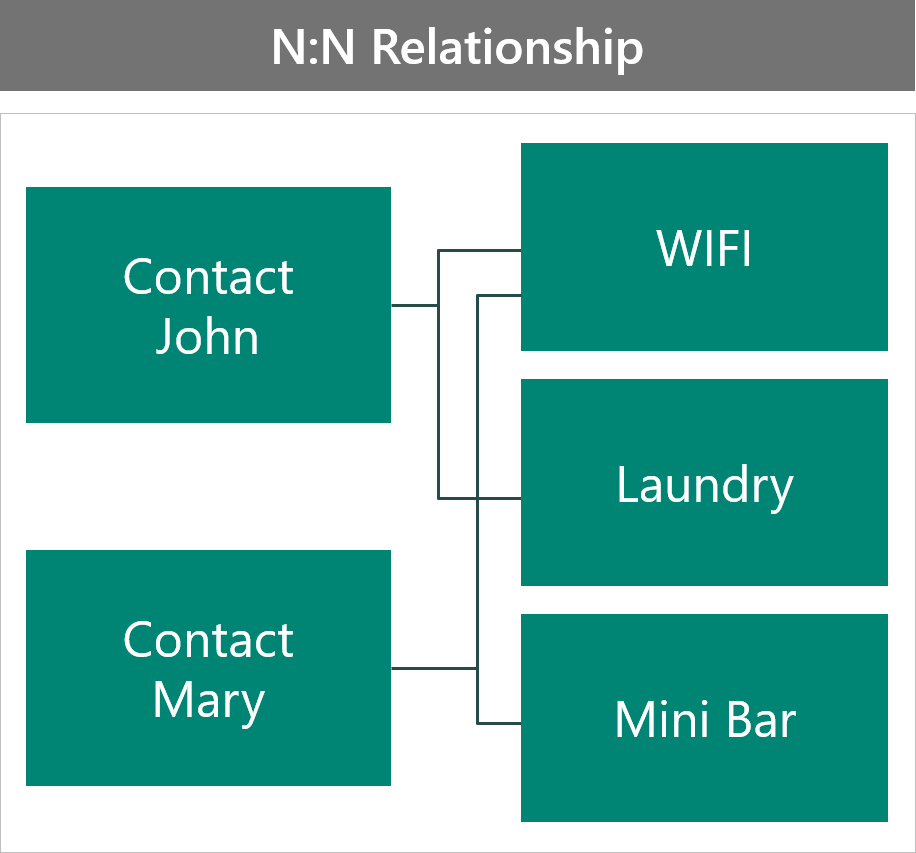
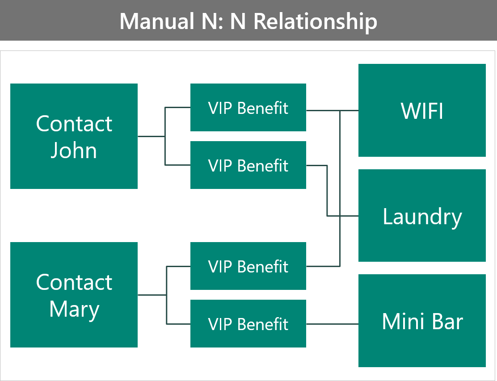
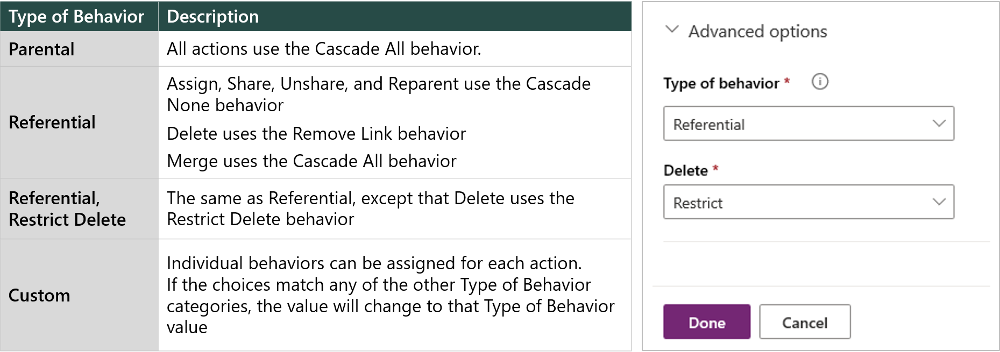

When you're storing or viewing data with your app, an important part of the design is the data structure. You should consider how the data will be used in one specific app or screen, in addition to how others will use the data. Referring to your personas, tasks, business process, and goals will help you define what data to store and how to structure it.

## Table types

Dataverse has three table types:

- **Standard** - Tables where you can store data and add to the navigation in model-driven apps. Most tables that you create will be standard. Several standard tables are created from the Common Data Model schema in a Dataverse environment.
- **Activity** - These tables are used to store interactions such as phone calls, tasks, and appointments. A set of activity tables are in a Dataverse database.
- **Virtual** - These tables allow you to create the table and columns in Dataverse but then use an external data source to store the data. To the user, the data appears in their apps like any other data.

When you create a custom standard table, you must specify its ownership:

- **User/Team** - Default option
- **Organization** - Used for reference data

## Custom activity tables

Activity tables are used to store interactions. They have a relationship to all tables that have **Enable for activities** set on their table metadata. Activity tables share the same set of columns and share the same security privileges. Rows in activity tables appear in the timeline on model-driven app forms. In this example, a custom activity table called Donation has been created.

Advantages for using custom activity tables are that they:

- Show up in a list with other activities.
- Can be rolled up with other activities.
- Can create a *donation* on any table that supports activities.

Major disadvantages of using custom activity tables are that they can't:

- Configure security different than any other activity.
- Control which tables are related to a *donation*.

## Column data types

You need to choose the data type for columns wisely. This notion is especially true for numeric data types because you can't compare numeric columns with different types, and restrictions are placed on data types for calculated and rollup columns. After a type has been chosen, it can't be changed.

| Data type             | Comments                                           |
| --------------------- | -------------------------------------------------- |
| Yes/No                | Ensure that you never need more choices            |
| File and Image        | Allows you to store file and images inline in Dataverse |
| Customer              | Can be either contact or account                   |
| Lookup/Choice         | Make sure that you choose the best one             |
| Date/Time             | Make sure that you choose the appropriate behavior |
| Numeric               | Many to choose from, so choose wisely              |

### Choice table vs. lookup table

How you decide between using a lookup table or a choice table depends on the circumstances.

Use a choice table when you want a table that:

- Only stores label and value as a jet-value pair.
- Has localization built-in.
- Is treated as a solution component.
- Doesn't have a built-in way to retire values.
- Has UX that works to about 200 items.
- Can be filtered by using JavaScript.
- Is stored as a whole number on the row.

Use a lookup table when you want a table that:

- Can store other data in columns on the row.
- Requires you to build localization.
- Is treated as reference data.
- Supports an inactive state.
- Has UX that scales to many items.
- Can filter by views and security.
- Is stored as an entity reference.

Storing other data on the lookup table allows you access when you are running workflows or other customizations that reference the data. For example, a related property can be used in a check condition.

By being a solution component, a choice table handles merge resolution by prefixing the value with the publisher prefix.

Adding values on a choice table requires administrator/customizer level access, while lookup values can be changed by a user if they are granted permission through security roles.

The user experience (UX) for choices is ideal for small quantity but does not work well for large sets. Lookups provide search type features that aren't available on choices.

If you have multiple choice columns that are dependent on one another, this task can only be achieved with form-based script, while lookups can be filtered on other lookups by using configuration.

### Store file and image data

You have several choices of where to store files and images:

- **Dataverse** - Store files and images by using the File and Image data types.
- **SharePoint** - Use for collaboration, but this option has an issue with security. Security for the files follows SharePoint permissions and is not synchronized with Dataverse row permissions.
- **Azure Storage** - Use for archiving and external access. This choice has standalone security, but it can be granted for small periods of time based on a link that is generated for consumption (valet pattern). Azure Storage can also handle large files.

Characteristics of file and image data types:

- They are good for upload and reference.
- The security follows record permissions.
- They are limited by size.

### Calculated columns

Calculated columns allow simple calculations to be performed on data in a row and they:

- Are calculated on retrieval of a record.
- Have a value that is read only.
- Can include columns from the same row and columns in many-to-one relationships.
- Can include rollup columns in calculation.
- Can't trigger an event for workflow, plug-in, or Power Automate.

### Rollup columns

Rollup columns allow aggregations for related rows in one-to-many relationships and they:

- Are calculated on a scheduled basis (minimum of one hour) and can be updated on-demand by a user.
- Have a value that is read only.
- Can roll up calculated columns.
- Can use hierarchy of related records.
- Can filter across related tables.
- Can't trigger an event for workflow, plug-in, or Power Automate.

You can roll up "simple" calculated columns, that is, calculated columns that include non-deterministic functions can't be rolled up.

## Relationships

Relationships define how rows are related to one another in Dataverse. Each table in Dataverse has a primary key to provide a unique reference to the rows in the table. In Dataverse, the primary key is a globally unique identifier (GUID) that is generated automatically by Dataverse when a row is created. Relationships are created by adding a reference to the primary key, which is known as a foreign key. In Dataverse, relationships are created by using a column on one table to hold the foreign key value. This foreign key is a pointer to the primary key on the other table.

Two types of relationships are supported in Dataverse:

- One-to-many (1:N)
- Many-to-many (N:N)

### One-to-many relationship

The following expense report shows an example of a one-to-many (1:N) relationship.

The preceding screenshot shows the main part of the expense report, which has the employee name and department details. Below the main part are multiple rows of descriptions for each purchased item. For this example, these descriptions will be called *line items*. The line items have a different structure from the main part of the expense report. Therefore, every expense report has several line items.

The relationship between the expense report and the line item is an example of a one-to-many (1:N) relationship. The main part of the expense report is linked to several line items. You can also view the relationship from the perspective of the line items: Each line item can only be linked to one expense report, which is a many-to-one (N:1) relationship.

### Many-to-many relationship

A multiple-to-multiple data structure is a special type and it is used for cases where multiple records can be associated with multiple sets of other records. A good example of a multiple-to-multiple data structure is your network of business partners. You have multiple business partners (customers and vendors) that you work with, and those business partners also work with multiple colleagues of yours.

The following sections provide examples of different types of multiple-to-multiple data structures.

### Example 1: Time-off approval request

The following example show two sets of data: one that represents the employee and the other that represents the time-off request. Because each employee will submit multiple requests, the relationship in this scenario is one-to-many, where "one" is the employee and "many" are the requests. The employee data and time-off request data are related to one another by having the employee number as the common column (also known as the key).

### Example 2: Purchase approval

In this example, the data structure looks sophisticated but is similar to the expense report example that was discussed at the beginning of this article. Each vendor or supplier is associated with multiple purchase orders. Each employee is in charge of multiple purchase orders. Hence, both sets of data have a one-to-many data structure.

Because employees might not always use the same vendor or supplier, vendors are used by multiple employees and each employee works with multiple vendors. Hence, the relationship between employees and vendors is many-to-many.

### Example 3: Expense reporting

The following example shows an entity relationship diagram (ERD) that contains multiple tables for an expense reporting solution.

## Example 4: Track which two benefits that the VIP selected

This example features two VIPs: John and Mary. John has chosen the WiFi and Laundry benefits, and Mary has chosen the WiFi and Mini-bar benefits. You can model this scenario in different ways. The first way is to model the scenario as a 1:N relationship.

In this configuration:

- The benefit record is unique to the contact.
- No ability is provided to look at all contacts that choose a certain benefit.
- You can do benefit record security based on the owner of the contact.
- You can store more data on the benefit record that is contact-specific.
- The relationship is parental to the benefit; otherwise, you will orphan the benefit records.

The second way is to model the scenario as a N:N relationship.

In this configuration:

- The associated records from the benefit shows all contacts that choose that benefit.
- Security on the benefit is shared for all contacts, so you will have no ability to tailor each contact.
- Any attributes on the benefit are shared for all contacts, so you will have no contact-specific data.
- You must use a reference relationship; otherwise, you would be removing the benefit from other contacts.

Neither configuration is ideal. 

The next example shows the creation of a custom (interset) table to hold the VIP's benefits.

This configuration:

- Adds the ability to store more data on the benefit table that is specific to that contact.
- Requires more work for the user to connect the records; they now have to create the intersect row manually.
- Secures benefits individually.
- Makes querying more difficult because you have no ability to directly access attributes on the benefit table.

The following example shows the use of columns on the Contact table.

This configuration:

- Works well for primary and secondary benefits, but would not scale to tracking many benefits.
- Simplifies querying and makes self-service Power BI easier for users.
- Follows the same security as the contact record.
- Requires you to create a query that scans primary and secondary benefits, if you are querying all users that choose a primary benefit.

This configuration is a good example of when the benefit must be recorded for some compliance/statistical purpose but has no impact on the business or processing.

### Relationship behaviors

Relationship behaviors control how certain actions cascade down to rows that are related to the primary table row through the 1:N relationship. Behaviors maintain referential integrity and can prevent orphan records from being left behind.

> [!IMPORTANT]
> Defining relationship behaviors is important because the cascading of assigned records can cause related records to be assigned. If in doubt, set the behavior to Referential and Restrict.

## Alternate keys

Alternate keys are used in integrations to reduce the need to perform a query to find a record. By using an alternate key, you can update a row without knowing its GUID.

Alternate keys:

- Are excellent for using in retrieves and updates.
- Can contain decimal, whole number, text fields, dates, and lookup fields.
- Can have up to five alternate keys for each table.
- Create a nullable unique index behind the scenes to enforce uniqueness for the key.

When a key is created, the system validates that that key can be supported by the platform.

## Diagram best practices

When creating ERDs for Dataverse, you should:

- Avoid data duplication. Every piece of data should have only one home. Rather than duplicating the same data between multiple tables, functionality like quick view forms and displaying related table data in views should be used.
- Use the ERD relationships to review and identify potential cascading behaviors that could impact business logic. For example, with parental relationships, permissions like Assign, Share, Unshare, Reparent, Delete, and Merge will automatically happen to related records when a parent record is updated.
