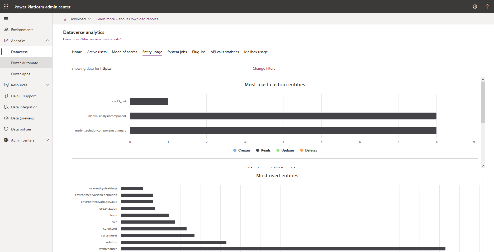

Designing for performance is an important part of the process and so is performance testing. It is important to perform performance testing on the system where the volume of data is close to your production system. That will give you a good understanding for app performance in general and for the areas to optimize. Use the instance copy function to create a copy of the production instance including the data. 

The other important aspect of adequate performance testing is to reproduce workloads expected in the production environment. There is often a disconnect between testing environments where the system is accessed by a handful of the testers and the production instance where hundreds and thousands of users may access the system at the same time. There are load testing tools available from Microsoft and third-party vendors and you will need to collaborate with your development team to ensure that the tools are installed, configured, and used appropriately within the development lifecycle.

## Instance statistics

CDS for Apps analytics is available via Microsoft Power Platform admin center [https://aka.ms/ppac](https://aka.ms/ppac/?azure-portal=true). It contains various statistics that can help identify potential areas for deeper performance analysis, for example most used entities, storage consumed, failing system jobs and plugins, etc. 

## Query performance

Dataverse is a service and, as any service, may not cater for your specific app design. Specific queries in your app may cause some performance issues. While you don’t have direct access to the components of the Dataverse such as database, there are tools available within Dataverse to help in tuning the environment to your specific needs. You can analyze and optimize query performance using the Data Performance view discussed in detail in the next topic.
There are many tools that can help performance tuning various aspects of Power Apps.

## Dynamics 365 diagnostics

There are two primary network characteristics affecting the performance: network bandwidth and latency. Identify if these may impact your app performance, by using the Dynamics 365 Diagnostics tool that is available at https://&lt;myorg&gt;.crm.dynamics.com/tools/diagnostics/diag.aspx where &lt;myorg&gt;.crm.dynamics.com is the URL of your Dynamics 365 organization.

After opening the page and pressing Run, the report will become available that will assist your network team in detecting and resolving the issues. The statistic includes some browser benchmarks that may be useful in identifying if browser performance is an issue.

## Analytics

Dataverse analytics are available via Microsoft Power Platform admin center [https://aka.ms/ppac](https://aka.ms/ppac/?azure-portal=true). Various statistics can help identifying potential areas for deeper performance analysis.

### Dataverse

The Table Usage tab contains information about most used out-of-the-box and custom entities. Identifying the most used entities helps concentrate the optimization efforts on the parts of the app that matter.

Other statistics are also available that may be useful. Plug-ins statistics can help identifying troublesome plugins, for example those with excessive average execution time.

### Power Apps analytics

Power Apps Analytics help with performance analysis by providing detailed statistics on Service Performance across various connectors used in your app. 

Additional information such as overall app usage, location statistics, or errors seen by end users can be extracted from other tabs. While not directly performance related, this information can be useful in pinpointing overall problematic areas that may be caused by poor app performance such as specific region, specific app, etc.
