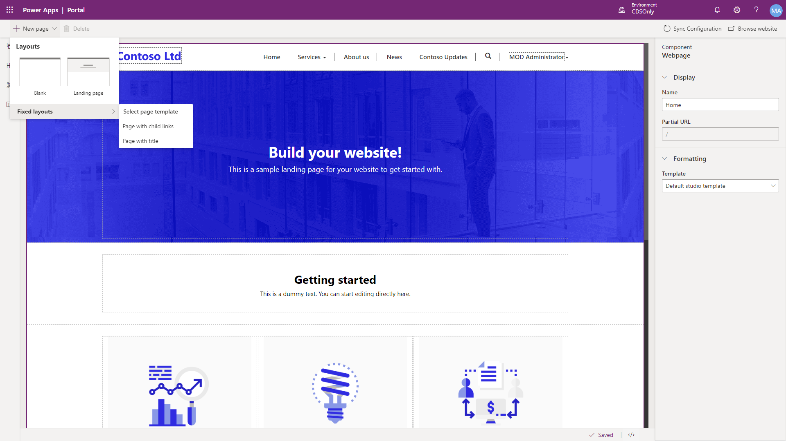

A portal maker can quickly add and organize new pages in the portals studio.

From the portal studio command bar, click New page. You will be presented with a number of page layout choices.  The choices available will depend on the portal starter template as well as any page templates you may have added to the portal using the Portal Management app.

> [!div class="mx-imgBorder"]
> 

Once you have selected a layout, the page will appear on the canvas as well as the web page properties will be available to edit in the properties pane. The maker can define the web page name, partial URL, and template.

The maker can then begin to add and edit components to the web page.

Once the webpage has been saved, a maker has the following options available to organize where and how the page is organized in the portal site map. Selecting pages from the toolbelt, the maker can select the particular page and can perform the following actions:

> [!div class="mx-imgBorder"]
> 

| Item | Details |
| -------------------- | ---- |
| Hide in default menu | A weblink record (menu option) will not be displayed on the main navigation.    |
| Add a child page     | A new web page can be added that is parented by the currently selected page     |
| Move up                     | Moves up the webpage in the sitemap      |
| Make subpage | Makes the currently selected page a child page of the page directly above it in the site map |
| promote subpage | Moves up the webpage in the hierarchy and make sibling of its former parent page |
| Delete | Deletes the webpage |

