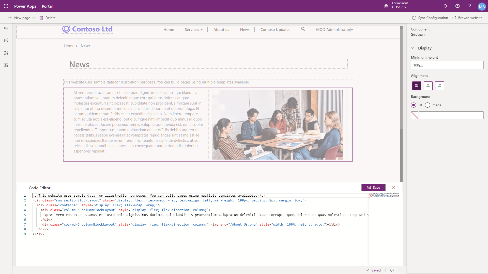
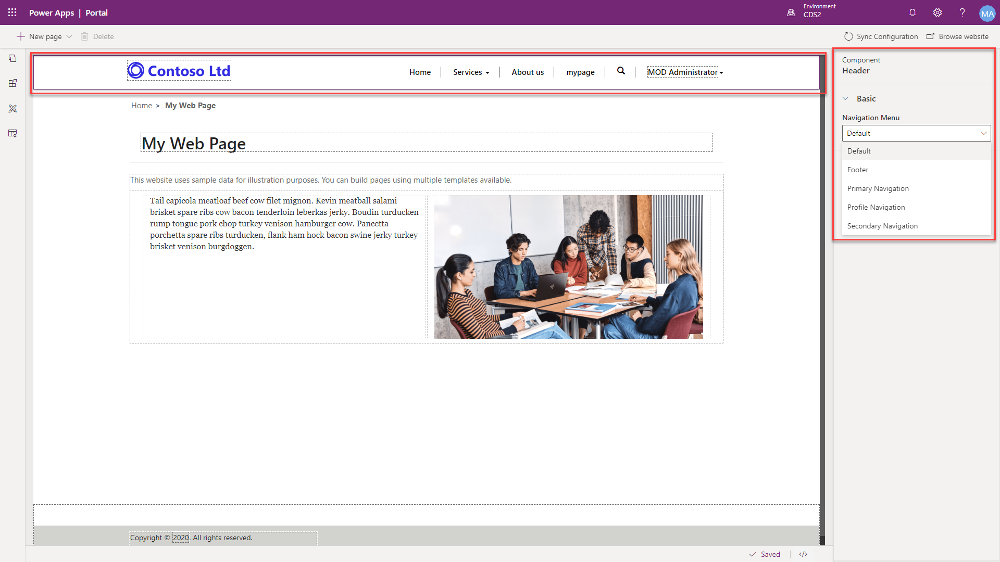
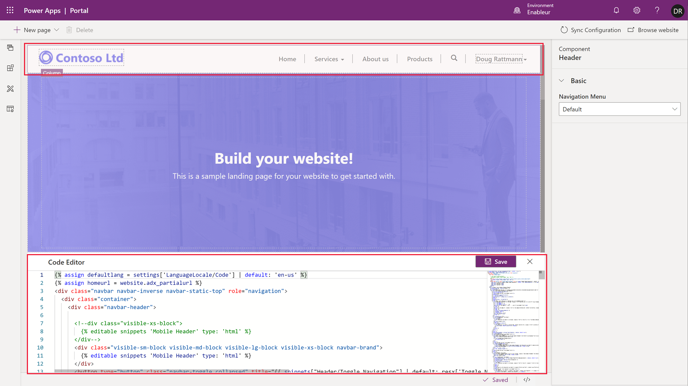

Most of the design, layout, and adding specific components can be easily done using point and click methods in the portal studio. However, there are instances where you may need to fine-tune specific components or add custom HTML, JavaScript, CSS, or Liquid to a particular page or section of a web page.

In the portal studio canvas, you can select a specific section and click on the </> in the footer to expand the Code Editor. This will display the source code of the specific web page.  You can edit or add custom code to through this editor.

> [!div class="mx-imgBorder"]
> 
> 
> [!WARNING] 
> You can potentially damage the layout of your page by entering incorrect syntax in the source code.

## Modify header and footer

When the header is selected in the portal studio, a maker can choose the navigation record (Web Link Set) to be used as the site navigation menu.

The header and footer layout can be further customized using the portal studio code editor.

> [!WARNING] 
> Because the header and the footer apply to the web site, direct modifications of the source code may result in the broken layout for the entire site.
