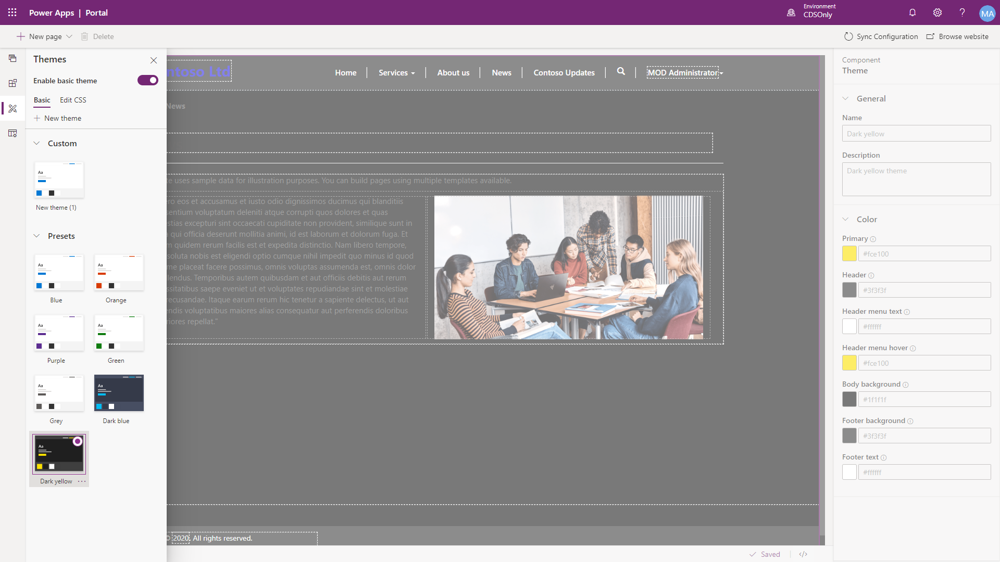
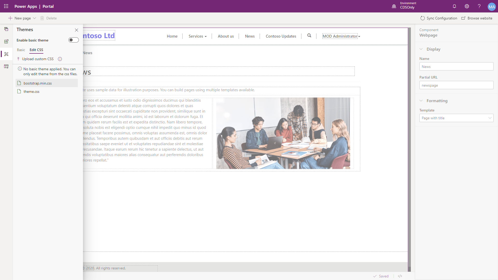

A portal theme describes the colors, fonts, outlines and other design elements of a Power Apps portal.

The portal is provisioned with a default theme. However, you may want to align your portal with your specific corporate branding.

## Basic theme

Portal basic themes mode can be enabled which allows for makers to change to a prebuilt preset theme or create a custom theme by selecting color properties for different aspects of the portal.

> [!div class="mx-imgBorder"]
> 

## Edit CSS

The portal studio allows makers to be able to directly edit CSS files applied to a portal, or to upload a custom CSS file.   

> [!div class="mx-imgBorder"]
> 

> [!IMPORTANT]
> Directly editing the default CSS files with incorrect syntax can lead to undesired results. Additional CSS files can be uploaded and edited to fine tune the portal look and feel. Power Apps portals supports the Bootstrap version 3 framework.
