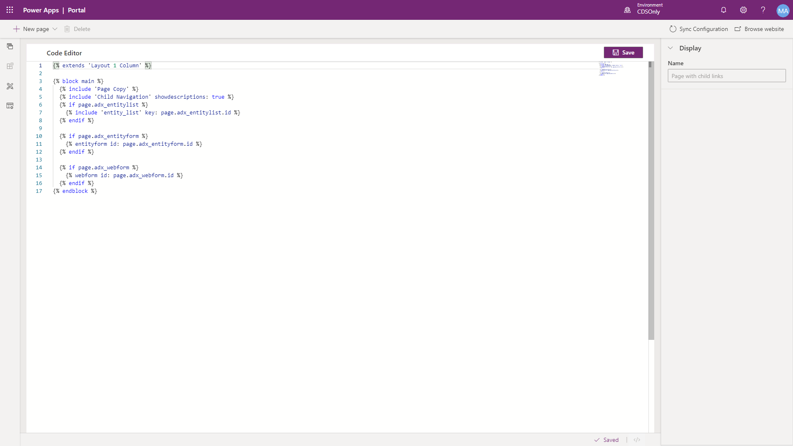

A web template can be composed of HTML, CSS and JavaScript code. Template can also include Liquid template language expressions that can be used to add dynamic content to pages. The Portal studio provides a built-in code editor to allow a maker to directly modify an existing web template.

On the toolbelt, select Templates and choose the web template you want to edit.  

> [!NOTE]
> Some of the default web templates or web templates without a corresponding page template, may not be editable.  

> [!div class="mx-imgBorder"]
> 

> [!WARNING]
> Directly editing the web templates with incorrect syntax can lead to undesirable results.

For more information about the Liquid language see [Work with Liquid templates](https://docs.microsoft.com/powerapps/maker/portals/liquid/liquid-overview/?azure-portal=true).