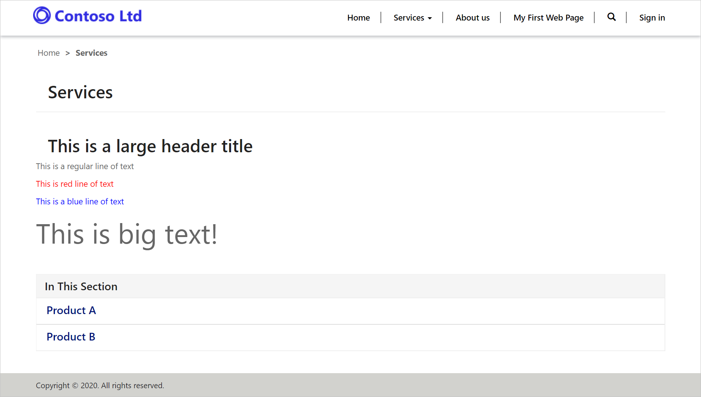

The purpose of this hands-on-lab is to edit web page source code using the Portal Studio.

At the end of these exercises, you will be able to accomplish the following:

- Open the Portal Studio to edit your portal
- View the source code of a web page section
- Add your own HTML code directly to a portal page or section

For this exercise you will need to have the following in your environment:

1. A Power Apps portal provisioned. If you do not have a Power Apps portal available, follow [Create Portal](https://docs.microsoft.com/powerapps/maker/portals/create-portal/?azure-portal=true) instructions to create one.
1. Access to the Power Apps maker portal.

## Scenario

To ensure consistent website look and define the *accessible* content that can be easily located and indexed, it is important to be able to edit HTML content of a page. In this exercise we will add some HTML code to the web page copy section using the Portal Studio code editor:

- Open your portal in Power Apps portal Studio.
- Open a Services web page.
- Add HTML code containing various elements such as headings, paragraphs, etc.
- Save the page and browse the website to view the results.

### Launch portal Studio

1. Navigate to the [Power Apps maker portal](https://make.powerapps.com/?azure-portal=true).
1. Make sure correct environment is selected in the environment selector in the top right-hand corner.
1. From the list of Apps, locate your portal app (Type = Portal).
1. Click on the ellipse (...) and choose **Edit**.  This will launch the Portal Studio.

### Locate web page 
1. From the toolbelt, click on the **Pages** icon.
1. Locate the **Services** web page and click to edit.

### Edit source code
1. Select the page copy section on the canvas.
1. Click on the **Source code editor** (</>) icon.
1. Replace the existing paragraph with the following HTML code:

    ```html
    <h2>This is a large header title</h2>
    <p>This is a regular line of text</p>
    <p style="color: red;">This is red line of text</p>
    <p style="color: blue;">This is a blue line of text</p>
    <p style="font-size: xxx-large;">This is big text!</p>
    ```

1. Click **Save**.
1. You should see the formatted text on the canvas.

### View web page

1. On the Command bar, click **Browse website**.
1. You should now see your page with the formatted text.

> [!div class="mx-imgBorder"]
> [](../media/7-edit-source-code-ss.png#lightbox)