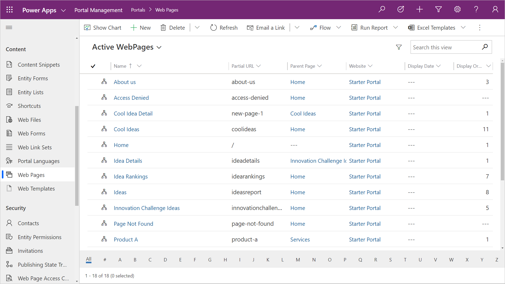

## Development lifecycle

Application Lifecycle Management (ALM) is important as the applications your organization builds becomes more complex and as more of your company depends on their stability.

If you create a model-driven Power App, a Power Automate flow or any other object to build a business solution on a Common Data Service environment, you typically contain these assets in a *solution* and export the single solution file from one environment to another.  The solution file can also be "unpacked" into discreet file components and uploaded to a source control system (such as Azure DevOps) that will maintain a repository of the solution and track the various changes.  There are many tools provided by Microsoft and the community to automate the Application Lifecycle Management (ALM) process.  For more information, see [Application lifecycle management (ALM) with Microsoft Power Platform](https://docs.microsoft.com/power-platform/alm/?azure-portal=true).

## Portal metadata

Power Apps portal configuration is stored directly within the Common Data Service as records known as the *portal metadata*.  When you provision a Power Apps portal, the portal template you choose will populate a number of portal specific Common Data Service entities with data that describe the website structure, the web pages, content, entity list configuration, entity form configuration, etc.  As you configure the portal using the Portal Studio or other tools, you are changing or adding to the portal metadata.

> [!div class="mx-imgBorder"]
> 

The portal metadata cannot be added to a Common Data Service solution file.  The challenge is how to move the portal metadata records from one environment to another.  While Model-driven Power Apps have built in features to export and import data, these work for a single entity, and must be sequenced based on data relationships.  

Portal metadata is stored in over 50 interconnected unique entities.  In addition, there is functionality built into the portal solutions that will be triggered as records are created.  For example, as a web page record is added to the portal, a corresponding web page record will be created for each provisioned language.  Using an import tool may inadvertently duplicate the web page records.

Portal metadata can be moved from one environment to another using tools that are available from the community and Microsoft.

### Configuration migration tool

The Configuration Migration tool is an application that can be run as a Windows desktop application or invoked as a PowerShell commandlet.  The tool can export and import a set of Common Data Service records and maintain the entity relationships.  

> [!div class="mx-imgBorder"]
> 

> [!NOTE]
> The Configuration Migration tool is designed for smaller datasets (specifically configuration data, such as portal metadata) and is not suited for high volume data migrations or integrations.

The Configuration Migration tool will use a schema file to determine which Common Data Service entities to export to a data file.  Microsoft has a predefined schema file for each of the portal templates to identify the specific portal metadata Common Data Service entities.

Once you have configured your Power Apps portal configuration, you can run the Configuration Migration tool to export your portal metadata to an xml file using the schema that corresponds to your portal template.

The portal metadata file ideally should be uploaded to a source control repository, where the changes can be tracked and used to deploy to other environments.

You will also need to deploy any configurations made to the Common Data Service, such as new entities and model-driven forms and views that are used by portal entity lists and entity forms.  You would move this configuration using *solutions*.  See [Solutions Overview](https://docs.microsoft.com/powerapps/maker/common-data-service/solutions-overview/?azure-portal=true)

On your destination environment, you can then again run the Configuration Migration tool to import the portal metadata file to update the portal configuration.

> [!CAUTION]
> Using the Configuration Migration tool will move over all and overwrite existing portal metadata.  There may be situations where content is specific to the environment (e.g. hyperlinks to specific URLs)  After the data has been migrated, you may need to update some content directly in the destination portal.

For information and steps to move portal metadata, see [Migrate portal configuration](https://docs.microsoft.com/powerapps/maker/portals/admin/migrate-portal-configuration/?azure-portal=true).
