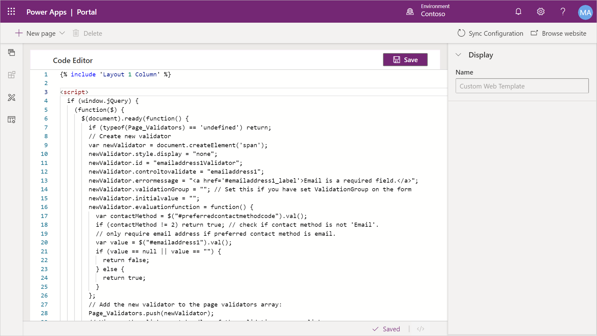
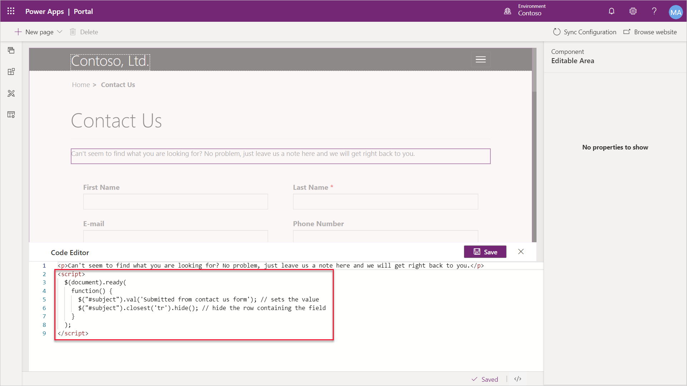

Power Apps portals do not support client-side Business Rules or custom JavaScript processes available on model-driven forms. However, custom JavaScript can be added directly to a portal page in the Portal Studio source code editor, as well as added to **Web Templates**.

> [!div class="mx-imgBorder"]
> [](../media/javascript-template.png#lightbox)

In addition, the **Entity Lists**, **Entity Forms**, and **Web Forms** include a custom JavaScript field that allows developers to add scripts implementing the required functionality.

The functionality can range from simply hiding controls, replacing input controls with a better user-friendlier equivalents, to invoking external web services and implementing fairly sophisticated integration scenarios.

Out of the box, Power Apps portals include the [JQuery](https://jquery.com/?azure-portal=true) library that makes manipulation of the page content and appearance a reasonably easy task.

### Controls and fields

For example, default Contact Us form that creates a lead in Common Data Service includes a mandatory Topic field. This field could be confusing for the site visitors. And we can't use CSS because using CSS styles to hide the control leaves behind the red asterisk that used to indicate that field is mandatory. JavaScript makes the job relatively easy. To set this field to a predefined value and hide it, in the Portal Studio a developer could add the following script to the source code of the page containing the Contact Us form:

```html
<script>
$(document).ready
(
  function()
  {
    $("#subject").val('Submitted from contact us form'); // sets the value
    $("#subject").closest('tr').hide(); // hide the row containing the field
  }
);
</script>
```

> [!div class="mx-imgBorder"]
> [](../media/javascript-page.png#lightbox)

JavaScript is a simple way to add additional behavior or functionality to your Power Apps portal. It can be added directly to a page, or to the **Entity Form** configuration (via the Portal Management app) or as part of a web template, depending on your scoping needs. Script can be used on the form to:

* Implement business rules
* Add dependencies between elements like dependent option sets
* Perform additional form validation

These options provide reasonable alternative to client-side business rules and scripting in model-driven forms.

> [!VIDEO https://www.microsoft.com/en-us/videoplayer/embed/RE4AmL6]

For additional details about scripting on portal, see [Add custom JavaScript](https://docs.microsoft.com/powerapps/maker/portals/configure/add-custom-javascript/?azure-portal=true).
